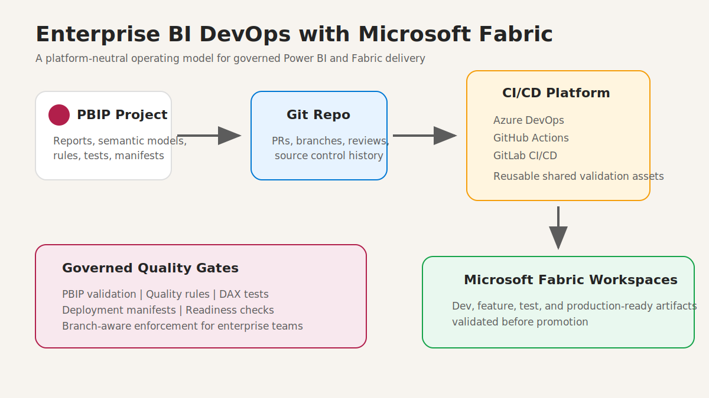
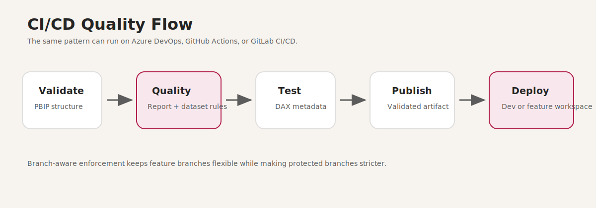
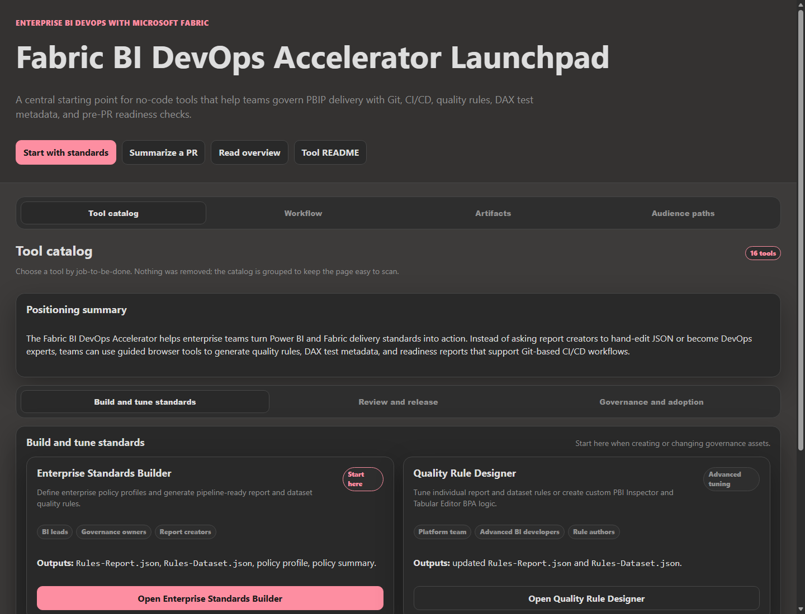
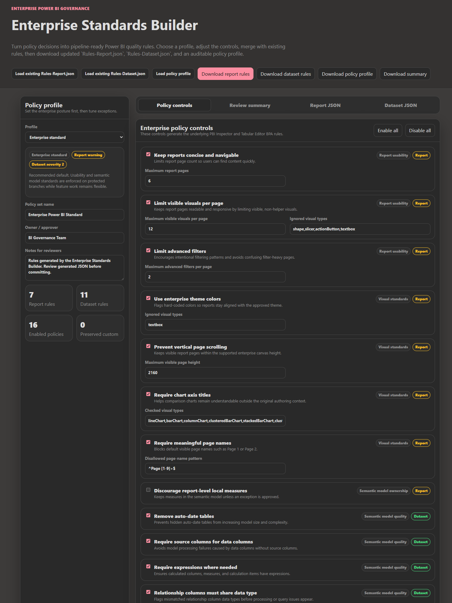
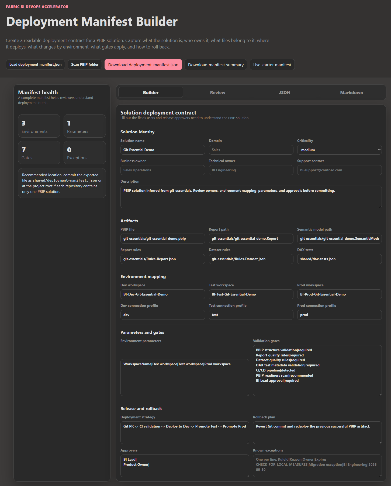
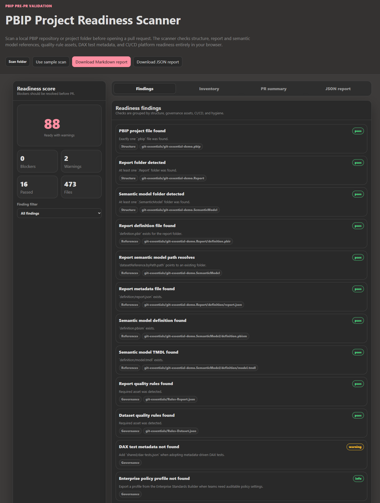
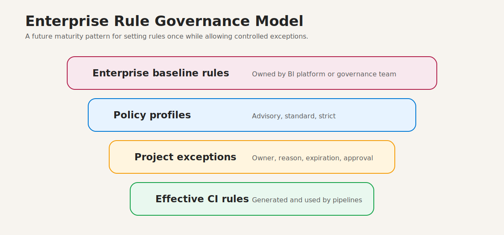

# Enterprise BI DevOps with Microsoft Fabric

Modern analytics teams are expected to move quickly, support governed delivery, and reduce release risk. Microsoft Fabric and Power BI PBIP projects make source control possible, but enterprise teams still need a repeatable operating model for validation, quality gates, release readiness, and deployment.

Enterprise BI DevOps with Microsoft Fabric brings those pieces together.

The solution is platform-neutral. Teams can use Azure DevOps, GitHub Actions, or GitLab CI/CD while sharing the same core validation assets and governance approach.

## What the solution helps standardize

- PBIP project structure
- Branch-aware quality gates
- Report and semantic model rule validation
- DAX test metadata
- Deployment manifests
- Pre-PR readiness checks
- Dev and feature workspace deployment patterns

## No-code tooling for BI governance

The repository includes static browser tools that help teams generate and tune governance artifacts.

The Enterprise Standards Builder helps governance owners generate report and dataset quality rules from policy profiles.

The Deployment Manifest Builder helps teams document release intent, ownership, environments, approvals, and rollback notes.

The PBIP Project Readiness Scanner helps teams identify missing structure or governance assets before a pull request.

## Enterprise direction

The long-term enterprise pattern is to define baseline rules centrally, apply policy profiles, and allow project-specific exceptions with owner, reason, approval, and expiration.

This supports standardization without blocking legitimate special cases.

## Repository

https://github.com/Coding-Forge/Fabric-BI-DevOps
