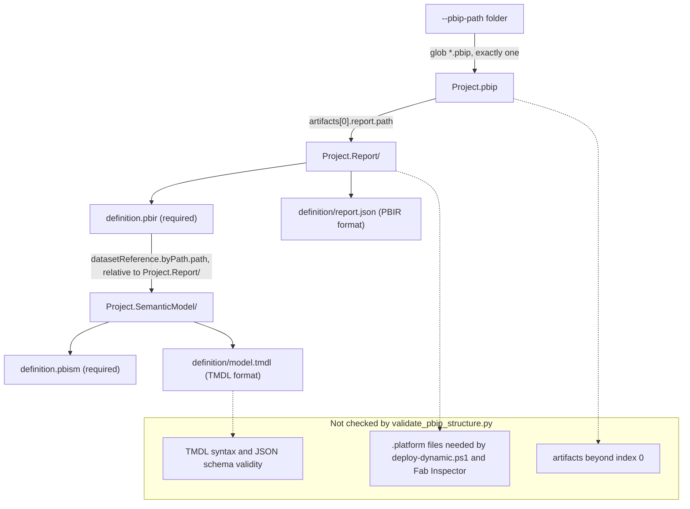
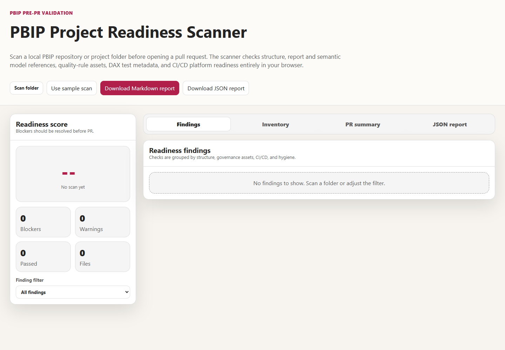

# Chapter 1 — PBIP Validation and Structure

*Platform Development: For Enterprise Power BI and Microsoft Fabric*

A Power BI project saved to disk looks like an ordinary folder: a `.pbip` file, a folder ending in `.Report`, a folder ending in `.SemanticModel`, and JSON and TMDL files underneath. It is tempting to commit it like any other folder and let the pipeline sort it out. The pipeline, however, sees a small graph whose edges are strings. One file names another file's location, which names a third. When any of those strings stops pointing at something real, every tool downstream of the break works from a different idea of what the project is.

This chapter is about that graph, and about the cheap, boring check that should run before anything else touches it.

## A project is a graph before it is a report

Here is the position this chapter defends. Before a rule engine, a DAX test harness, or a deployment script sees a Power BI project, a deterministic check should prove that its declared graph resolves: exactly one `.pbip` file in the folder the pipeline was handed, a report folder at the path that `.pbip` declares, a semantic model folder at the path the report's `definition.pbir` declares through `datasetReference.byPath.path`, and the model's `definition.pbism` and `definition/model.tmdl` files where the chosen format says they must live. That check goes first, it fails fast, and it reports its findings as paths a person can act on.

The claim is falsifiable in a practical way. If your downstream tools—Tabular Editor's Best Practice Analyzer, Fab Inspector, your deployment script—reliably report a broken reference as early, as clearly, and as cheaply as a thirty-line existence check does, then a separate structure stage is ceremony and you should delete it. The rest of this chapter argues that they don't. The evidence comes from the `Fabric-BI-DevOps` repository's own code and from runs I made against that code on September 24, 2026.

If you author reports and models in Power BI Desktop, the material on the project graph, local validation, and the readiness scanner is written for you; skim the runner details. If you own the pipeline, the validator walkthrough, the adapter comparison, and the section on what validation does not prove are yours. Both of you should read the scenario, because its failure starts on an author's laptop and surfaces in an engineer's build log.

## When the graph breaks, each tool tells a different story

PBIP stores its internal references as relative paths, which are fragile in exactly the ways people handle folders. Renaming `Sales.SemanticModel` to `Revenue.SemanticModel` in File Explorer leaves every file intact and breaks the one edge that matters, because `definition.pbir` still says `../Sales.SemanticModel`. Saving the project one directory deeper than the pipeline expects hides a consistent graph from the path the pipeline was given. Keeping both versions of a conflicted `.pbip` produces two project roots. None of these corrupts report or model content; all of them change what the pipeline thinks it is validating.

What makes this expensive is how the later stages react when nobody checks the graph first. The dataset-rules job in all three of the repository's pipelines discovers semantic models by recursive wildcard, looking for any `*.pbism` or `*.pbidataset` file under the PBIP path; the report-rules job does the same for `*.pbir`. Neither reads the `.pbip` or follows `byPath`. After the rename, Tabular Editor analyzes the renamed model folder without complaint, because nothing tells it the report no longer points there. The deployment script, `shared/scripts/deploy-dynamic.ps1`, does follow `byPath`, and fails with a `Resolve-Path` error when the referenced folder is gone. The quality stage passed against one reading of the project and the deployment failed against another, and the pull-request conversation becomes about whose tool is broken rather than about the folder that moved.

A structure gate collapses those readings into one. It follows the same edges the deployment will follow, it does so before any tool is downloaded, and when it fails it names the missing path.

> **ILLUSTRATIVE SCENARIO — The Project One Folder Down**
>
> *This scenario is a composite. It combines troubleshooting patterns documented in the repository into a single narrative for teaching purposes; it does not describe one specific incident. The underlying facts are single-sourced in `docs/faq.md` ("The pipeline fails with `No .pbip file found`"), `docs/Troubleshooting.md` ("PBIP Structure Validation Fails" and "Pipeline Cannot Find Report or Semantic Model Definitions"), and `docs/workshops/sample-data/dib-supply-chain/pbip-build-guide.md`.*
>
> A report author follows the DIB Supply Chain build guide to the letter. Part 1 tells her to save the project as `DIB Supply Chain Readiness.pbip` and recommends the save path `shared/pbip-local/DIB Supply Chain Readiness/`. She does, commits the result to a feature branch, and runs the PBIP Project Readiness Scanner against `shared/pbip-local` before opening a pull request. The scanner reports one `.pbip` file found, a resolving `byPath` reference, and both definition files present.
>
> The first pipeline job fails: `No .pbip file found under …/shared/pbip-local`. She can see the `.pbip` in the repository browser, so she assumes the pipeline is misconfigured and asks the platform engineer to look. He reads the validator and finds the cause in one line: it calls `root.glob("*.pbip")`, which looks only at the top of the folder it is given, and every pipeline hands it `shared/pbip-local`. The scanner passed because it matches `.pbip` anywhere in the folder you select, including subfolders. Two tools applied the same rule—"exactly one project file"—to two different scopes.
>
> The first fix attempt makes things worse. To get the project "to the root," someone moves the files up a level and, while they're at it, renames the model folder to remove the spaces. The next run fails differently: `Missing semantic model directory`, followed by the two definition files the validator expected inside it. The report's `definition.pbir` still points at the old folder name. This time the message names the exact path, and the author fixes it by renaming the folder back—or, if the new name is wanted, by updating `datasetReference.byPath.path` in `definition.pbir` to match it.
>
> **What changed after this:** the team wrote down one rule—the pipeline's PBIP path is the folder that directly contains the `.pbip` file—and set `PBIP_PATH` per project instead of relying on a default. They also started running the command-line validator locally, with the same argument CI uses, in addition to the scanner, because only the former checks the scope CI checks.

The lesson is not that the build guide or the scanner is wrong; each is reasonable on its own terms. The failure is that nothing forced the author's view of the project and the pipeline's view to be the same view before the change was committed.

## Reading the project as a contract

The operating model is simple to state and takes discipline to keep: treat each validated PBIP project as a declared graph — one project entry point, a report reference, a model reference, and the format files your policy requires at each endpoint. Define the accepted shapes in writing, then run the same graph check locally, in pull requests, and before deployment.

<!-- EDITORIAL: reworded to separate the portable structure-validation model from the repository's specific format policy (PBIR/TMDL/byPath), which is now framed explicitly as a policy choice in the next section rather than baked into the model itself. -->


### Four files, two edges

The `.pbip` file is the entry point Power BI Desktop opens; for the pipeline, its interesting content is the `artifacts` array, where each entry names a report by relative path. That path is the first edge. It points at a folder, conventionally `<Project>.Report`, whose required file is `definition.pbir`—the file Microsoft's report-folder documentation describes as holding the report's core settings and its reference to the semantic model.

That reference is the second edge, and it takes one of two forms. With `byPath`, the report points at a semantic model folder by relative path (absolute paths are not supported, and the separator is a forward slash), and Desktop opens the model alongside the report for editing. With `byConnection`, the report points through a connection string at a model already published to a Fabric workspace. The first form produces a self-contained project; the second produces a thin report that depends on something outside the repository.

At the end of a `byPath` edge sits the semantic model folder, whose required file is `definition.pbism`. Its `version` property determines the allowed model formats: version 4.0 or above permits TMSL in `model.bim` or TMDL in a `definition\` folder, whose root document is `definition/model.tmdl`. The report side forks the same way. PBIR-Legacy keeps a single `report.json` at the top of the report folder; PBIR splits the report into files under `definition\`, with `definition/report.json` at the root and each page and visual in its own file. Microsoft's documentation currently describes both PBIP and PBIR as preview features and states that PBIR will become the only supported report format at general availability.

### Stricter than Desktop, on purpose

Set those facts beside the repository's validator and its contract turns out narrower than what Desktop will open. It requires `definition/report.json`, which exists only in PBIR; `definition/model.tmdl`, which exists only in TMDL; `datasetReference.byPath.path`, which rules out thin reports; and exactly one `.pbip` directly inside the folder it is given, which rules out multi-project folders.

Those are policy choices. For teams that require report and model changes to be reviewed together as text, a PBIR/TMDL, local-`byPath`, one-project-per-path policy is a strong default: it produces file-level diffs, keeps the referenced model in the same pull request, and gives downstream gates one unambiguous target. But a team that deliberately ships thin reports against a certified shared model will see correct work rejected with `No datasetReference.byPath.path declared`; that team should encode a different accepted shape explicitly. Decide in writing which shapes your pipeline accepts, then make the validator enforce that decision, rather than discovering the policy by reading code after a failure.

<!-- EDITORIAL: scoped the "right defaults" claim to the team profile it actually supports (text-reviewed, co-versioned changes), per rubber-duck review feedback that the original stated it as an unqualified universal default. -->


### Who owns which edge

The report author owns the content of the graph. Every edge is written by Power BI Desktop when the author saves, and every edge is broken by someone moving files outside Desktop. The practical rule for authors is short: move or rename a project with **Save As** in Power BI Desktop rather than in the file system, and if you must touch folder names by hand, run the validator before you commit.

The platform engineer owns the scope of the check: the folder the validator receives, the guarantee that every later job and the published artifact use that same folder, and the decision about project shapes the validator rejects. Most "the pipeline is broken" entries in the repository's troubleshooting guide are really about scope—a validator pointed at one folder and a project saved in another.

## Building the first gate

Everything in this section runs from a clone of the repository with Python 3.11 or later on your path; the pipelines pin 3.11, and I ran these examples with Python 3.12.10. None of it needs Fabric access or a service principal.

### The validator, line by line

The validator lives at `shared/tests/validate_pbip_structure.py`, with a copy for the shared-template pattern at `shared/universal-pipeline/tests/validate_pbip_structure.py`. The copies differ only in the "no `.pbip` found" hint, which in the universal copy refers to "the folder configured as pbipPath."

**Listing 1.1 — `shared/tests/validate_pbip_structure.py`, lines 17–35.** Locating the project root and its declared artifacts.

```python
def validate_pbip_structure(root: Path) -> list[str]:
    errors: list[str] = []

    pbip_files = sorted(root.glob("*.pbip"))
    if not pbip_files:
        return [f"No .pbip file found under {root}. Place your PBIP project files (*.pbip, *.Report/, *.SemanticModel/) locally in shared/pbip-local."]
    if len(pbip_files) > 1:
        return [
            "Expected exactly one .pbip file at the project root, found: "
            + ", ".join(str(path.name) for path in pbip_files)
        ]

    pbip_file = pbip_files[0]
    pbip_config = _load_json(pbip_file)

    artifacts = pbip_config.get("artifacts", [])
    if not artifacts:
        errors.append(f"No artifacts declared in {pbip_file.name}")
        return errors
```

Line 20 is the most consequential line in the file: `root.glob("*.pbip")` is not recursive; it looks only at the immediate contents of the folder passed as `--pbip-path`. The validator refuses to guess among zero or multiple project roots, because every later check depends on knowing which project file is authoritative. Lines 32 to 35 read the `artifacts` array and stop if it is missing or empty; a `.pbip` with no artifacts is a project that points at nothing.

<!-- EDITORIAL: condensed line-by-line code narration per reviewer feedback that it read more like a guided code review than argument-relevant prose (dropped the sort-determinism aside, which doesn't affect the reader's decision). -->


**Listing 1.2 — `shared/tests/validate_pbip_structure.py`, lines 37–72.** Following the report path and the byPath reference.

```python
    report_path_value = artifacts[0].get("report", {}).get("path")
    if not report_path_value:
        errors.append(f"No report path declared in {pbip_file.name}")
        return errors

    report_dir = (pbip_file.parent / report_path_value).resolve()
    _assert_exists(report_dir, errors, "report directory")
    report_definition = report_dir / "definition.pbir"
    report_json = report_dir / "definition" / "report.json"
    _assert_exists(report_definition, errors, "report definition file")
    _assert_exists(report_json, errors, "report metadata file")

    if report_definition.exists():
        report_config = _load_json(report_definition)
        semantic_model_path_value = (
            report_config.get("datasetReference", {})
            .get("byPath", {})
            .get("path")
        )
        if not semantic_model_path_value:
            errors.append(f"No datasetReference.byPath.path declared in {report_definition}")
        else:
            semantic_model_dir = (report_definition.parent / semantic_model_path_value).resolve()
            _assert_exists(semantic_model_dir, errors, "semantic model directory")
            _assert_exists(
                semantic_model_dir / "definition.pbism",
                errors,
                "semantic model definition file",
            )
            _assert_exists(
                semantic_model_dir / "definition" / "model.tmdl",
                errors,
                "semantic model model.tmdl file",
            )

    return errors
```

Line 37 reads only `artifacts[0]`. If your `.pbip` declares additional artifacts, the validator does not check them. Line 42 resolves the report path relative to the folder that contains the `.pbip`, which is the same way the deployment script resolves it. Lines 44 to 47 then assert the two report files the repository requires. Notice that errors accumulate from this point rather than returning early: a renamed report folder produces three messages—directory, `definition.pbir`, and `definition/report.json`—so the author sees the whole shape of the problem at once.

The guard on line 49 is easy to miss: without `definition.pbir` the validator cannot know which model the report meant, so the model checks don't run. When the file exists, lines 51 to 55 walk the nested keys defensively, so a `byConnection` report produces a clean message on line 57 rather than a stack trace. Line 59 resolves the model path relative to the report folder—`report_definition.parent`—which is why a correct `byPath` value is usually `../<Project>.SemanticModel`. Lines 60 to 70 assert the model directory, `definition.pbism`, and `definition/model.tmdl`. The optional `definition/relationships.tmdl` is deliberately not checked; the troubleshooting guide notes that single-table models may not have relationships at all.

**Listing 1.3 — `shared/tests/validate_pbip_structure.py`, lines 75–92.** The command-line contract: messages to stderr, exit code 1 on any error.

```python
def main() -> int:
    parser = argparse.ArgumentParser()
    parser.add_argument("--pbip-path", required=True)
    args = parser.parse_args()

    root = Path(args.pbip_path).resolve()
    if not root.exists():
        print(f"PBIP path does not exist: {root}", file=sys.stderr)
        return 1

    errors = validate_pbip_structure(root)
    if errors:
        for error in errors:
            print(error, file=sys.stderr)
        return 1

    print(f"PBIP structure validation passed for {root}")
    return 0
```

The wrapper is what makes the file a gate. Line 81 separates "the folder doesn't exist" from "the folder isn't a valid project," which saves time when a pipeline variable is misspelled. Errors go to standard error and any error returns exit code 1. That exit code is the entire integration surface: Azure Pipelines script steps, GitHub Actions `run` steps, and GitLab `script` lines all fail on a non-zero exit, so the validator needs no platform-specific code.

### A fixture you can break on purpose

The fastest way to understand a structural check is to build the smallest project it accepts and then damage it. The repository ships no PBIP content—`shared/pbip-local/README.md` reserves that folder for your own artifacts—so the fixture below is one I created for this chapter. It is not from the repository and not a complete Power BI project; it is the minimum the validator's contract requires.

```text
good/
  Sales.pbip                              {"version":"1.0","artifacts":[{"report":{"path":"Sales.Report"}}],"settings":{"enableAutoRecovery":true}}
  Sales.Report/definition.pbir            {"version":"4.0","datasetReference":{"byPath":{"path":"../Sales.SemanticModel"}}}
  Sales.Report/definition/report.json     {}
  Sales.SemanticModel/definition.pbism    {"version":"4.2","settings":{}}
  Sales.SemanticModel/definition/model.tmdl
```

Run the validator from the repository root the same way the GitHub Actions and GitLab pipelines do, first against the repository's own empty PBIP folder and then against the fixture:

```powershell
python shared/tests/validate_pbip_structure.py --pbip-path shared/pbip-local
python shared/tests/validate_pbip_structure.py --pbip-path <fixture>/good
```

In a fresh clone the first command fails as expected, because `shared/pbip-local` contains only its README; the message ends with the hint to place your PBIP files there. The second command prints `PBIP structure validation passed for` followed by the absolute path, and exits 0.

Now break the fixture one way at a time. I made each of the following copies of `good/` and ran the validator against each. The output below is verbatim except that I replaced my local absolute prefix with `<fixture>`.

```text
# Semantic model folder renamed to Revenue.SemanticModel; definition.pbir unchanged
Missing semantic model directory: <fixture>\renamed\Sales.SemanticModel
Missing semantic model definition file: <fixture>\renamed\Sales.SemanticModel\definition.pbism
Missing semantic model model.tmdl file: <fixture>\renamed\Sales.SemanticModel\definition\model.tmdl

# A second .pbip file created by copying the first
Expected exactly one .pbip file at the project root, found: Sales - Copy.pbip, Sales.pbip

# Project saved one folder down, validator pointed at the parent
No .pbip file found under <fixture>\nested\pbip-local. Place your PBIP project files (*.pbip, *.Report/, *.SemanticModel/) locally in shared/pbip-local.

# definition.pbir switched to a byConnection reference
No datasetReference.byPath.path declared in <fixture>\byconn\Sales.Report\definition.pbir
```

Every one of those runs exited 1. One more experiment produces output of a different kind. When I left a merge-conflict marker inside `definition.pbir`, Python raised `json.decoder.JSONDecodeError: Expecting property name enclosed in double quotes` with a line and column, and the process still exited 1. The gate held, but the author gets a traceback instead of a sentence; wrapping `_load_json` to name the offending file is a small, worthwhile change.

### Reading a failure

Most structural failures map to one decision the author or engineer has to make. The table below pairs the validator's messages with the question to ask and the usual fix.

| Message begins with | Question to ask | Usual fix |
|---|---|---|
| `PBIP path does not exist` | Is the pipeline variable or local argument spelled correctly? | Correct `PBIP_PATH` or the `--pbip-path` argument. |
| `No .pbip file found under` | Is the project saved directly in this folder, or one level down? | Point the path at the folder containing the `.pbip`, or move the project up. |
| `Expected exactly one .pbip file` | Did a conflict resolution or copy leave two roots? | Delete the stray `.pbip`, or validate each project separately. |
| `No artifacts declared` / `No report path declared` | Was the `.pbip` hand-edited or truncated? | Re-save from Power BI Desktop. |
| `Missing report directory` | Was the report folder renamed or moved? | Rename it back or re-save from Desktop. |
| `Missing report metadata file` | Is the report in PBIR-Legacy format? | Upgrade the report to PBIR, or change the policy. |
| `No datasetReference.byPath.path declared` | Is this a thin report bound with `byConnection`? | Decide whether thin reports are allowed; if so, change the policy. |
| `Missing semantic model directory` | Was the model folder renamed without updating `definition.pbir`? | Restore the name or re-save so the reference is rewritten. |
| `Missing semantic model model.tmdl file` | Is the model saved as TMSL (`model.bim`)? | Save as TMDL, or change the policy. |

Three rows end in "or change the policy": the messages are accurate, but some describe legitimate projects your written policy hasn't yet decided to accept.

## Figure 1.1 — The graph the repository checks

The diagram shows the edges the validator follows and, in the lower group, what later stages depend on that it never checks.



## What a green structure check proves, and what it doesn't

A passing run proves something narrow and valuable: for the first artifact in the single `.pbip` at the given path, the report folder and the model folder it references exist, and the files the format policy requires are present. It does not prove those files are valid, that the project will deploy, or that the quality tools will evaluate it.

**It does not parse TMDL.** I replaced the fixture's `model.tmdl` with the single line `this is not tmdl`. The validator passed. Tabular Editor 2.29.0—the version the pipelines' `releases/latest` URL downloaded on the day I tested—then refused to load the model, printing `Error loading file: TmdlFormatException encountered while deserializing TMDL` with the document name `./model` and line number 1, and exiting with code 1. The structure gate did its job; the dataset-rules job caught the content problem. That division of labor is fine as long as nobody reads a green validation as a model that loads.

**It does not check `.platform` files.** The deployment script reads each item's `.platform` file to learn the item's type and display name, and it stops if the file is missing.

**Listing 1.4 — `shared/scripts/deploy-dynamic.ps1`, lines 545–557.** Deployment requires .platform metadata that the structure check never looks for.

```powershell
function Get-PlatformMetadata {
    param(
        [Parameter(Mandatory = $true)]
        [string]$ItemFolder
    )

    $platformPath = Join-Path $ItemFolder '.platform'
    if (!(Test-Path $platformPath)) {
        throw "Fabric .platform metadata not found: $platformPath"
    }

    return Get-Content -Path $platformPath -Raw | ConvertFrom-Json
}
```

The same gap affects report rules in a quieter way. When I ran Fab Inspector 3.4.0 against a PBIR report folder without a `.platform` file, it logged "No platform files found in directory" and fell back to what it calls legacy behavior. My test rule declared `itemType` as `Report`, as every rule in `shared/examples/Rules-Report.json` does, and it did not run: no findings were produced and the process exited 0. Adding a `.platform` file with `"type": "Report"` made the same rule execute and fail. A report folder without `.platform` can therefore pass the structure gate, pass the report-quality job by evaluating nothing, and fail only at deployment. The repository's `.gitignore` explicitly re-includes `.platform` files under `shared/pbip-local`, so the authors expected them to be committed. Adding a `.platform` existence check beside each folder the validator already visits is a three-line change and the first extension I would make.

**It does not survive deployment unchanged, and doesn't need to.** The `byPath` reference is a design-time edge. When the deployment script builds the report definition it sends to Fabric, it replaces that edge with a connection to the semantic model it has just deployed.

**Listing 1.5 — `shared/scripts/deploy-dynamic.ps1`, lines 581–592.** At deployment, the byPath reference is rewritten to a byConnection reference by semantic model ID.

```powershell
        if ($Type -eq 'Report' -and $relativePath -eq 'definition.pbir') {
            if ([string]::IsNullOrWhiteSpace($SemanticModelId)) {
                throw 'SemanticModelId is required when deploying report definitions through the Fabric REST API.'
            }

            $definitionPbir = Get-Content -Path $file.FullName -Raw | ConvertFrom-Json
            $datasetReference = [pscustomobject]@{
                byConnection = [pscustomobject]@{
                    connectionString = "semanticmodelid=$SemanticModelId"
                }
            }
            $definitionPbir | Add-Member -NotePropertyName 'datasetReference' -NotePropertyValue $datasetReference -Force
```

This is consistent with Microsoft's report-folder documentation, which notes that a report deployed through the Fabric REST API needs only the `semanticmodelid` property in a `byConnection` connection string. It is also the strongest argument for validating `byPath` first: the deployment script trusts that edge enough to deploy the model it points to before deploying the report, so a wrong edge produces a wrong deployment, not merely a failed one.

**It does not cover every supported shape.** Thin reports, PBIR-Legacy reports, TMSL models, and multi-artifact projects are all valid Desktop output that the validator rejects or ignores—policy, not a defect, but it belongs in your written standard.

## The readiness scanner: the same contract for a different audience

The repository's `tools/` folder contains self-contained HTML tools that run in a browser without a server or network access; they are companion tools shipped with the repository, not Microsoft products. The one built for this chapter's failure mode is the PBIP Project Readiness Scanner at `tools/pbip-readiness-scanner/index.html`, which lets an author check a project before a reviewer or pipeline spends time on it, without installing Python.



The scanner applies the same graph checks as the validator, but its design choices differ in three ways that matter. The listing shows the core of its reference check.

**Listing 1.6 — `tools/pbip-readiness-scanner/index.html`, lines 617–629.** The scanner treats a missing byPath reference as a warning, not a blocker.

```javascript
          try {
            const parsed = JSON.parse(await fileMap.get(pbir).text());
            const modelPath = parsed?.datasetReference?.byPath?.path;
            if (modelPath) {
              const resolved = normalizePath(resolveRelative(reportDir, modelPath));
              if (hasDirectory(fileMap, resolved)) {
                addFinding(report, "pass", "Report semantic model path resolves", "`datasetReference.byPath.path` points to an existing folder.", resolved, "References");
              } else {
                addFinding(report, "blocker", "Report semantic model path does not resolve", "Update `definition.pbir` so `datasetReference.byPath.path` points to the committed semantic model folder.", resolved, "References");
              }
            } else {
              addFinding(report, "warning", "Report has no local semantic model reference", "No `datasetReference.byPath.path` was found. Confirm whether the report intentionally references a remote/shared model.", pbir, "References");
            }
```

First, as the scenario showed, the scanner finds `.pbip` files anywhere in the folder you select, while the validator looks only at the top of its folder. Second, where the validator fails a report that lacks `byPath`, the scanner raises a warning titled "Report has no local semantic model reference" and asks whether the project intentionally uses a remote model. Third, the scanner checks every `.SemanticModel` folder it finds, whether or not a report references it, and it goes beyond structure to look for `Rules-Report.json`, `Rules-Dataset.json`, `dax-tests.json`, pipeline files, `Prepare-QualityRules.ps1`, the validator itself, a README, secret-bearing file extensions, and files over 10 MB.

Its score is deliberately blunt. The `calculateScore` function in the same file starts at 100 and subtracts 20 for each blocker and 6 for each warning; any blocker makes the label "Not PR-ready."


The score in that screenshot is exactly what the formula predicts—100 minus two warnings at 6 points each—so authors can see precisely which finding costs what.

Use the scanner as the author's pre-flight check and the validator, with the pipeline's folder argument, as the gate. When they disagree, the disagreement is information: usually the author selected a different folder from the one CI checks, or the project uses a shape the scanner tolerates and the validator does not. Lab 1 (`docs/workshops/core-fabric-git/labs/lab1-connect-git.md`) places the scanner at "Part 2b," right after the first Git sync, which captures a structural baseline before the first change. Two other tools read the same structure: the Deployment Manifest Builder can scan a PBIP folder to seed a deployment contract, and the PBIP Diff Viewer categorizes the differences between two snapshots, which is the fastest way to see that a pull request renamed a folder rather than editing content.

## One validator, three adapters

The validator is platform-neutral because its interface is an exit code. The adapters differ in where Python runs, which path the validator receives, and what happens to the folder afterward. This section is for the platform engineer.

**Azure DevOps.** The combined pipeline at `azdo/azure-pipelines.yml` sets `PROJECT_ROOT` to `shared` and `PBIP_PATH` to `shared/pbip-local`, runs every job on the `windows-2022` Microsoft-hosted image declared once at the top of the file, and makes the structure check the first job of the first stage.

**Listing 1.7 — `azdo/azure-pipelines.yml`, lines 51–66.** Azure DevOps: structure validation is the first job of the Validate stage.

```yaml
- stage: Validate
  displayName: 'Validate PBIP Artifacts'
  jobs:
    - job: ValidatePBIP
      displayName: 'Validate PBIP Structure'
      steps:
        - checkout: self

        - task: UsePythonVersion@0
          inputs:
            versionSpec: '$(PYTHON_VERSION)'
          displayName: 'Set Python version to: $(PYTHON_VERSION)'

        - script: |
            python $(PROJECT_ROOT)/tests/validate_pbip_structure.py --pbip-path "$(PBIP_PATH)"
          displayName: 'Run PBIP structure validation'
```

Both quality jobs declare `dependsOn: ValidatePBIP`, and the `Test` stage declares `dependsOn: Validate` with `condition: succeeded()`, so a structural failure stops everything after it. The CI-only file, `azdo/azure-pipelines_ci.yml`, sets `PBIP_PATH` to `pbip-local` and passes `"$(PROJECT_ROOT)/$(PBIP_PATH)"`, reaching the same folder by a different route—exactly what breaks when snippets are copied between the two files. The combined pipeline publishes the whole `shared` folder as the `pbip-drop` artifact, and its deploy stages look for the project at `pbip-drop/pbip-local`. That matches what the validator checked only because two variables happen to agree; nothing enforces it.

**GitHub Actions.** In `.github/workflows/powerbi-ci.yml`, the structure check is its own job on a Linux runner.

**Listing 1.8 — `.github/workflows/powerbi-ci.yml`, lines 52–65.** GitHub Actions: structure validation on ubuntu-latest with actions/setup-python.

```yaml
  validate_pbip:
    name: Validate PBIP Structure
    runs-on: ubuntu-latest
    steps:
      - name: Checkout repository
        uses: actions/checkout@v4.2.0

      - name: Set up Python
        uses: actions/setup-python@v5.1.0
        with:
          python-version: ${{ env.PYTHON_VERSION }}

      - name: Run PBIP structure validation
        run: python shared/tests/validate_pbip_structure.py --pbip-path "${{ env.PBIP_PATH }}"
```

The quality jobs run on `windows-latest` because Tabular Editor and the Fab Inspector CLI build the pipeline downloads are Windows executables; each downstream job declares `needs: validate_pbip` and checks `needs.validate_pbip.result == 'success'`. The artifact differs most: `publish_artifacts` uploads only `${{ env.PBIP_PATH }}` as `pbip-artifacts`, with `if-no-files-found: error`. The deploy jobs check out the repository again for the deployment script, then search several candidate folders in the artifact for one containing a `.pbip`. That search is more forgiving than the validator—another reason the validator must run first, because only it guarantees the deployed project is the one that was checked.

**GitLab CI/CD.** The file lives at `gitlab/gitlab-ci.yml`, and its header comment warns that GitLab looks for `.gitlab-ci.yml` at the repository root by default; you must set the project's CI/CD configuration file path to `gitlab/gitlab-ci.yml` before anything runs.

**Listing 1.9 — `gitlab/gitlab-ci.yml`, lines 59–63.** GitLab: structure validation in a slim Python container on any Linux runner.

```yaml
validate_pbip:
  stage: validate
  image: python:3.11-slim
  script:
    - python shared/tests/validate_pbip_structure.py --pbip-path "$PBIP_PATH"
```

The check runs in the `python:3.11-slim` image, so any Docker-capable Linux runner will do, while the quality and deploy jobs need a separately registered Windows runner tagged `windows`. Later jobs use `needs: [validate_pbip]`, which gates them on the validation job directly rather than through stage order alone, and `publish_artifact` copies `"$PBIP_PATH/."` into a `pbip-drop/` artifact that expires after seven days. The shared Azure DevOps template under `shared/universal-pipeline/` adds one variation: it checks out the templates repository and runs `$(TEMPLATES_REPO)/tests/validate_pbip_structure.py` against a `pbipPath` parameter defaulting to `pbip-local`, so the validator is versioned with the template rather than with each project.

Across all three, the useful invariant is the one this chapter started with: the folder the validator receives must be the folder the quality jobs search, the folder the artifact packages, and the folder the deployment resolves. Each platform expresses that folder in its own variable syntax; none of them checks that the four uses agree. Make that agreement a review item whenever a pipeline file changes.

## Trade-offs and lighter paths

A strict structure contract has real costs. The first is rejected work: a team that publishes thin reports against a certified shared model, or keeps a PBIR-Legacy report while it plans the upgrade, will see correct projects fail. Silencing the check is the wrong response. Encode the exception instead—accept `byConnection` for named report folders, or allow a root-level `report.json` for a dated migration window—and keep failing everything else. The validator is short enough that these are small edits.

The second cost is scope. A repository with several projects needs each validated separately, and the tempting shortcut—a recursive glob—reintroduces the ambiguity the "exactly one" rule prevents. Enumerate projects explicitly, or run one job per project folder.

For a single author working alone, running the readiness scanner before each commit plus the validator locally with CI's folder argument covers most of the risk, and the habit transfers intact when a second author arrives. At the other end, a team with many projects and contributors should go further than the repository does: validating `definition.pbir`, `definition.pbism`, and `.platform` against the public JSON schemas Microsoft publishes in the `microsoft/json-schemas` repository, adding the `.platform` check described above, and loading the model with Tabular Editor as part of the structure stage rather than waiting for the rules job to discover a TMDL parse error.

What I would not do without a demonstrated substitute is skip the structure stage because the quality jobs "will catch it." The runs in this chapter show that they discover files by wildcard, can evaluate an orphaned model, and can evaluate nothing at all when `.platform` is missing—all without failing. A very small solo project with no CI/CD, or a managed product whose own tooling guarantees graph integrity, may not need a separate stage; everyone else should treat this as the default.

<!-- EDITORIAL: softened "in any context" per reviewer feedback that it conflicted with the book's own "strong default, not universal dogma" standard. -->


## Evidence and further reading

The repository sources for this chapter are `shared/tests/validate_pbip_structure.py` and its universal-template copy; `shared/scripts/deploy-dynamic.ps1`; `tools/pbip-readiness-scanner/index.html`; the three pipeline files `azdo/azure-pipelines.yml`, `.github/workflows/powerbi-ci.yml`, and `gitlab/gitlab-ci.yml`; and the troubleshooting material in `docs/Troubleshooting.md`, `docs/faq.md`, `docs/Local-Validation-Guide.md`, `shared/pbip-local/README.md`, and `docs/workshops/sample-data/dib-supply-chain/pbip-build-guide.md`.

The first-hand evidence consists of the fixture runs described above, made on September 24, 2026 with Python 3.12.10, Tabular Editor 2.29.0, and Fab Inspector 3.4.0 (the latter two downloaded through the same URLs the pipelines use). Your results with later tool versions may differ; rerun the experiments rather than trusting the transcript.

Official and upstream documentation:

- Power BI Desktop projects overview: https://learn.microsoft.com/en-us/power-bi/developer/projects/projects-overview
- Project report folder, including `definition.pbir`, `byPath`, `byConnection`, and PBIR: https://learn.microsoft.com/en-us/power-bi/developer/projects/projects-report
- Project semantic model folder, including `definition.pbism` versions and TMDL: https://learn.microsoft.com/en-us/power-bi/developer/projects/projects-dataset
- TMDL overview: https://learn.microsoft.com/en-us/analysis-services/tmdl/tmdl-overview
- Fabric Git integration overview: https://learn.microsoft.com/en-us/fabric/cicd/git-integration/intro-to-git-integration
- Public JSON schemas for Fabric item files: https://github.com/microsoft/json-schemas
- Tabular Editor 2 command-line options: https://docs.tabulareditor.com/en/features/Command-line-Options.html
- Fab Inspector (formerly PBI Inspector V2): https://github.com/NatVanG/fab-inspector

## Freshness note

Last verified September 24, 2026. On that date, Microsoft's documentation described Power BI Desktop projects and the PBIR report format as preview features, and stated that PBIR will become the only supported report format at general availability. If PBIR has reached GA by the time you read this, the validator's requirement for `definition/report.json` will have moved from a policy choice to the only option. The Fab Inspector repository now redirects from its former `PBI-InspectorV2` name, and its README describes it as a community project that Microsoft does not support; the pipelines still download from the old URL, which resolved on the date of verification. Tool behavior reported in this chapter is specific to the versions named above.

## Reader decision checklist

Answer these for your own repository before moving on to quality gates.

1. Which folder does your pipeline pass to the structure validator, and is it the same folder your quality jobs search, your artifact packages, and your deployment resolves? Write the four paths down and compare them.
2. Does every PBIP project in your repository sit directly inside the folder its pipeline validates, or do any live one level down?
3. Which project shapes will you accept: PBIR only, or PBIR-Legacy during a migration window; TMDL only, or `model.bim` too; local `byPath` models only, or thin `byConnection` reports as well? Is that decision written somewhere a reviewer can find it?
4. Do your report and model folders contain `.platform` files, and does anything fail if one is missing before deployment?
5. Does any artifact beyond `artifacts[0]` in your `.pbip` files matter to you, and if so, what checks it?
6. Do authors run the validator locally with the same argument CI uses, or only the readiness scanner?
7. Is structure validation the first job in every one of your CI adapters, with every later job depending on it explicitly?
