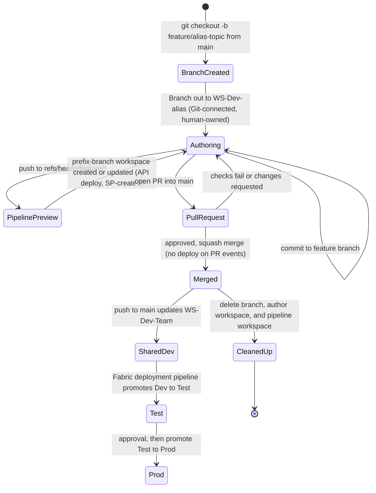

# Chapter 2 — Branching and Environment Strategy

*Platform Development: For Enterprise Power BI and Microsoft Fabric*

Source control for application code rests on an assumption so familiar that nobody states it: a branch is a private copy. Two developers on two branches can each break the build on their own machine without touching the other. Fabric Git integration keeps the branches but changes what sits at the end of them. A workspace connected to a branch is not a private checkout; it is a shared runtime that other people open, refresh, and present from. Microsoft's own description of the development process puts it plainly: each workspace can be connected to a single branch, and changes made directly in a workspace affect everyone who uses it.

That one fact reshapes branching strategy for Power BI and Fabric content. This chapter works out the consequences.

## One branch, one workspace, one direction of travel

For multi-author Fabric work that needs a live workspace, treat each workspace as a branch-bound runtime: active feature work happens in a separate feature workspace, shared Dev mirrors reviewed `main`, and Test and Prod receive content only through promotion, never a Git connection. Record each workspace's purpose, source, owner, expiry, and cleanup path outside CI YAML, and check the pipelines against that written record — the branch patterns in your CI files (`feature/*`, `feature/**`, `/^feature\//`) are runner configuration, not a substitute for it. A single author working alone can skip the per-branch-workspace piece of this without abandoning the rest.

<!-- EDITORIAL: rescoped the opening claim so the per-branch-workspace default applies to multi-author/live-preview work, consistent with the single-author exception the chapter already grants later; the general rule (one source, owner, purpose, lifecycle per workspace) is now stated as the always-true part. -->


You can falsify this. If a team of more than one author can work in a single shared Dev workspace by switching it between feature branches, without anyone's work disappearing from view, without stakeholders previewing half-finished changes, and without the workspace being left on the wrong branch after a merge, then per-branch workspaces are overhead. The repository's FAQ and Microsoft's branch-switching documentation both describe why that doesn't happen in practice.

This chapter speaks to both of the book's readers, but not equally in every section. Report and model authors should read the failure mode, the lifecycle walkthrough, and the material on switching branches and resolving conflicts; those are the moments where an author's action changes what other people see. Platform engineers should read everything, and especially the sections on the repository's two kinds of feature workspace, cleanup, and the adapter comparison, because that is where the written strategy and the pipeline YAML quietly disagree.

## When the shared workspace follows whoever switched it last

The failure starts with an instruction that is correct for one person and wrong for a team. Lab 1 in `docs/workshops/core-fabric-git/labs/lab1-connect-git.md` connects a Dev workspace to `main`, then in Part 3.2 has the participant open **Workspace settings → Git integration**, choose **Switch branch**, and point that same workspace at `feature/<your-alias>-lab1`. Part 5.3 switches it back to `main` after the merge. For a single learner working through a lab, that is a clean introduction to the mechanics. The lab's own "Extension" section then explains that real team development goes a step further and gives each feature branch a dedicated personal workspace.

The step between those two sections is where teams get hurt. According to Microsoft's documentation on branch workspaces, switching a connected workspace to another branch overrides all items in the workspace; an item that exists in the old branch but not the new one is deleted from the workspace; and you cannot switch while the workspace has uncommitted changes. None of that loses work that has been committed to Git. All of it changes what the workspace shows to everyone else, immediately.

> **ILLUSTRATIVE SCENARIO — Two Branches, One Workspace**
>
> *This scenario is a composite built from documented troubleshooting patterns, not an account of a single incident. The source material is single-sourced in `docs/faq.md`—the questions "I created a feature branch but the workspace still shows `main`," "Should I work directly in the shared Dev workspace (`WS-Dev-<team>`) on my feature branch?," "After the PR merges, the shared Dev workspace still shows my feature branch content," and "Items show 'Conflict' status"—together with Parts 3.2 and 5.3 of Lab 1 and the branch-out guidance in `docs/architecture/branching-strategy.md`.*
>
> Two authors on the same team take Lab 1's main path back to their real work. Both have Admin on the shared `WS-Dev-FinanceBI` workspace, so both can switch its branch. The first switches it to `feature/bcampbell-sales-ytd`, adds a new report page, and commits. The second, who needs to test a role change, switches the workspace to `feature/jsmith-rls-update`. Fabric does what its documentation says it will: every item is replaced with the version from the second branch, and the first author's new page disappears from the workspace because it doesn't exist in that branch. It is safe in Git. It is gone from the screen the business analyst was using for a walkthrough that afternoon.
>
> The next morning the first author tries to switch back and is blocked; the second has uncommitted edits in the workspace, and Fabric won't switch branches over uncommitted changes. When the second author's pull request merges, nobody switches the workspace back to `main`, which is precisely the situation one FAQ entry describes: the shared Dev workspace still shows feature-branch content after the merge. A day later someone edits a report directly in the workspace while a teammate's merge changes the same report on the connected branch, and the item shows **Conflict**.
>
> **What changed after this:** the team adopted the branch-out pattern for all feature work, cut the shared workspace down to a single Admin—the only role that can switch its branch by default—and added one line to the team standard: "`WS-Dev-FinanceBI` is connected to `main`; if it shows any other branch, that is an incident."

Each step in that story is a documented behavior working as designed. The failure is architectural: one runtime was asked to represent several branches at once, and Fabric resolves that by making the most recent switch win.

## A written strategy the pipelines can be checked against

The operating model assigns each workspace a single job, a single branch or promotion source, a named owner, and a defined lifetime. Everything else in this chapter is detail on how to keep those four properties true.

### The shared Dev workspace is a mirror of `main`

The shared Dev workspace exists so that stakeholders and teammates can see the latest reviewed state of the team's content. It is connected to `main`; nobody authors in it; and it changes only when `main` changes. `docs/architecture/workspace-strategy.md` records that mapping in its branch table.

**Listing 2.1 — `docs/architecture/workspace-strategy.md`, lines 101–106.** The repository's branch-to-workspace mapping.


| Branch Pattern | Workspace | Notes |
|---|---|---|
| `main` | `WS-Dev-<team>` | Trunk; all PRs merge here; workspace auto-syncs |
| `feature/<alias>-*` | `WS-Dev-<alias>` (personal) | Developer branches out to a personal workspace; isolated from shared workspace |
| `feature/<team>-*` | `WS-Dev-<team>-<feature>` (scoped) | Multi-developer feature work in a shared-but-scoped feature workspace |
| `release/*` | — | Tagged releases; content promoted to Test/Prod via pipeline |

Notice what the `release/*` row says: tagged releases have no workspace of their own and reach Test and Prod through the deployment pipeline. That keeps the model simple. There is exactly one path into controlled environments, and it runs through a Fabric deployment pipeline whose stages are bound to Dev, Test, and Prod workspaces. The FAQ's answer to "Should the Test and Prod workspaces be Git-connected?" is an unqualified no, and the governance checklist marks a Git-connected Test or Prod workspace as a `[BLOCK]` item. Lab 3 in `docs/workshops/core-fabric-git/labs/lab3-deployment-pipelines.md` walks through binding the stages and configuring deployment rules.

There is a tension in the repository here that you should resolve deliberately. The workspace strategy says the shared Dev workspace follows `main`. All three pipelines, however, deploy to the Dev workspace from both `main` and `develop`. If your team uses a `develop` branch, those two branches write to the same Dev target and the most recent pipeline run wins—the same last-writer problem as the scenario, moved from a person to a runner. Either remove `develop` from the Dev deployment condition, or do what `docs/architecture/github-fabric-git-best-practices.md` suggests and give `develop` its own shared integration workspace.

A second tension is subtler. The repository currently gives shared Dev two possible writers: Git sync from `main` and a post-merge API deployment. Do not adopt that ambiguity. In this book's reference model, shared Dev is Git-connected to `main`, and Git sync is authoritative; CI validates and publishes artifacts but does not deploy into that workspace. A team that instead chooses API deployment should use a separate, non-Git-connected integration workspace and must not treat it as the shared Dev mirror.

<!-- EDITORIAL: replaced the "choose one, here are your two options" framing with a stated reference default, per reviewer feedback that a chapter defending a strong default should settle it rather than leave both options open. -->


### Feature workspaces come in two kinds in this repository

Read the repository's documents and pipelines side by side and you find two different things both called a feature workspace.

The first is the author's workspace. `docs/architecture/branching-strategy.md` describes creating it by hand—named `WS-Dev-<alias>` for personal work or `WS-Dev-<Team>-<Feature>` for a scoped team feature, assigned to the same capacity as shared Dev, and connected through Git integration to the feature branch with the same folder path the shared workspace uses. Fabric now offers a direct route to the same result. Microsoft's branch-workspace documentation describes a **Branch out** action in the **Source control** pane that creates a new Git branch from the source workspace's branch and either creates a new workspace connected to it or switches an existing one. Branching out also records a link between the new branch workspace and its source, which shows up in the workspace tree, breadcrumbs, and the related-branches tab. This workspace is where the author works. It is Git-connected, and a human owns it.

The second is the pipeline's workspace. When a push lands on a `feature/` branch, each pipeline's feature deployment stage runs `shared/scripts/deploy-dynamic.ps1`, which computes a workspace name from a prefix and the branch name, creates the workspace if it does not exist, and deploys the validated PBIP artifact into it through the Fabric REST API. That workspace is not Git-connected. The service principal creates it, and the script adds no other members. It is a preview of what the pipeline would deploy, not a place to author.

They answer different questions. The author's workspace answers "what am I building?"; the pipeline's answers "does what I pushed deploy cleanly, and what does it look like?" Teams get into trouble when they run both without deciding which one reviewers open, or with names too similar to tell apart. Name them distinctly, write down which one a reviewer uses, and turn off the one you don't need. For most teams the author's workspace is essential and the pipeline's is optional.

### Names, owners, and expiry

Names carry the strategy into the Fabric portal, so they deserve precision. The workspace strategy prescribes `WS-{Environment}-{Team/Project}[-{Qualifier}]`, PascalCase for the team segment, hyphens rather than spaces or underscores, no dates, and at most 50 characters; the governance checklist treats a nonconforming name as a `[BLOCK]` item. The pipeline's naming lives in two small functions.

**Listing 2.2 — `shared/scripts/deploy-dynamic.ps1`, lines 79–94.** Branch names become workspace-name segments.

```powershell
function ConvertTo-SafeDisplayName {
    param(
        [Parameter(Mandatory = $true)]
        [string]$Value
    )

    $safeName = $Value -replace '^refs/heads/', ''
    $safeName = $safeName -replace '[^A-Za-z0-9._-]+', '-'
    $safeName = $safeName.Trim('-')

    if ([string]::IsNullOrWhiteSpace($safeName)) {
        return 'workspace'
    }

    return $safeName
}
```

**Listing 2.3 — `shared/scripts/deploy-dynamic.ps1`, lines 421–443.** Feature branches resolve to a prefixed workspace, created on first use.

```powershell
function Resolve-TargetWorkspaceId {
    if ($Branch -like 'refs/heads/feature/*') {
        if ([string]::IsNullOrWhiteSpace($FeatureWorkspacePrefix)) {
            throw 'FeatureWorkspacePrefix is required for feature branch deployment.'
        }

        $branchName = ConvertTo-SafeDisplayName -Value ($Branch -replace '^refs/heads/feature/', '')
        $workspaceName = "$FeatureWorkspacePrefix-$branchName"
        $workspace = Get-FabricWorkspaceByName -DisplayName $workspaceName

        if ($workspace) {
            Write-Host "Using existing feature workspace '$workspaceName' ($($workspace.id))."
            return $workspace.id
        }

        if ($RequireExistingItems) {
            throw "Feature workspace '$workspaceName' was not found or is not visible to the service principal. Initial publish is required before update-only deployment."
        }

        $workspace = New-FabricWorkspace -DisplayName $workspaceName
        Write-Host "Created feature workspace '$workspaceName' ($($workspace.id))."
        return $workspace.id
    }
```

Line 422 of Listing 2.3 is the only place in the deployment path where the branch decides the environment: anything under `refs/heads/feature/` goes to a feature workspace, and everything else falls through to the Dev lookups that follow. Line 427 strips the `feature/` prefix and passes the rest through `ConvertTo-SafeDisplayName`, whose line 86 replaces every run of characters outside `A–Z`, `a–z`, `0–9`, `.`, `_`, and `-` with a single hyphen. Line 428 then joins prefix and branch with a hyphen. Lines 431 to 434 reuse an existing workspace by exact display name. Line 436 enforces update-only mode when the caller asks for it, and otherwise line 440 creates the workspace.

To see what that produces, I extracted the function and ran it against three branch names with the prefix `WS-Dev-FinanceBI`:

| Branch | Resulting workspace name | Length |
|---|---|---|
| `feature/bcampbell-sales-ytd` | `WS-Dev-FinanceBI-bcampbell-sales-ytd` | 36 |
| `feature/finance/model refactor` | `WS-Dev-FinanceBI-finance-model-refactor` | 39 |
| `feature/jsmith_RLS#update` | `WS-Dev-FinanceBI-jsmith_RLS-update` | 34 |

Two details are worth knowing. The sanitizer keeps underscores, which the naming standard asks you to avoid, and nothing enforces the 50-character limit. Both are easy to handle with branch-naming conventions, but only if the conventions exist. And the prefix is yours to choose: the GitLab file's header gives `Dev-Feature` as an example, which would violate the repository's own naming rule. Set `FeatureWorkspacePrefix` to something like `WS-Dev-<Team>`, or add a qualifier such as `-CI` if you also create author workspaces and want the pipeline's previews to be obvious at a glance.

Ownership is where the pipeline's workspaces need the most attention. The repository's `New-FabricWorkspace` function sends only a display name to the Fabric workspaces endpoint. It does not assign a capacity, add human members, or record who the workspace belongs to. The author's branch-out workspace has an obvious owner—the person who branched out—but the pipeline's workspace belongs, in practice, to a service principal. Decide who is accountable for each pipeline workspace, typically the branch author, and make sure that person can actually open it. Microsoft's branch-workspace documentation also describes a *branch workspace admin profile* for branch-out, currently in preview, which is worth evaluating if you want consistent administration on author workspaces.

Nothing in the repository expires a workspace. The branching strategy tells authors to delete the feature workspace after merge, and the workspace strategy says to delete branches and their workspaces together, but no pipeline stage does it. Every merged branch therefore leaves behind at least one workspace until a person remembers. Expiry needs a mechanism, not a sentence.

### Switching branches and resolving conflicts

Once every branch has its own workspace, branch switching becomes rare, and it should be. Microsoft's current documentation says that switching a connected workspace's branch is restricted to workspace Admins by default, and that an Admin can enable a per-workspace setting, **Allow users with at least Contributor role to change Git branch**, to delegate it. The repository's FAQ still states that you need Contributor on the workspace and Write on the repository, which reflects an earlier permission model. For the shared Dev workspace, leave the default in place. For author workspaces, enabling the setting is reasonable, because the only person affected is the author.

Conflicts arrive from two directions. Inside Fabric, a conflict means the same item changed both in the workspace and in the connected branch; the item's Git status shows **Conflict** and **Commit** is disabled until you resolve it. Microsoft's conflict-resolution guide offers three routes: choose a version per item in the UI—**Accept incoming changes** or **Keep current content**—revert one side to its last synced state, or check out a new branch from the last synced commit and resolve the difference in Git. Per-branch workspaces make the first kind rare, because only one person edits each workspace.

The second kind is ordinary Git conflict between a feature branch and `main`. The branching strategy's advice is to keep branches short and to rebase often.

**Listing 2.4 — `docs/architecture/branching-strategy.md`, lines 159–161.** Keeping a feature branch current with main.

```bash
git fetch origin
git rebase origin/main
git push --force-with-lease origin feature/<alias>-<task>
```

After the rebase, the author opens **Source control → Incoming changes** in the feature workspace and selects **Update all**. PBIR helps here: because it stores each page and visual in its own file, two authors changing different visuals touch different files and rarely conflict at all. When a conflict does land inside a PBIP JSON file, resolve it, then run the structure validator from Chapter 1 before pushing. An unresolved conflict marker inside `definition.pbir` makes the validator raise a JSON parse error, which is far better found locally than in CI. If the resolution is risky, `docs/architecture/github-fabric-git-best-practices.md` recommends creating a fresh feature workspace from the resolved branch and validating the project there before final review.

## Walking a feature from branch to cleanup

This walkthrough follows one change through the whole lifecycle using the repository as shipped. It assumes a service principal that the Fabric tenant settings allow, that has been added to the Dev workspace, and that can create workspaces—Lab 2 notes that feature workspace creation requires that permission.

**Create the branch from `main`.** The repository's convention is `feature/<alias>-<short-description>`. These are the Git commands from `docs/architecture/branching-strategy.md` with the placeholders filled in:

```bash
git fetch origin
git checkout -b feature/bcampbell-sales-ytd origin/main
git push -u origin feature/bcampbell-sales-ytd
```

**Branch out to the author's workspace.** In the shared Dev workspace, open **Source control**, select **Branch out**, choose the existing branch or name a new one, and create a new workspace named per your standard—`WS-Dev-bcampbell` in the repository's examples. Microsoft's documentation notes that branch settings aren't copied during branch-out, that capacity must be available, and that only Git-supported items appear in the new workspace. If you prefer the manual route in `docs/architecture/branching-strategy.md`, create the workspace, connect it to the same repository and folder path, and set the branch to your feature branch. Before the first edit, run the PBIP Project Readiness Scanner on your local copy, as Lab 1 Part 2b suggests, so that you have a structural baseline.

**Configure the feature prefix once per repository.** Each platform reads it from a different place. Azure DevOps expects `FeatureWorkspacePrefix` to be defined either as a pipeline variable or in the `pbip-shared-secrets` variable group `azdo/azure-pipelines.yml` links (`azdo/azure-pipelines.yml:4-9,35`). GitHub Actions reads `vars.FEATURE_WORKSPACE_PREFIX`, a repository or environment variable, while the credentials come from `secrets`. GitLab reads `FEATURE_WORKSPACE_PREFIX` from project CI/CD variables.

**Commit and push.** Commits made from the author's workspace, or from Power BI Desktop, land on the feature branch. Each push triggers the pipeline, which validates, runs quality rules and tests, publishes the artifact, and then—because the ref starts with `refs/heads/feature/`—runs the feature deployment. On the first push the log contains `Created feature workspace '<name>' (<id>).` On later pushes it contains `Using existing feature workspace '<name>' (<id>).` A successful commercial-cloud deployment ends with `Fabric PBIP deployment completed.` Those strings come directly from `deploy-dynamic.ps1`.

**Open the pull request.** The pipeline runs again against the proposed merge, and—as Chapter 3 explains—quality rules evaluate against the stricter target-branch policy. No deployment happens on this run. Every adapter's feature and Dev deployment conditions exclude pull-request events, so the reviewer's live preview is whichever feature workspace your standard names. The repository's `docs/architecture/branching-strategy.md` says that the PR run includes "feature workspace deployment"; the pipeline files show that it's the push to the branch that deploys, not the pull request.

**Merge and let `main` update Dev.** The branching strategy recommends a squash merge. The resulting push to `main` satisfies the Dev deployment condition, and `deploy-dynamic.ps1` logs `Using Dev workspace '<name>' (<id>).` when it resolves the target by name. In `azdo/azure-pipelines.yml` the default name is `Git-Essentials`, set in the `DEV_WORKSPACE_NAME` variable. Because `Resolve-TargetWorkspaceId` checks `DevWorkspaceName` before `DevWorkspaceId` for commercial-cloud deployments (`shared/scripts/deploy-dynamic.ps1:445-462`), that hard-coded name wins over any `DevWorkspaceId` in the variable group—change it before your first run.

**Promote through the deployment pipeline.** Test and Prod change only when someone promotes from Dev to Test and from Test to Prod through the Fabric deployment pipeline, with the comparison review, deployment rules, and approval gate Lab 3 describes. Nothing in the CI files touches either stage.

**Clean up.** Delete the branch, delete the author's workspace, and delete the pipeline's workspace. The last of those is the one that gets forgotten, and it is the easiest to automate, because its name is a deterministic function of the branch name. Pipeline previews require automated cleanup; without it, they are not a complete operating model. The repository does not include this job. Before enabling pipeline previews, implement a scheduled or merge-triggered job that: (1) derives preview names with the same sanitizer used at deployment, (2) enumerates all workspace pages -- not just the first -- (3) excludes names mapped to live `feature/` branches, (4) requires a preview-only prefix and age threshold, (5) logs the candidate set for review, and (6) deletes only after that review or a dry run. Until that job exists, use author workspaces only, or accept a named manual cleanup owner. The sketch below illustrates the delete call only; it does not implement the safeguards above and has not been run against a tenant.

<!-- EDITORIAL: reframed the cleanup sketch as illustrative-only and pulled the required safeguards ahead of the code, per reviewer feedback that the chapter called cleanup mandatory but demonstrated it with intentionally incomplete pseudocode presented as the reference implementation. -->

```powershell
# Author's sketch, not part of the repository. Illustrates the delete call only --
# does not page results, exclude live branches, or apply an age threshold. See the safeguards above.
$headers  = @{ Authorization = "Bearer $accessToken" }
$prefix   = 'WS-Dev-FinanceBI-'
$response = Invoke-RestMethod -Method Get -Uri 'https://api.fabric.microsoft.com/v1/workspaces' -Headers $headers
foreach ($ws in @($response.value) | Where-Object { $_.displayName -like "$prefix*" }) {
    if ($liveWorkspaceNames -notcontains $ws.displayName) {
        Write-Host "Deleting orphaned feature workspace $($ws.displayName) ($($ws.id))"
        Invoke-RestMethod -Method Delete -Uri "https://api.fabric.microsoft.com/v1/workspaces/$($ws.id)" -Headers $headers
    }
}
```

Two cautions apply to that sketch and to the repository's own lookup. The Fabric list-workspaces response can be paged with a continuation token, and neither the sketch nor `Get-FabricWorkspaceByName` in `deploy-dynamic.ps1` follows one; in a tenant where the service principal can see many workspaces, add paging before trusting either. And deleting a workspace removes its items, so scope the prefix narrowly enough that the job cannot match a workspace a human created.

### Figure 2.1 — The lifecycle of one feature



### When the walkthrough fails

Most failures in this lifecycle produce a message you can search for in the pipeline log.

| Symptom in the log | Likely cause | What to do |
|---|---|---|
| `Missing required deployment variable: FeatureWorkspacePrefix` (Azure DevOps) or `Missing required setting for feature deployment: FEATURE_WORKSPACE_PREFIX` (GitHub, GitLab) | The prefix is not defined where that platform reads it. | Add it to the variable group, repository variables, or CI/CD variables described above. |
| `FeatureWorkspacePrefix is required for feature branch deployment.` | The script was called for a feature branch without a prefix. | Same fix; this is the script's own guard. |
| `Dev workspace '<name>' was not found or is not visible to the service principal.` | The Dev workspace name is wrong, or the service principal isn't a member. | Correct `DEV_WORKSPACE_NAME` or add the service principal to the workspace. |
| A Fabric API error when creating the feature workspace | The service principal cannot create workspaces in your tenant. | Grant the permission, or pre-create feature workspaces and disable creation. |
| The feature stage never runs on a pull request | Working as designed; deploy conditions exclude PR events. | Review in the author's workspace or the preview created by the branch push. |
| GitLab feature deployment reports missing `TENANT_ID` or `APP_ID` | Variables marked **Protected** are unavailable on unprotected `feature/` branches. | See the GitLab discussion below. |

## Trigger patterns are not a workspace strategy

Every CI platform lets you say "run on these branches." None of them knows what a workspace is. The three pipelines in this repository implement the same intended strategy with three different trigger models, and the differences are exactly where a strategy that exists only in YAML drifts. This section is for the platform engineer.

### Azure DevOps

The combined pipeline triggers on pushes to three branch patterns and declares pull-request triggers for two targets.

**Listing 2.5 — `azdo/azure-pipelines.yml`, lines 18–29.** Azure DevOps push and pull-request triggers.

```yaml
trigger:
  branches:
    include:
      - main
      - develop
      - feature/*

pr:
  branches:
    include:
      - main
      - develop
```

Two platform behaviors change how those lines work. First, Microsoft's documentation states that for an Azure Repos Git repository you cannot configure a pull-request trigger in the YAML file; PR validation comes from a **Build validation** branch policy on the target branch, which is also what makes the check required. The `pr:` block matters only when the pipeline builds a GitHub or Bitbucket repository. The FAQ's instructions for adding the branch policy are the part to follow. Second, a pull-request build's `Build.SourceBranch` is `refs/pull/<id>/merge`, according to the predefined-variables reference. The deployment stages are plain stages gated by conditions on that variable.

**Listing 2.6 — `azdo/azure-pipelines.yml`, lines 553–559.** Azure DevOps feature deployment runs only for refs/heads/feature/ pushes.

```yaml
  condition: |
    and(
      in(dependencies.Publish.result, 'Succeeded'),
      in(dependencies.Determine_Target_Cloud.result, 'Succeeded'),
      in(dependencies.Discover_Gov_Items.result, 'Succeeded', 'Skipped'),
      startsWith(variables['Build.SourceBranch'], 'refs/heads/feature/')
    )
```

A PR build's ref matches neither this condition nor the Dev stage's `refs/heads/main` or `refs/heads/develop`, which is how the "no deploy on PR" behavior arises. Neither stage is a deployment job bound to an Azure DevOps environment, so the platform records no environment history for these deployments, and credentials come from the `pbip-shared-secrets` variable group. The CI-only file `azdo/azure-pipelines_ci.yml` triggers on `main` and `feature/*` only and has no deploy stages at all. Neither file uses a `paths` filter, so documentation-only commits trigger full runs; the FAQ shows how to add one.

### GitHub Actions

`.github/workflows/powerbi-ci.yml` triggers on `push` to `main`, `develop`, and `feature/**`, on `pull_request` targeting `main` and `develop`, and on `workflow_dispatch`. The double asterisk matters: in GitHub's filter syntax a single `*` does not match `/`, so `feature/**` is what admits nested names such as `feature/finance/model-refactor`. Deployment is decided per job.

**Listing 2.7 — `.github/workflows/powerbi-ci.yml`, lines 466–471.** GitHub Actions feature deployment job gating and environment.

```yaml
  deploy_feature:
    name: Deploy to Feature Workspace
    runs-on: windows-latest
    needs: publish_artifacts
    if: ${{ github.event_name != 'pull_request' && needs.publish_artifacts.result == 'success' && startsWith(github.ref, 'refs/heads/feature/') }}
    environment: feature
```

The condition excludes `pull_request` events explicitly and tests `github.ref` for the feature prefix. Unlike Azure DevOps, both deploy jobs are bound to GitHub environments—`dev` and `feature`—which means you can attach protection rules such as required reviewers or deployment-branch restrictions to them without touching the YAML. The environment names are static, so every feature branch deploys through the one `feature` environment; the per-branch identity lives only in the workspace name. Secrets and plain variables are separated: `TENANT_ID`, `APP_ID`, `CLIENT_SECRET`, and `DEV_WORKSPACE_ID` come from `secrets`, while `DEV_WORKSPACE_NAME` and `FEATURE_WORKSPACE_PREFIX` come from `vars`.

### GitLab CI/CD

`gitlab/gitlab-ci.yml` uses workflow rules that admit merge-request pipelines and branch pipelines for `main`, `develop`, and any branch matching `/^feature\//`. GitLab's documentation warns that rules like these can produce two pipelines for a single push when a merge request is open—a branch pipeline and a merge-request pipeline. Here that is partly useful, because the branch pipeline deploys the preview and the merge-request pipeline evaluates the stricter policy, but it doubles runner time on every push to a branch with an open merge request.

**Listing 2.8 — `gitlab/gitlab-ci.yml`, lines 310–322.** GitLab feature deployment rules and a per-branch dynamic environment.

```yaml
deploy_feature:
  stage: deploy
  tags:
    - windows
  needs: [publish_artifact]
  rules:
    - if: '$CI_PIPELINE_SOURCE == "merge_request_event"'
      when: never
    - if: '$CI_COMMIT_BRANCH =~ /^feature\//'
      when: on_success
    - when: never
  environment:
    name: feature/$CI_COMMIT_REF_SLUG
```

GitLab is the only adapter that gives each branch its own environment record: `feature/$CI_COMMIT_REF_SLUG` creates a dynamic environment per branch. GitLab supports stopping such environments with an `on_stop` job, or automatically with `auto_stop_in`, but this file uses neither, so the environment list grows with every branch and the workspace behind each one is never deleted. That is the most natural place in any of the three adapters to hang the cleanup job sketched above.

Two more GitLab specifics can stop the walkthrough. The file's header asks for the credential variables to be created "Masked + Protected." GitLab's documentation states that a protected variable is available only in pipelines running on protected branches or protected tags. Unless your `feature/` branches are protected, the feature deployment job starts on an unprotected branch without `TENANT_ID`, `APP_ID`, or `CLIENT_SECRET` and fails its required-variable check. Choose deliberately: protect the feature branch pattern, scope unprotected credentials to a feature environment, or don't deploy features from GitLab. Also note that GitLab's deploy jobs pass only the branch, credentials, workspace settings, and PBIP path to `deploy-dynamic.ps1`. They do not forward the authority host or Fabric endpoint overrides the other two adapters pass, so as written the GitLab adapter uses the script's commercial-cloud defaults.

Side by side, each adapter expresses "feature branches deploy to a feature workspace; `main` deploys to Dev; pull requests deploy nothing" in its own syntax, and each adds behavior the others lack—branch policies, environments with protection rules, dynamic environments with stop hooks, protected variables. Rather than comparing YAML line by line, verify four outcomes on any platform you adopt: feature pushes create only the preview your model permits; pull-request runs do not deploy; `main` is the only source for shared Dev; and preview workspaces and environment records expire. Record adapter-specific controls and known exceptions — including GitLab's protected-variable availability — in the written strategy, and keep it beside the YAML so both are reviewed together.

<!-- EDITORIAL: tightened the closing summary of the three-adapter walkthrough into an outcome-based comparison, per reviewer feedback that the detailed per-platform tour risked becoming a configuration inventory that diluted the chapter's through-line. Kept the per-adapter technical detail above intact since it was independently fact-checked. -->


## Tools that support the strategy

The repository's browser tools can't enforce a strategy, but several make it visible.

The Pipeline Config Generator at `tools/pipeline-config-generator/index.html` builds Azure DevOps, GitHub Actions, or GitLab YAML from a single profile that includes branch triggers and separate switches for Dev and feature deployment. Lab 2's first step is to generate a profile and compare it to the checked-in pipeline, which is exactly the review this chapter recommends.


The PBIP Diff Viewer at `tools/pbip-diff-viewer/index.html` compares two PBIP snapshots and classifies the differences. Lab 1's Part 4.2b uses it with a "before" folder from the parent branch and an "after" folder from the feature branch, which is the fastest way to review what a branch actually changed—and to confirm, after a conflict resolution, that nothing else did.


The PBIP Project Readiness Scanner belongs at branch creation, as a baseline, and again before the pull request. The CI/CD Platform Parity Matrix records which capabilities each platform supports, and is a sensible place to record gaps such as GitLab's protected-variable interaction. A Branch Strategy Wizard is listed as expected future tooling in `docs/workshops/future/branch-strategy-workshop.md`, but it does not exist in `tools/` today, so the strategy document remains a human artifact.

## Trade-offs and lighter paths

Per-branch workspaces cost capacity, attention, and cleanup, and not every team needs the full model.

A single author working mostly in Power BI Desktop can skip Fabric feature workspaces entirely. Work on a local feature branch, validate locally, push, and let the pull request's checks decide. The shared Dev workspace still follows `main`. What you give up is a live preview for reviewers, which matters less when there is one author and one reviewer who can open the branch in Desktop.

A small team should usually keep author workspaces and drop the pipeline's previews. Branch-out gives each author isolation and gives reviewers a live report. Turning off the feature deployment removes a service-principal-owned workspace per branch and the cleanup it implies. In Azure DevOps that means removing or disabling the `Deploy_Feature` stage; in GitHub, the `deploy_feature` job; in GitLab, the `deploy_feature` job's rule. Keep the push-triggered validation, because it tells the author early what the pull request will say later.

Larger teams, or teams with strict review requirements, get the most from running both kinds of workspace—the author's for building and the pipeline's for proving the artifact deploys—provided the names distinguish them and cleanup is automated. If you automate branch-out itself rather than using the portal, Microsoft's documentation points to a Create Workspace Relation API, currently in preview, for recording the link between a branch workspace and its source.

Some shortcuts are legitimate. The branching strategy allows a hotfix branch worked directly in the shared Dev workspace when a fix is needed in less than an hour; if you allow that, write down who may do it and switch the workspace back to `main` as the last step. Long-lived branches are not a shortcut. The repository's documents set targets of fewer than five business days in one place and treat more than two weeks as an anti-pattern in another; pick one number, publish it, and split larger work.

## Evidence and further reading

Repository sources: `docs/architecture/branching-strategy.md`, `docs/architecture/workspace-strategy.md`, `docs/architecture/cicd-architecture.md`, `docs/architecture/github-fabric-git-best-practices.md`, `docs/governance/governance-checklist.md`, `docs/faq.md` sections 1, 2, and 8, `docs/workshops/core-fabric-git/labs/lab1-connect-git.md`, `lab2-ci-pipeline.md`, and `lab3-deployment-pipelines.md` in the same folder, `docs/workshops/future/branch-strategy-workshop.md`, `shared/scripts/deploy-dynamic.ps1`, and the three pipeline files. The workspace-name table was produced by running the repository's `ConvertTo-SafeDisplayName` function on September 24, 2026.

Official documentation:

- Fabric development process and branch strategy: https://learn.microsoft.com/en-us/fabric/cicd/git-integration/manage-branches
- Branch workspaces, branch-out, and switching branches: https://learn.microsoft.com/en-us/fabric/cicd/git-integration/branched-workspace
- Resolving Git conflicts in Fabric: https://learn.microsoft.com/en-us/fabric/cicd/git-integration/conflict-resolution
- Fabric deployment pipelines: https://learn.microsoft.com/en-us/fabric/cicd/deployment-pipelines/intro-to-deployment-pipelines
- Fabric REST API, delete workspace: https://learn.microsoft.com/en-us/rest/api/fabric/core/workspaces/delete-workspace
- Azure Repos Git triggers and branch-policy PR validation: https://learn.microsoft.com/en-us/azure/devops/pipelines/repos/azure-repos-git
- Azure Pipelines predefined variables: https://learn.microsoft.com/en-us/azure/devops/pipelines/build/variables
- GitHub Actions workflow syntax and filter patterns: https://docs.github.com/en/actions/reference/workflows-and-actions/workflow-syntax
- GitHub Actions deployment environments: https://docs.github.com/en/actions/reference/workflows-and-actions/deployments-and-environments
- GitLab workflow rules and duplicate pipelines: https://docs.gitlab.com/ci/yaml/workflow/ and https://docs.gitlab.com/ci/jobs/job_rules/
- GitLab environments, `on_stop`, and `auto_stop_in`: https://docs.gitlab.com/ci/environments/
- GitLab protected CI/CD variables: https://docs.gitlab.com/ci/variables/

## Freshness note

Last verified September 24, 2026. Microsoft's branch-workspace page was updated in September 2026 and describes branch-out, selective branching, and the default Admin-only permission for switching branches; it labels the branch workspace admin profile and the Create Workspace Relation API as preview. The repository's FAQ describes an older permission requirement for branch switching and should be read with that in mind. Fabric's Git integration surface changes frequently, so recheck the branch-out limitations list and the switch-branch permission model before you publish a team standard that depends on them.

## Reader decision checklist

1. Which workspace does your shared Dev environment use, which single branch is it connected to, and who is the only role allowed to switch it?
2. Do your pipelines deploy to Dev from any branch other than `main`? If they include `develop`, which workspace should `develop` really update?
3. Is the shared Dev workspace updated by Git sync, by the pipeline, or by both—and which one is authoritative?
4. For each feature branch, which workspaces exist: an author's branch-out workspace, a pipeline preview, or both? Which one does a reviewer open?
5. What exact names will those workspaces receive for your longest and oddest branch names, and do the names pass your naming standard?
6. Who owns each pipeline-created workspace, and can that person open it?
7. What deletes feature workspaces after merge, and how will you know when it stops working?
8. Are Test and Prod free of any Git connection, and is the deployment pipeline the only path into them?
9. On GitLab, will your credential variables be available to feature-branch pipelines under your protection settings?
