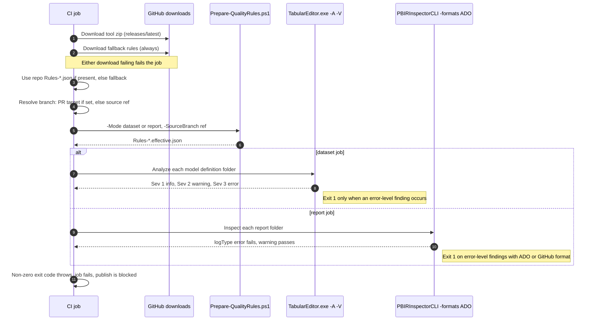

# Chapter 3 — Quality Gates

*Platform Development: For Enterprise Power BI and Microsoft Fabric*

Most Power BI teams already have standards—in a center-of-excellence deck, a reviewer's head, or a checklist pinned to a Teams channel: no floating-point columns, hide the foreign keys, format every measure, keep pages readable. What most teams lack is a way to know, before a merge, which of those standards a change was actually held to. A standard enforced by whoever reviews the pull request is a preference. It becomes a gate only when a machine applies it the same way every time and a person can predict the result.

This chapter is about building that machine from two community rule engines, a source-controlled baseline, and one short PowerShell script that decides how strict to be.

## A gate is a rule set you can predict

**Claim:** In a branch-aware BI repository, a quality gate is predictable only when authors can inspect the exact rule set for the target branch, know which findings produce a failing exit code, and trace every approved deviation to a time-bounded record. Versioned baselines and generated effective rules make that predictability repeatable rather than dependent on reviewer memory.

<!-- EDITORIAL: reworded from a four-part necessary-condition definition to a falsifiable outcome claim, per reviewer feedback that the original read as a definition of "gate" rather than a testable position, and bundled enforceability, observability, and exception governance as equally necessary when they aren't. -->


Try the test on your own pipeline. Pick an open pull request and, without running anything, write down which rules could fail it and which could only warn. If you can't, you have quality checks, not a gate. In this repository the answer depends on three interacting layers—the baseline files, `Prepare-QualityRules.ps1`, and the tools' own severity handling—and it is not what most people guess from reading any one of them.

For report and model authors, the sections on the two rule vocabularies, the branch policy, and exceptions explain why a change that passed on your branch can fail on its pull request and what to do about it. For platform engineers, the sections on wiring, tool downloads, and adapter differences are where the gate's reliability is won or lost.

## Green on the branch, red on the pull request

The characteristic failure of a branch-aware quality gate is not a rule that fires. It is a rule that fires somewhere the author didn't expect. The repository documents both halves in `docs/Troubleshooting.md`: "a dataset rule triggers on `main` or `develop` but not on a feature branch," and "a report rule is only blocking on `main` or `develop`." The troubleshooting guide explains the mechanism accurately. What it cannot do is prevent the reaction that usually follows.

> **ILLUSTRATIVE SCENARIO — The Rule That Waited for the Pull Request**
>
> *This scenario is a composite assembled from troubleshooting patterns the repository documents; it does not describe a single incident. The facts are single-sourced in `docs/Troubleshooting.md` ("Dataset Rules Behave Differently on Branches," "Report Rules Behave Differently on Branches," "A Rule Is Too Noisy," and "Tool Download Failures in CI") and `docs/faq.md` ("The Dataset Quality Rules job fails. How do I read the failure output?").*
>
> A model author builds out a finance report and model in a feature workspace. Every push runs the pipeline, and every run is green. She opens a pull request into `main`, and the report-rules job fails on a rule she has never seen fail: `SHOW_AXES_TITLES`, which her team's `Rules-Report.json` defines as a warning. Several charts hide their axis titles by design, because the titles repeat the visual header.
>
> The first instinct in the pull request thread is the wrong one. A teammate suggests changing the rule's `logType` in `Rules-Report.json` as part of the same pull request, or setting `disabled` to `true`, and merging. It would work. It would also weaken the standard for every report in the repository, bury the decision inside an unrelated feature, and leave no record of who approved it or for how long.
>
> The platform engineer explains what actually happened. On a feature-branch push, `Prepare-QualityRules.ps1` keeps five named report rules at `warning`. On a pull request targeting `main`, it promotes those same five to `error`, and Fab Inspector returns a failing exit code for error-level findings. The rule didn't change between runs; the policy did, because the target branch did. The same week, a second author on the dataset side notices something odder: a severity-2 rule she expected to block on `main` only produced a warning. That one takes longer to explain.
>
> **What changed after this:** the team stopped editing baseline files inside feature pull requests. Legitimate deviations went into `policy-exceptions.json` with an owner, a reason, an approver, and an expiry date, and the team adopted `New-EffectiveQualityRules.ps1` as the mechanism for applying those exceptions — wiring it into the pipeline is a change you still have to make yourself; as shipped, none of the three pipelines calls it. Authors began running `Prepare-QualityRules.ps1` locally with `-SourceBranch refs/heads/main` before opening a pull request, so the strict rule set was never a surprise. And the team wrote down, per rule severity, what blocks and what warns—which turned out to be the most useful page in their standard.

<!-- EDITORIAL: corrected the Field Note's "what changed" resolution, which had implied the exception script was wired into a pipeline; the chapter's own later section (below) confirms none of the three shipped pipelines calls it. Per reviewer feedback, this blurred the repository's current state with its recommended end state. -->


The pattern to take away is that branch-aware strictness is sound, but it moves the moment of truth from the push to the pull request. If authors can't preview the strict rule set, they meet it for the first time in front of a reviewer, and the pressure to weaken the rule arrives at the same moment.

## Two engines, two vocabularies

The repository gates semantic models with Tabular Editor 2's Best Practice Analyzer and reports with Fab Inspector, formerly published as PBI Inspector V2, whose README describes it as a community project not supported by Microsoft. Neither engine is a Microsoft product, and they express strictness in different vocabularies.

Dataset rules live in `shared/Rules-Dataset.json`, a JSON array of BPA rules. Each has a stable `ID`, a `Scope` of Tabular Object Model types, a boolean `Expression` that returns true on a violation, an optional `FixExpression`, and an integer `Severity`.

**Listing 3.1 — `shared/Rules-Dataset.json`, lines 2–12.** One dataset rule from the repository's BPA baseline.

```json
  {
    "ID": "AVOID_FLOATING_POINT_DATA_TYPES",
    "Name": "[Performance] Do not use floating point data types",
    "Category": "Performance",
    "Description": "The \"Double\" floating point data type should be avoided, as it can result in unpredictable roundoff errors and decreased performance in certain scenarios. Use \"Int64\" or \"Decimal\" where appropriate (but note that \"Decimal\" is limited to 4 digits after the decimal sign).",
    "Severity": 2,
    "Scope": "DataColumn, CalculatedColumn, CalculatedTableColumn",
    "Expression": "DataType = \"Double\"",
    "FixExpression": "DataType = DataType.Decimal",
    "CompatibilityLevel": 1200
  },
```

The repository's baseline contains 70 rules: 18 at severity 1, 40 at severity 2, and 12 at severity 3. It closely tracks the `BPARules.json` published in the `microsoft/Analysis-Services` GitHub repository, which the pipelines download as a fallback; on September 24, 2026 that upstream file contained 71 rules, the extra one being `NUMERIC_COLUMN_SUMMARIZE_BY` at severity 3. That single difference will matter shortly.

Report rules use a different shape: an object with a top-level `rules` array, where each rule has an `id`, an `itemType` and `part` that scope it to the report structure, a `test` written in JSON logic, a `disabled` flag, and a `logType` of `warning` or `error`.

**Listing 3.2 — `shared/examples/Rules-Report.json`, lines 4–10.** The identifying fields of one report rule.

```json
      "id": "REDUCE_PAGES",
      "name": "Reduce number of pages per report",
      "description": "Keep reports concise enough for users to navigate quickly.",
      "logType": "warning",
      "itemType": "Report",
      "part": "Pages",
      "disabled": false,
```

That file lives under `shared/examples/`. As of this writing there is no `shared/Rules-Report.json` in the repository, although `docs/faq.md`, Lab 2, and `shared/pbip-local/README.md` all describe one. Every pipeline looks for `Rules-Report.json` in the project root and, finding none, falls back to Fab Inspector's upstream `Base-rules.json` downloaded at run time. Until you commit your own report baseline, your report gate is whatever that upstream file contains on the day the pipeline runs—so the first practical step is to generate and commit one with the Enterprise Standards Builder.

The two vocabularies map to blocking behavior differently, and I verified both on September 24, 2026 with the tool versions the pipelines' `releases/latest` URLs returned that day: Tabular Editor 2.29.0 and Fab Inspector 3.4.0.

For Tabular Editor, the pipeline runs `TabularEditor.exe "<model definition>" -A "<rules>" -V`. The `-V` switch makes Tabular Editor emit Azure DevOps logging commands, and its documentation states that severity 1 findings are informational, severity 2 findings are warnings, and severity 3 or higher are errors, with exit code 1 only when an error-level output occurs. My runs matched: a severity-1 violation exited 0; a severity-2 violation emitted `##vso[task.logissue type=warning;]` and `task.complete result=SucceededWithIssues` and exited 0; a severity-3 violation emitted an error, `result=Failed`, and exited 1.

For Fab Inspector, the pipeline runs `PBIRInspectorCLI.exe -fabricitem "<report folder>" -rules "<rules>" -formats "ADO"`. With the `ADO` or `GitHub` format, a failing rule whose `logType` is `error` exited 1 and a failing `warning` rule exited 0. With the default `Console` format, the same failing error-level rule exited 0. If anyone "simplifies" the pipeline's `-formats` argument, the report gate silently stops blocking.

## How the branch becomes a policy

`shared/scripts/Prepare-QualityRules.ps1` sits between the baseline and the tools. The pipelines never pass a baseline file to either engine directly; they pass the effective file this script writes. An identical copy lives in `shared/universal-pipeline/scripts/` for the shared-template pattern.

**Listing 3.3 — `shared/scripts/Prepare-QualityRules.ps1`, lines 20–49.** Normalizing whatever branch value the CI platform supplies into one policy reference.

```powershell
function Test-UsableBranchRef {
    param([string]$Value)

    return ![string]::IsNullOrWhiteSpace($Value) -and $Value -notlike '$(*'
}

function ConvertTo-BranchRef {
    param([string]$Value)

    if (!(Test-UsableBranchRef -Value $Value)) {
        return ''
    }

    if ($Value.StartsWith('refs/', [System.StringComparison]::OrdinalIgnoreCase)) {
        return $Value
    }

    return "refs/heads/$Value"
}

$outputDirectory = Split-Path -Path $OutputPath -Parent
if ($outputDirectory) {
    New-Item -ItemType Directory -Path $outputDirectory -Force | Out-Null
}

$sourceBranchRef = ConvertTo-BranchRef -Value $SourceBranch
$targetBranchRef = ConvertTo-BranchRef -Value $TargetBranch
$policyBranchRef = if (Test-UsableBranchRef -Value $targetBranchRef) { $targetBranchRef } else { $sourceBranchRef }
$strictBranchRefs = @('refs/heads/main', 'refs/heads/develop')
$isStrictBranch = $strictBranchRefs -contains $policyBranchRef
```

Lines 20 to 24 define what counts as a usable branch value: not blank, and not an unexpanded Azure Pipelines macro that still reads `$(…)`. Lines 26 to 38 normalize a bare name such as `main` into `refs/heads/main` while leaving anything already beginning with `refs/` alone. That normalization exists because the platforms don't agree on format: Microsoft's predefined-variables reference gives `refs/heads/main` for `System.PullRequest.TargetBranch` in Azure Repos and plain `main` for a GitHub repository. Line 47 prefers `-TargetBranch` when one is supplied, and lines 48 and 49 define strictness as membership in exactly two refs, `main` and `develop`.

**Listing 3.4 — `shared/scripts/Prepare-QualityRules.ps1`, lines 51–58.** Dataset mode filters by severity.

```powershell
if ($Mode -eq 'dataset') {
    $rules = Get-Content -Path $SourcePath -Raw | ConvertFrom-Json
    $minimumSeverity = if ($isStrictBranch) { 2 } else { 3 }
    $effectiveRules = @($rules | Where-Object { [int]$_.Severity -ge $minimumSeverity })
    $effectiveRules | ConvertTo-Json -Depth 100 | Set-Content -Path $OutputPath -Encoding UTF8
    Write-Host "Prepared dataset rules for $policyBranchRef with minimum severity $minimumSeverity."
    exit 0
}
```

Dataset strictness changes coverage, not the blocking threshold. Feature branches evaluate 12 severity-3 rules, all of which can fail the job. `main` and `develop` add 40 severity-2 rules, but Tabular Editor reports those as warnings; severity-1 rules never run. Therefore a strict branch evaluates 52 rules but still blocks on the same 12 — which is why the second author's severity-2 rule warned instead of failing. "Strict" in dataset mode means *more visible*, not *more blocking*.

<!-- EDITORIAL: condensed per reviewer feedback that the original repeated the same distinction across several sentences; this keeps every decision-relevant number while landing the key point faster. -->


**Listing 3.5 — `shared/scripts/Prepare-QualityRules.ps1`, lines 60–80.** Report mode defaults missing log types and promotes five named rules on strict branches.

```powershell
$mainOnlyBlockingWarnings = @(
    'REDUCE_VISUALS_ON_PAGE',
    'REDUCE_OBJECTS_WITHIN_VISUALS',
    'REDUCE_PAGES',
    'SHOW_AXES_TITLES',
    'GIVE_VISIBLE_PAGES_MEANINGFUL_NAMES'
)

$reportRules = Get-Content -Path $SourcePath -Raw | ConvertFrom-Json
foreach ($rule in $reportRules.rules) {
    if ($rule.PSObject.Properties.Name -notcontains 'logType' -or [string]::IsNullOrWhiteSpace($rule.logType)) {
        $rule | Add-Member -NotePropertyName logType -NotePropertyValue 'warning'
    }

    if ($mainOnlyBlockingWarnings -contains $rule.id) {
        $rule.logType = if ($isStrictBranch) { 'error' } else { 'warning' }
    }
}

$reportRules | ConvertTo-Json -Depth 100 | Set-Content -Path $OutputPath -Encoding UTF8
Write-Host "Prepared report rules for $policyBranchRef. Strict-branch blocking rules promoted: $isStrictBranch"
```

Report mode works differently. Lines 69 to 72 give any rule without a `logType` the value `warning`. Lines 74 to 76 then touch only the five rule IDs hard-coded on lines 60 to 66, setting each to `error` on a strict branch and to `warning` everywhere else—including when the baseline already says `error`. Every other rule keeps whatever `logType` the baseline gives it. In report mode, therefore, strictness really does mean *more blocking*, but only for those five IDs and only if your baseline uses them.

I ran the script against the repository's baseline and example files with several branch values to make the behavior concrete. Every row below is observed output, not inference.

| `-SourceBranch` value | Policy reference logged | Dataset minimum severity | Dataset rules kept |
|---|---|---|---|
| `refs/heads/feature/sales-ytd` | `refs/heads/feature/sales-ytd` | 3 | 12 |
| `refs/heads/main` | `refs/heads/main` | 2 | 52 |
| `main` | `refs/heads/main` | 2 | 52 |
| `develop` | `refs/heads/develop` | 2 | 52 |
| `refs/pull/42/merge` | `refs/pull/42/merge` | 3 | 12 |
| `$(System.PullRequest.TargetBranch)` | *(blank)* | 3 | 12 |

The last two rows are the ones to remember. If a pull-request build reaches the script without a resolved target branch, the script falls back to the source ref, which for a pull request is a `refs/pull/…` ref, and the lenient policy applies. The script does not fail; it logs `Prepared dataset rules for  with minimum severity 3.`, with a telltale double space where the branch should be. Search your logs for that line.

Against `shared/examples/Rules-Report.json` on `main`, four rules became errors—`REDUCE_PAGES`, `REDUCE_VISUALS_ON_PAGE`, `SHOW_AXES_TITLES`, and `GIVE_VISIBLE_PAGES_MEANINGFUL_NAMES`—because the fifth promoted ID, `REDUCE_OBJECTS_WITHIN_VISUALS`, is not in that file. Against the upstream `Base-rules.json` the pipelines fall back to, only three of the five IDs were present on the day I checked. And a rule with a custom ID, such as the `report-page-visual-density` rule Lab 4 has participants create in the Rule Designer, is never promoted no matter what severity the lab sets for protected branches, because promotion is keyed to the literal IDs in the script.

One defect is worth knowing before it bites. Line 70 treats a rule whose `logType` exists but is blank as missing, and line 71 then tries to add a property that already exists. With `$ErrorActionPreference` set to `Stop`, the script fails with "Cannot add a member with the name "logType" because a member with that name already exists," exits 1, and writes no output file; I reproduced this with a one-rule file whose `logType` was an empty string. The job fails closed, which is the right direction, but the message points at the script rather than the rule. Remove empty `logType` values from generated files, or add `-Force` to the `Add-Member` call.

### Previewing the gate locally

Authors can see the strict rule set before a reviewer does. From the repository root, with PowerShell 7:

```powershell
pwsh -File shared/scripts/Prepare-QualityRules.ps1 -Mode dataset `
  -SourcePath shared/Rules-Dataset.json -OutputPath out/Rules-Dataset.effective.json `
  -SourceBranch refs/heads/main
pwsh -File shared/scripts/Prepare-QualityRules.ps1 -Mode report `
  -SourcePath shared/examples/Rules-Report.json -OutputPath out/Rules-Report.effective.json `
  -SourceBranch refs/heads/main
```

The first prints `Prepared dataset rules for refs/heads/main with minimum severity 2.` and writes 52 rules; the second prints `Prepared report rules for refs/heads/main. Strict-branch blocking rules promoted: True`. Point the report command at your own `Rules-Report.json` once it exists, and add `-ExecutionPolicy Bypass` where your machine requires it, as `docs/Local-Validation-Guide.md` shows.

### Figure 3.1 — One quality job, end to end



## Wiring the gate on three platforms

The three adapters run the same script and tools but differ in where they get the branch, which Windows runner they use, how they invoke the tools, and how a job is skipped. This section is for the platform engineer.

### Where the branch comes from

Azure DevOps reads the pull-request target from `SYSTEM_PULLREQUEST_TARGETBRANCH` and otherwise uses `BUILD_SOURCEBRANCH`.

**Listing 3.6 — `azdo/azure-pipelines.yml`, lines 107–112.** Azure DevOps chooses the policy branch inside the inline script.

```yaml
    $effectiveRulesPath = Join-Path $tempPath "Rules-Dataset.effective.json"
    $qualityBranch = $env:BUILD_SOURCEBRANCH
    $pullRequestTargetBranch = $env:SYSTEM_PULLREQUEST_TARGETBRANCH
    if (![string]::IsNullOrWhiteSpace($pullRequestTargetBranch)) {
        $qualityBranch = $pullRequestTargetBranch
    }
```

Microsoft documents that `System.PullRequest.TargetBranch` is initialized only when the build ran because of a pull request affected by a branch policy. For Azure Repos that is the normal case, but any build where the variable is absent falls through to the lenient policy, as the table above shows.

GitHub Actions reads `GITHUB_BASE_REF`, which GitHub sets only for `pull_request` and `pull_request_target` events, and prefixes it with `refs/heads/` itself. It also adds a guard the other adapters lack.

**Listing 3.7 — `.github/workflows/powerbi-ci.yml`, lines 115–131.** GitHub Actions resolves the branch and refuses to run if the fallback rules were used.

```yaml
    $effectiveRulesPath = Join-Path $tempPath "Rules-Dataset.effective.json"
    $qualityBranch = "$env:GITHUB_REF"
    if (![string]::IsNullOrWhiteSpace($env:GITHUB_BASE_REF)) {
        $qualityBranch = "refs/heads/$env:GITHUB_BASE_REF"
    }

    & (Join-Path $repoPath "scripts\Prepare-QualityRules.ps1") `
    -Mode dataset `
    -SourcePath $sourceRulesPath `
    -OutputPath $effectiveRulesPath `
    -SourceBranch $qualityBranch

    $effectiveRules = Get-Content -Path $effectiveRulesPath -Raw | ConvertFrom-Json
    Write-Host "Effective dataset rule count: $(@($effectiveRules).Count)"
    if ($effectiveRules.ID -contains 'NUMERIC_COLUMN_SUMMARIZE_BY') {
        throw "Effective dataset rules still include NUMERIC_COLUMN_SUMMARIZE_BY. Add or refresh shared/Rules-Dataset.json."
    }
```

Lines 127 to 131 are a clever piece of defense. The repository's baseline deliberately omits `NUMERIC_COLUMN_SUMMARIZE_BY`, which the upstream fallback file contains at severity 3. If that ID appears in the effective rules, the job must have fallen back to the downloaded file, and it fails with an instruction to refresh `shared/Rules-Dataset.json`. That turns a silent fallback into a loud one. Azure DevOps and GitLab would benefit from the same guard.

GitLab reads `CI_MERGE_REQUEST_TARGET_BRANCH_NAME`, which is populated in merge-request pipelines, and otherwise `CI_COMMIT_REF_NAME`.

**Listing 3.8 — `gitlab/gitlab-ci.yml`, lines 100–104.** GitLab derives the policy branch from merge-request variables.

```yaml
      $effectiveRulesPath = Join-Path $tempPath "Rules-Dataset.effective.json"
      $qualityBranch = "refs/heads/$env:CI_COMMIT_REF_NAME"
      if (![string]::IsNullOrWhiteSpace($env:CI_MERGE_REQUEST_TARGET_BRANCH_NAME)) {
          $qualityBranch = "refs/heads/$env:CI_MERGE_REQUEST_TARGET_BRANCH_NAME"
      }
```

Because GitLab's workflow rules in this file admit both branch pipelines and merge-request pipelines, a push to a branch with an open merge request can produce one lenient run and one strict run for the same commit. Only the merge-request run represents the gate.

### Runners, invocation, and output

All three adapters require Windows for these tools. Azure DevOps uses `windows-2022`; GitHub uses `windows-latest`; GitLab requires a self-managed runner tagged `windows`, whose scripts write to `$env:TEMP` rather than a platform temp variable.

**GitLab prerequisite:** the downloaded Fab Inspector CLI build is framework-dependent. When I ran it on a machine without a .NET 8 x64 runtime, it exited before evaluating anything, with "Failed to resolve hostfxr.dll" and a request for `apphost_version=8.0.28`. Validate that runtime on self-managed runners, and recheck the software list of any hosted image you rely on when it changes.

<!-- EDITORIAL: split the runner paragraph so the platform choice and the .NET runtime prerequisite are separately actionable, per reviewer feedback that the original bundled too many independent decisions into one paragraph. -->


Tabular Editor is started the same way everywhere, following its documentation's advice for PowerShell tasks: `Start-Process` with `-Wait -PassThru`, then a check of the process exit code.

**Listing 3.9 — `azdo/azure-pipelines.yml`, lines 153–159.** Azure DevOps runs Tabular Editor and throws on a non-zero exit code.

```yaml
Write-Host "##[group]Running rules for: '$itemPath'"
$process = Start-Process -FilePath $toolPath -ArgumentList """$itemPath"" -A ""$rulesPath"" -V" -NoNewWindow -Wait -PassThru
Write-Host "##[endgroup]"

if ($process.ExitCode -ne 0) {
    throw "Tabular Editor rules failed for $itemPath with exit code $($process.ExitCode)"
}
```

GitHub's version also redirects standard output and standard error to files and replays them, sending stderr lines through `Write-Error`. Because GitHub prepends `$ErrorActionPreference = 'stop'` to `pwsh` scripts, the first replayed stderr line ends the step, so on GitHub any stderr output from Tabular Editor fails the job even when its exit code is 0. For Fab Inspector, Azure DevOps and GitLab use the same `Start-Process` pattern, while GitHub calls the executable directly and checks `$LASTEXITCODE`.

**Listing 3.10 — `.github/workflows/powerbi-ci.yml`, lines 299–306.** GitHub Actions invokes Fab Inspector with the call operator.

```yaml
foreach ($itemFolder in $itemsFolders) {
    $itemPath = $itemFolder.Directory.FullName
    Write-Host "Running rules for: $itemPath"
    & $toolPath -fabricitem "$itemPath" -rules "$rulesPath" -formats "ADO"
    if ($LASTEXITCODE -ne 0) {
        throw "Fab Inspector rules failed for $itemPath with exit code $LASTEXITCODE"
    }
}
```

All three adapters pass `-formats "ADO"`. On Azure DevOps that produces native logging commands. On GitHub and GitLab the same `##vso[…]` lines appear as plain text, and nothing is annotated. Fab Inspector's CLI reference also lists a `GitHub` format that emits Actions-compatible annotations. In my test it produced the same exit codes as `ADO`, so switching the GitHub adapter to it is a low-risk improvement. Tabular Editor has a matching `-G` switch for GitHub workflow commands, according to its documentation.

### Skipping, and what a skip means downstream

The adapters disagree most about skipping. The project-local Azure DevOps file offers no skip switch. The shared template under `shared/universal-pipeline/` offers `skipDatasetRules` and `skipReportRules` parameters that remove the jobs at compile time. GitLab honors `SKIP_DATASET_RULES` and `SKIP_REPORT_RULES` variables through rules that set `when: never`. GitHub is the subtle one. The workflow defines `workflow_dispatch` inputs such as `skip_dataset_rules` and folds them into workflow-level environment variables, but each job's `if:` condition reads only the repository variables `vars.PBIP_CI_SKIP_DATASET_RULES` and `vars.PBIP_CI_SKIP_REPORT_RULES`. As written, the manual-run inputs do not skip anything; only the repository variables do.

Downstream, a skipped quality job is treated as acceptable. GitHub's publish job accepts `success` or `skipped` for each quality job. GitLab's publish job lists the quality jobs as `optional` needs. In Azure DevOps, a removed job simply isn't part of the stage. That means a skip anywhere is a policy decision, not a convenience, and it should be recorded as one.

## When the downloads fail

Every quality job begins by downloading its tool and a fallback rule file from GitHub.

**Listing 3.11 — `azdo/azure-pipelines.yml`, lines 74–93.** Both downloads run unconditionally at the start of the dataset job.  

```yaml
- task: PowerShell@2
    displayName: 'Download Tabular Editor and fallback rules'
    inputs:
    targetType: 'inline'
    script: |
        $tempPath = Join-Path "$(Agent.TempDirectory)" "pbip-quality"
        $toolPath = Join-Path $tempPath "TE"

        New-Item -ItemType Directory -Path $tempPath -Force | Out-Null
        New-Item -ItemType Directory -Path $toolPath -Force | Out-Null

        Write-Host "##[debug]Downloading Tabular Editor binaries"
        $downloadUrl = "https://github.com/TabularEditor/TabularEditor/releases/latest/download/TabularEditor.Portable.zip"
        $zipFile = Join-Path $tempPath "TabularEditor.zip"
        Invoke-WebRequest -Uri $downloadUrl -OutFile $zipFile
        Expand-Archive -Path $zipFile -DestinationPath $toolPath -Force

        Write-Host "##[debug]Downloading dataset fallback rules"
        $rulesUrl = "https://raw.githubusercontent.com/microsoft/Analysis-Services/master/BestPracticeRules/BPARules.json"
        Invoke-WebRequest -Uri $rulesUrl -OutFile (Join-Path $tempPath "Rules-Dataset.fallback.json")
```

Three properties of that step shape the gate's failure behavior. Both downloads are unconditional, so a runner that can reach the Tabular Editor release but not `raw.githubusercontent.com` fails a job that would never have used the fallback file. The tool URLs use `releases/latest`, so the version floats; the next run may get something newer than the versions I tested without any change to the repository. And a failed download fails the job, which blocks artifact publication on all three platforms. The gate fails closed—the right default—but a network restriction looks exactly like a quality failure until someone reads the log.

The troubleshooting guide's list of causes—transient release availability, network restrictions on the agent, and upstream asset-name changes—is accurate. The asset-name risk is not hypothetical. The Fab Inspector repository has been renamed from `PBI-InspectorV2` to `fab-inspector`. On September 24, 2026 the pipelines' old URLs still resolved, the release still contained `win-x64/CLI/PBIRInspectorCLI.exe` at the path the jobs expect, and the old raw URL for `Base-rules.json` still returned the file. None of those facts is guaranteed tomorrow.

For an enterprise gate, pin tool versions to specific release URLs and log them, cache or mirror the archives inside your network, and make the fallback download conditional on the baseline being absent—or remove it and fail when the baseline is missing, as GitHub's guard effectively does for datasets.

## Exceptions without editing the baseline

The scenario's team needed a way to say "this report may hide axis titles until the end of the quarter, and here is who approved it" without touching the baseline. The repository has the pieces, but as shipped none of the three pipelines uses them.

The Policy Exception Register at `tools/policy-exception-register/index.html` records each exception's ID, rule ID, owner, approver, affected artifact, reason, mitigation, status, and expiration, and exports `policy-exceptions.json`. The script that consumes it is `shared/scripts/New-EffectiveQualityRules.ps1`, which merges the baseline, the same branch policy as `Prepare-QualityRules.ps1`, optional declarative overrides, and active exceptions into effective files plus a JSON and Markdown summary. Its definition of "active" is strict.

**Listing 3.12 — `shared/scripts/New-EffectiveQualityRules.ps1`, lines 34–41.** Only approved exceptions with a future or current expiry date take effect.

```powershell
function Test-ActiveException {
    param($Exception)
    if (!$Exception) { return $false }
    if ($Exception.status -ne 'approved') { return $false }
    if ([string]::IsNullOrWhiteSpace($Exception.expiresOn)) { return $false }
    $expires = [datetime]::Parse($Exception.expiresOn).Date
    return $expires -ge (Get-Date).Date
}
```

An exception must be `approved` and must carry an `expiresOn` date that hasn't passed; anything else is recorded under `exceptionsIgnored` and the baseline applies. I tested three exceptions against the repository's files with `-TargetBranch main`. An approved, unexpired exception setting `SHOW_AXES_TITLES` to `warning` took effect after the branch promotion, so the rule warned on `main`. An approved exception for `REDUCE_PAGES` that had expired on 2026-08-01 was ignored, and the rule stayed at `error`. An approved dataset exception lowering `HIDE_FOREIGN_KEYS` to severity 1 removed it from the strict set, which dropped from 52 rules to 51. The generated `effective-rules-summary.md` listed the two applied exceptions by ID.

That matches the governance controls in `docs/enterprise-quality-rules-pattern.md`: every exception has an owner, a reason, and an expiry, and an expired one reverts to the baseline. None of the three pipeline files calls the script today, so the wiring is yours to add: replace each "Prepare … rules for branch policy" step with one call to `New-EffectiveQualityRules.ps1`, passing the resolved target branch as `-TargetBranch` and your committed `policy-exceptions.json` as `-ExceptionsPath`, and publish the summary files as build artifacts. Expiry is compared with the runner's local date, and the Markdown summary lists applied exceptions but not ignored ones, which appear only in the JSON summary.

## Tools that produce and explain the rules

Three companion tools operationalize this chapter's model; they run locally in a browser and ship with the repository, not as Microsoft products. Use **Enterprise Standards Builder** to generate and commit a report/dataset rule baseline; use **Effective Rules Generator** to preview the exact target-branch policy before opening a pull request; and use **Policy Exception Register** to create the expiring exception file consumed by `New-EffectiveQualityRules.ps1`.

The Enterprise Standards Builder at `tools/enterprise-standards-builder/index.html` turns policy choices into both rule files and an auditable policy profile. It offers named profiles—Advisory adoption, Enterprise standard, and Strict enterprise gate—and parameters such as maximum pages and visuals per page. According to `docs/tool-walkthrough.md`, it adjusts pre-built policies but does not create new ones or edit raw JSON. It is the right tool for producing the missing `shared/Rules-Report.json`.


The Effective Rules Generator at `tools/effective-rules-generator/index.html` is the browser counterpart of `New-EffectiveQualityRules.ps1`. You load baselines, choose source and target branches, add overrides and exception JSON, and preview what CI would enforce before committing anything. It is the most direct way to answer the question this chapter opened with.


The Policy Exception Register creates the file the generator and script consume.


Two more browser tools are useful, but with a caveat. The Quality Rule Designer at `tools/rule-designer/index.html` is for authoring individual rules — it creates, edits, and deletes rules from templates or custom JSON logic and previews the JSON diff — but its output must be reconciled with the promotion mechanism: changing a rule's ID removes it from `Prepare-QualityRules.ps1`'s promotion list, and a new custom ID never joins that list.


The Rule Coverage Matrix, used in Lab 4, maps each written policy to an automated rule or a manual check. Use it to record which standards the gate enforces and which still rely on a reviewer.

<!-- EDITORIAL: reordered this section around the three tools that most directly answer the chapter's opening question, and moved the Rule Designer's promotion-list caveat immediately alongside it, per reviewer feedback that the original four-tool catalog diffused the tie-in and arrived too late. -->


## Diagnosing a failed or suspicious quality run

| What you see | What it usually means | What to do |
|---|---|---|
| `Tabular Editor rules failed for … with exit code 1` | A severity-3 rule fired, or the model failed to load. | Read the `##vso[task.logissue type=error;]` lines above it; a TMDL load error names the document and line. |
| A severity-2 rule appears only as a warning on `main` | Expected: Tabular Editor maps severity 2 to warning. | Raise the rule to severity 3 if it should block everywhere. |
| `Fab Inspector rules failed for … with exit code 1` | An error-level report rule failed, often one of the five promoted IDs on a strict branch. | Fix the report, or record an approved exception. |
| Report job passes with no findings at all | Missing `.platform` file, or a changed `-formats` value. | See Chapter 1 on `.platform`; keep `ADO` or `GitHub` format. |
| `Prepared dataset rules for  with minimum severity 3.` | The branch did not resolve; the lenient policy applied. | Check the PR target variable for your platform. |
| `Effective dataset rules still include NUMERIC_COLUMN_SUMMARIZE_BY` (GitHub) | The repository baseline wasn't found; the fallback was used. | Restore or correct `shared/Rules-Dataset.json` and `PROJECT_ROOT`. |
| Download step fails | Network egress, GitHub availability, or an asset-name change. | Check both URLs separately; pin and mirror tools. |

## Trade-offs and lighter paths

The full gate is worth building when several authors share standards and no reviewer can hold them all in mind. A single author or a pilot team can start with advisory rules: run both jobs, keep report rules at `warning` and dataset rules at severity 2 or lower, and treat the output as a checklist that blocks nothing. The Standards Builder's advisory profile exists for this stage. `docs/Rules-Authoring-Guide.md` recommends the same staged path in general terms—add a rule as advisory, fix most violations, then promote it to blocking on `main`—without prescribing a specific severity number; map that staged rollout onto severity 3 or `error` one rule at a time once the backlog of violations is cleaned up.

Teams that want to avoid Windows runners can use the shared template's skip parameters, as the FAQ shows, and keep only the Linux jobs. That removes model and report rules from CI entirely, so pair it with local BPA and Fab Inspector runs before each pull request. It is a lighter path, not an equivalent one.

Teams with many repositories should move in the other direction, toward the end state described in `docs/enterprise-quality-rules-pattern.md`. That means a central, versioned baseline consumed by tag, declarative project overrides instead of copied rule files, and exceptions that fail or revert when they expire. The shared template's `rulesDatasetPath` and `rulesReportPath` parameters are the first step.

The one shortcut I would never take is editing the baseline inside a feature pull request to get a build green. It changes the standard for everyone, silently, with no expiry. The exception register exists so that nobody has to.

## Evidence and further reading

Repository sources: `shared/scripts/Prepare-QualityRules.ps1` and its universal copy, `shared/scripts/New-EffectiveQualityRules.ps1`, `shared/Rules-Dataset.json`, `shared/examples/Rules-Report.json`, `shared/examples/policy-exceptions.json`, the three pipeline files, `shared/universal-pipeline/templates/fabric-ci.yml`, `docs/Troubleshooting.md`, `docs/faq.md` section 3, `docs/Rules-Authoring-Guide.md`, `docs/enterprise-quality-rules-pattern.md`, `docs/Local-Validation-Guide.md`, `docs/tool-walkthrough.md`, `tools/README.md`, and `docs/workshops/accelerator-toolkit/labs/lab4-standards-rules-policy.md`.

First-hand evidence, all gathered on September 24, 2026: the branch-policy table produced by running `Prepare-QualityRules.ps1`; the empty-`logType` failure; the exception behavior produced by running `New-EffectiveQualityRules.ps1`; the severity and exit-code behavior of Tabular Editor 2.29.0 and Fab Inspector 3.4.0 against small fixtures; the .NET runtime requirement of the downloaded Fab Inspector build; and HTTP checks of the pipelines' download URLs.

Upstream and official documentation:

- Tabular Editor 2 command-line options, BPA severity mapping, and exit codes: https://docs.tabulareditor.com/en/features/Command-line-Options.html
- Best Practice Analyzer rules published by Microsoft: https://github.com/microsoft/Analysis-Services/tree/master/BestPracticeRules
- Fab Inspector repository and CLI reference: https://github.com/NatVanG/fab-inspector and https://github.com/NatVanG/fab-inspector/blob/main/docs/cli-reference.md
- Azure Pipelines predefined variables, including `System.PullRequest.TargetBranch`: https://learn.microsoft.com/en-us/azure/devops/pipelines/build/variables
- Azure Repos branch policies and build validation: https://learn.microsoft.com/en-us/azure/devops/repos/git/branch-policies
- GitHub Actions variables, including `GITHUB_BASE_REF`: https://docs.github.com/en/actions/reference/workflows-and-actions/variables
- GitHub Actions contexts and job conditions: https://docs.github.com/en/actions/reference/workflows-and-actions/contexts
- GitLab predefined variables and merge-request pipelines: https://docs.gitlab.com/ci/variables/predefined_variables/ and https://docs.gitlab.com/ci/pipelines/merge_request_pipelines/
- Power BI project report folder and PBIR: https://learn.microsoft.com/en-us/power-bi/developer/projects/projects-report

## Freshness note

Last verified September 24, 2026. The tool behaviors in this chapter were observed with Tabular Editor 2.29.0 and Fab Inspector 3.4.0, the versions the pipelines' floating `releases/latest` URLs returned that day. Tabular Editor's documentation also describes a cross-platform successor CLI, `te`, as a limited public preview with a stated expiry of October 31, 2026, and recommends `TabularEditor.exe` for production pipelines for now; revisit that before you rely on either. Fab Inspector's README describes it as a community project not supported by Microsoft, and its repository has been renamed from `PBI-InspectorV2`. If you pin versions, as recommended above, rerun the severity and exit-code experiments whenever you move the pin.

## Reader decision checklist

1. Is there a committed `Rules-Report.json` and `Rules-Dataset.json` in the folder your pipeline treats as the project root, or is your report gate running on a file downloaded at build time?
2. For a pull request into `main` today, which dataset rules can block (severity 3 and above) and which can only warn? Can every author on the team answer that?
3. Which of the five report rule IDs that `Prepare-QualityRules.ps1` promotes exist in your baseline, and should any custom rule IDs be added to that list?
4. Does every adapter resolve the pull-request target branch reliably, and would you notice the log line that shows it didn't?
5. Are your tool versions pinned, and can your runners reach the download URLs, or a mirror of them?
6. Are exceptions recorded in `policy-exceptions.json` with an owner, approver, and expiry, and does your pipeline actually consume that file?
7. Who is allowed to skip a quality job on each platform, and where is a skip recorded?
8. Is your Fab Inspector output format still `ADO` or `GitHub`, so error-level findings produce a failing exit code?
