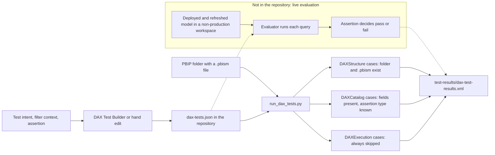

# Chapter 4 — DAX Testing

*Platform Development: For Enterprise Power BI and Microsoft Fabric*

A semantic model is the part of a Power BI solution that most resembles application code and is least often treated like it. Measures branch, iterate, and depend on one another; a change to one relationship or one filter-context modifier can move a number on a page nobody opened during review. Yet the usual evidence that a measure is correct is that someone looked at a card visual and the number seemed plausible. This chapter is about replacing that glance with a test—and about being exact regarding what the repository's test harness does today, because the gap between what it validates and what it appears to validate is the most important thing in this chapter.

## A DAX test is a question asked in a specific filter context

This chapter's default is simple: do not report DAX catalog validation as measure validation. An enabled test is meaningful only when it states its business intent, filter context, and machine-decidable assertion—and when the pipeline identifies whether that assertion was actually evaluated. A versioned catalog is useful evidence; it is not evidence that a measure ran.

<!-- EDITORIAL: narrowed the claim to one central, falsifiable position per reviewer feedback that the original bundled test-design guidance with CI-reporting honesty as if they were a single indivisible discipline. -->

The repository demonstrates the narrower claim directly: its current runner can accept a nonexistent measure and an invalid query because it validates catalog metadata rather than evaluating DAX. If that distinction is hidden in CI, a green result overstates what reviewers know. Teams may reasonably choose manual execution or automated execution, but they should not call either absent evidence a passing semantic test.

<!-- EDITORIAL: replaced the broader "visual review vs. live queries" falsification claim, which the chapter's own evidence didn't fully support, with the narrower comparison the runs actually demonstrate. -->


Model authors should read the sections on test intent, the catalog, and the DAX Test Builder; those determine whether a test means anything. Platform engineers should read the runner walkthrough, the JUnit and adapter sections, and the extension pattern, which is where a metadata check can become a real gate—or be mistaken for one.

## The number that stayed green

The failure mode is quiet by construction. A measure is renamed, a calculation group changes precedence, or a relationship flips from single to both directions. The report still renders. The pipeline still passes, because what the pipeline checks is the shape of a JSON file, not the value of a measure. The first person to notice is a business user comparing a slide with last month's.

> **ILLUSTRATIVE SCENARIO — Seven Checks, Zero Evaluations**
>
> *This scenario is a composite built from patterns the repository documents; it does not describe a single incident. The facts are single-sourced in `docs/Troubleshooting.md` ("DAX Test Stage Shows Skipped DAX Execution"), `docs/faq.md` ("DAX test results are not appearing in the Azure DevOps Tests tab" and "The CI pipeline validates structure but there are no DAX measures in the model. Why does `run_dax_tests.py` still run?"), and the runner's own docstring.*
>
> A finance team adopts the toolkit and sees a DAX test stage in every pipeline run. The Azure DevOps **Tests** tab shows seven results and no failures. Two of the seven are named `TOTAL_SALES_CURRENT_YEAR.Execution` and `MARGIN_PERCENT_VALID_RANGE.Execution`, which reads to a busy reviewer like two measures that were checked.
>
> A model author renames `[Total Sales]` to `[Net Sales]` as part of a pricing change. Nobody edits the catalog. The next run is still green with seven checks. So is the one after it, and the one after the author deletes an obsolete relationship that `[Margin %]` depended on. Weeks later an analyst asks why the margin card on the executive page is blank.
>
> The retrospective finds the explanation in the XML. Both `.Execution` cases were marked `skipped` with the message "DAX query execution is not configured yet." The two `.Metadata` cases passed because the catalog entries were well-formed; nothing compared them with the model. The troubleshooting guide had said as much—"treat current execution-skipped tests as metadata coverage, not full semantic validation"—but the pipeline summary did not.
>
> **What changed after this:** the team renamed its dashboard tile from "DAX tests" to "DAX catalog checks," added a pipeline step that fails when any test marked `severity: "error"` is skipped on `main`, and scheduled the evaluator work described at the end of this chapter as a tracked backlog item instead of an assumption.

The pattern to take away is not that the runner is wrong. Its docstring and its skip messages are candid. The failure is that nobody made the difference between *validated metadata* and *evaluated measure* visible at the point where people decide whether to merge.

## Designing the test before the harness

The operating model has three parts: write the test as a precise question, store it in a catalog whose fields a machine can check, and let the harness report each layer of checking separately. The harness is the smallest of the three.

### Intent, context, and assertion

Start with intent, because it decides everything else. "Revenue is not blank for the current fiscal year" protects a different thing from "Revenue reconciles to the sum of its order lines." The first catches a broken relationship or a filter that eliminates every row. The second catches a logic error that still produces a plausible number. Write the intent as a sentence a business owner would sign.

Filter context is where most DAX tests silently lose meaning. A measure has no value in the abstract; it has a value under a set of filters. `[Revenue YTD]` evaluated with no filter on the calendar table is a different question from the same measure evaluated for June 2026. A test must therefore pin the context it asserts about—by year, by month, by a known customer or product, or by a deliberately empty slice when the intent is to check blank handling. When the context is left implicit, the test depends on whatever the evaluator's defaults happen to be, and a harmless change to a date table can flip the result.

The assertion is the last decision. Point assertions such as `equals` fit reconciliations against known totals. Range assertions such as `between` fit ratios. Relational assertions—one measure compared with another under the same context—fit invariants like "year-to-date is at least the current period for an additive, non-negative metric." Every assertion needs a tolerance, because floating-point arithmetic and rounding in source systems make exact equality brittle.

### The catalog's actual shape

The repository's catalog format captures all of this. Here is the first entry in the default catalog at `shared/dax-tests.json`.

**Listing 4.1 — `shared/dax-tests.json`, lines 7–35.** A complete test entry: intent, owner, filter context, assertion, and the DAX query an evaluator would run.

```json
    {
      "id": "TOTAL_SALES_CURRENT_YEAR",
      "name": "Total Sales current-year baseline",
      "enabled": true,
      "severity": "error",
      "owner": "Finance BI",
      "measure": {
        "table": "Sales Measures",
        "name": "[Total Sales]"
      },
      "scenario": "Protects executive revenue reporting by validating the current-year sales baseline.",
      "filterContext": [
        "Calendar[Year]=2026"
      ],
      "assertion": {
        "type": "greaterThanOrEqual",
        "expected": 1000000,
        "tolerance": {
          "value": 0,
          "type": "absolute"
        }
      },
      "tags": [
        "finance",
        "executive",
        "baseline"
      ],
      "query": "EVALUATE ROW(\"Actual\", CALCULATE([Total Sales], Calendar[Year] = 2026))"
    },
```

Read the fields as answers to the three design questions. `scenario` records intent. `filterContext` records the context in a human-readable form, and `query` expresses the same context as executable DAX—`CALCULATE([Total Sales], Calendar[Year] = 2026)` wrapped in `EVALUATE ROW` so that a single named column, `Actual`, comes back. `assertion` carries the type, the expected value, and a tolerance. `severity`, `owner`, and `tags` make the test governable. Note that `filterContext` and `query` say the same thing twice, and nothing in the repository checks that they still agree. If someone edits one and not the other, the catalog describes one test and would execute another.

The richer patterns live in `shared/examples/dax-tests.json`, a twelve-test starter catalog whose description says the tests "should be customized to each semantic model before enabling." Every entry there has `"enabled": false` and `"requiresCustomization": true`. The reconciliation test shows how relational assertions are expressed.

**Listing 4.2 — `shared/examples/dax-tests.json`, lines 172–186.** A relational assertion: the query returns both the actual and the expected value in one row.

```json
      "assertion": {
        "type": "equalsExpression",
        "expectedExpression": "[Total Revenue] - [Total Cost]",
        "tolerance": {
          "value": 0.01,
          "type": "absolute"
        }
      },
      "tags": [
        "finance",
        "reconciliation",
        "derived-measure"
      ],
      "query": "EVALUATE ROW(\"Actual\", CALCULATE([Gross Margin], Calendar[Year] = 2026), \"Expected\", CALCULATE([Total Revenue] - [Total Cost], Calendar[Year] = 2026))",
      "requiresCustomization": true
```

`equalsExpression` carries an `expectedExpression`, and the query returns two named columns, `Actual` and `Expected`, computed under the same `CALCULATE` filter. That design is sensible. It keeps both sides of the comparison in one query, so the evaluator can't accidentally evaluate them under different contexts. The year-to-date example uses the same idea with an `ExpectedMinimum` column and the `greaterThanOrEqualMeasure` type.

There is a documentation conflict worth resolving before you rely on either file. `tools/README.md` and `docs/governance/power-bi-governance-tools.md` both describe `shared/dax-tests.json` as a starter catalog of generally accepted patterns whose tests are "disabled by default." That description matches `shared/examples/dax-tests.json`. The file actually at `shared/dax-tests.json` contains two tests, both enabled, against `[Total Sales]` and `[Margin %]` in a table named `Sales Measures`, with no `requiresCustomization` flag. The same two tests are the "starter examples" seeded by the DAX Test Builder. If your model has no such measures, your pipeline is currently "validating" tests about a model you don't have.

## What the runner actually does

The runner is `shared/tests/run_dax_tests.py`, with an identical copy under `shared/universal-pipeline/tests/`. Its docstring states its scope plainly: it validates PBIP model presence, reads a catalog, validates enabled tests "for metadata completeness," and represents query execution "as skipped until an evaluator such as semantic-link-labs, XMLA, or Tabular Editor scripting is wired in." Everything below confirms that description line by line.

### Finding the catalog

**Listing 4.3 — `shared/tests/run_dax_tests.py`, lines 58–76.** Catalog discovery tries five locations in order.

```python
def _find_catalog(model_path: Path, tests_path: str | None) -> Path | None:
    if tests_path:
        explicit = Path(tests_path).resolve()
        if not explicit.exists():
            raise FileNotFoundError(f"DAX test catalog not found: {explicit}")
        return explicit

    script_root = Path(__file__).resolve().parents[1]
    candidates = [
        model_path / "dax-tests.json",
        model_path.parent / "dax-tests.json",
        Path.cwd() / "dax-tests.json",
        Path.cwd() / "shared" / "dax-tests.json",
        script_root / "dax-tests.json",
    ]
    for candidate in candidates:
        if candidate.exists():
            return candidate.resolve()
    return None
```

An explicit `--tests-path` that doesn't exist raises an error on line 62. Without one, the runner tries the model folder, its parent, the working directory, a `shared` folder under the working directory, and finally `script_root`, which line 65 defines as the parent of the folder holding the script. For the project-local runner at `shared/tests/`, that last candidate is `shared/dax-tests.json`, the toolkit's own two-test catalog. I confirmed the consequence by calling `_find_catalog` directly against a fixture model with no catalog of its own: it returned the repository's `shared/dax-tests.json`. A consumer project that forgets its catalog therefore doesn't get "no catalog found"; it silently validates the toolkit's sample tests. Only when I copied the runner into a folder without a sibling catalog did it report the skip it was designed to report.

### Validating each test

**Listing 4.4 — `shared/tests/run_dax_tests.py`, lines 86–111.** Per-test validation checks fields, not the model.

```python
def _validate_test(test: dict[str, Any]) -> list[str]:
    errors: list[str] = []
    test_id = str(test.get("id", "")).strip()
    assertion = test.get("assertion", {})
    assertion_type = assertion.get("type") if isinstance(assertion, dict) else None
    measure = test.get("measure", {})

    if not test_id:
        errors.append("Test is missing id.")
    if not str(test.get("name", "")).strip():
        errors.append(f"{test_id or 'Unnamed test'} is missing name.")
    if not isinstance(measure, dict) or not str(measure.get("name", "")).strip():
        errors.append(f"{test_id or 'Unnamed test'} is missing measure.name.")
    if not isinstance(assertion, dict):
        errors.append(f"{test_id or 'Unnamed test'} assertion must be an object.")
    elif assertion_type not in SUPPORTED_ASSERTIONS:
        errors.append(
            f"{test_id or 'Unnamed test'} has unsupported assertion type: {assertion_type}."
        )
    if not str(test.get("query", "")).strip():
        errors.append(f"{test_id or 'Unnamed test'} is missing query.")
    if test.get("requiresCustomization") is True and test.get("enabled") is True:
        errors.append(
            f"{test_id or 'Unnamed test'} is still marked requiresCustomization=true."
        )
    return errors
```

This validator establishes catalog completeness, not semantic correctness: it checks that `id`, `name`, `measure.name`, and `query` are non-empty, that the assertion is an object whose `type` is one of the ten names in `SUPPORTED_ASSERTIONS`, and that a test isn't enabled while still flagged as needing customization. It does not inspect the TMDL, verify `measure.name` exists in the model, parse `query` as DAX, confirm `expected` is present where an assertion needs it, or reconcile `filterContext` with `query`. Treat a pass accordingly. The catalog's `severity`, `owner`, and `tags` fields are also descriptive today; CI does not use them to route ownership or decide whether a failure blocks a merge.

<!-- EDITORIAL: condensed the metadata-validator walkthrough per reviewer feedback that it read as an exhaustive code-by-code paraphrase; kept every decision-relevant limitation. -->


Two more omissions change how you should read a red or green result. The runner never reads severity. An enabled test marked warning whose metadata is incomplete fails the run exactly as an error test would, and once execution exists, nothing in the current code distinguishes a warning-level miss from an error-level one. If severity is meant to decide whether a failure blocks a merge, that decision has to be written into the extension, not assumed from the field's presence. The runner also ignores owner and tags. They are useful—the Markdown catalog the builder exports groups tests by them, and they are how a reviewer knows whom to ask about a failing reconciliation—but nothing in CI enforces that an owner exists. A catalog entry without an owner is a test nobody will fix when it breaks, so make owner a review requirement for any test you enable.

### Reporting execution

**Listing 4.5 — `shared/tests/run_dax_tests.py`, lines 226–246.** Every test's execution case is recorded as skipped, enabled or not.

```python
        if enabled:
            results.append(
                TestResult(
                    name=f"{test_id}.Execution",
                    classname="DAXExecution",
                    status="skipped",
                    message=(
                        "DAX query execution is not configured yet. Metadata validated; "
                        "wire semantic-link-labs, XMLA, or Tabular Editor scripting to execute."
                    ),
                )
            )
        else:
            results.append(
                TestResult(
                    name=f"{test_id}.Execution",
                    classname="DAXExecution",
                    status="skipped",
                    message="Test is disabled in dax-tests.json.",
                )
            )
```

This is the center of the chapter. For an enabled test with valid metadata, lines 227 to 237 add a `.Execution` case with status `skipped` and the message "DAX query execution is not configured yet." For a disabled test, lines 239 to 246 add a skipped case saying the test is disabled. No code path in the file sends a query anywhere. Nor does anything import `semantic-link-labs`, even though all three pipelines run `pip install semantic-link-labs` immediately before the runner. That install step currently adds nothing but time and a network dependency.

### Writing JUnit and choosing an exit code

**Listing 4.6 — `shared/tests/run_dax_tests.py`, lines 270–291.** One JUnit testsuite, written relative to the working directory; success means zero failures.

```python
    failures = sum(1 for result in results if result.status == "failure")
    skipped = sum(1 for result in results if result.status == "skipped")

    suite = ET.Element(
        "testsuite",
        name="DAXTests",
        tests=str(len(results)),
        failures=str(failures),
        skipped=str(skipped),
        timestamp=datetime.now(timezone.utc).isoformat(),
    )
    for result in results:
        _add_case(suite, result)

    tree = ET.ElementTree(suite)
    tree.write(results_dir / "dax-test-results.xml", xml_declaration=True, encoding="utf-8")

    print(
        f"DAX test metadata validation complete: {len(results)} checks, "
        f"{failures} failures, {skipped} skipped."
    )
    return failures == 0
```

The runner writes a single `<testsuite name="DAXTests">` element—no `<testsuites>` wrapper—with `tests`, `failures`, and `skipped` attributes, to `test-results/dax-test-results.xml` under whatever directory the process was started in (line 254 uses a relative path). Line 291 returns success when there are no failures, so skipped cases never affect the exit code. A catalog of fifty enabled tests, none evaluated, exits 0.

## Running it: observed behavior

Everything in this section is observed output from runs I made on September 24, 2026 with Python 3.12.10. I ran from a scratch directory so the `test-results` folder would not be written into the repository, and passed absolute paths. The fixture model was a folder containing only a `definition.pbism` file—enough for the runner's structure checks, which look only for the folder and any `*.pbism` beneath it.

First, the command the pipelines effectively run, against the repository's own empty PBIP folder:

```powershell
python shared/tests/run_dax_tests.py --model-path shared/pbip-local
```

It printed `DAX test metadata validation complete: 7 checks, 1 failures, 2 skipped.` and exited 1. The one failure was `DefinitionFileExists`, because `shared/pbip-local` holds only its README. The catalog was found at the model folder's parent, `shared/dax-tests.json`; its two tests passed metadata validation; and both execution cases were skipped.

Then the variations, all against the fixture:

| Scenario | Summary line | Exit | What the XML showed |
|---|---|---|---|
| Default catalog via `--tests-path shared/dax-tests.json` | 7 checks, 0 failures, 2 skipped | 0 | Two `.Execution` cases skipped: "DAX query execution is not configured yet." |
| Starter catalog `shared/examples/dax-tests.json` | 27 checks, 0 failures, 12 skipped | 0 | Twelve `.Execution` cases skipped: "Test is disabled in dax-tests.json." |
| One starter test enabled without other edits | 26 checks, 1 failures, 11 skipped | 1 | `TOTAL_REVENUE_NOT_BLANK is still marked requiresCustomization=true.` |
| Measure renamed to `[Measure That Does Not Exist]`, query replaced with `EVALUATE ROW("Actual", 1/0)` | 7 checks, 0 failures, 2 skipped | 0 | Metadata passed; execution skipped. |
| One test's `query` removed, another's assertion set to `approximately` | 5 checks, 2 failures, 0 skipped | 1 | `is missing query`; `has unsupported assertion type: approximately.` |
| Catalog file truncated to invalid JSON | 3 checks, 1 failures, 0 skipped | 1 | `DaxTestCatalogValidJson` failed with the parser message. |
| `--tests-path` pointing at a missing file | 1 checks, 1 failures, 0 skipped | 1 | Only `DaxTestCatalogDiscovery` was reported; the structure checks were lost. |

The fourth row is the one to show your team. A test that refers to a measure the model doesn't contain, carrying a query that divides by zero, produces exactly the same green summary as a correct test. The third row is the repository's one real safety interlock working as designed: you can't enable a starter test without clearing its customization flag. The last row reveals a small defect. When catalog discovery throws, the `except` block on lines 260 to 268 replaces the whole result list, so the JUnit file loses the model-structure cases that would otherwise have run.

### Figure 4.1 — What runs today and what an evaluator would add



## The DAX Test Builder

The repository's tool for authoring the catalog is `tools/dax-test-builder/index.html`, a self-contained page that runs in the browser without a server. Like the other tools in `tools/`, it is a companion shipped with the repository, not a Microsoft product. It lets an author fill in ID, name, measure, table, owner, scenario, assertion, expected value, tolerance, severity, filter context, and tags; it previews a DAX query; and it exports `dax-tests.json` and a Markdown catalog for review.


The builder's query preview is generated by a short function.

**Listing 4.7 — `tools/dax-test-builder/index.html`, lines 961–965.** The builder derives the DAX query from the measure name and filter lines.

```javascript
    function generateDaxQuery(measure, filters) {
      if (!measure) return "";
      const filterText = filters.length ? `, ${filters.map(filterToDax).join(", ")}` : "";
      return `EVALUATE ROW("Actual", CALCULATE(${measure}${filterText}))`;
    }
```

Each filter line such as `Calendar[Year]=2026` is converted by a companion function into a `CALCULATE` filter argument, quoting non-numeric values. The result has the same `EVALUATE ROW("Actual", …)` shape the catalog uses. Three details matter for authors. First, the builder regenerates the query only while the query box is empty; once a query exists, editing the filter lines no longer changes it, which is exactly how `filterContext` and `query` drift apart. Second, the assertion list offers eight types. It omits `equalsExpression` and `greaterThanOrEqualMeasure`, which the runner supports and the starter catalog uses, and the form has no fields for `expectedExpression`, `expectedMeasure`, or `requiresCustomization`. Because saving rebuilds the entry from the form's fields alone, editing a loaded starter test and saving it drops those three properties. Third, the CSV bulk import creates every row as enabled with severity `warning` and an `equals` assertion. That is convenient for sketching a catalog and risky if the file is committed before each row is reviewed.

![The DAX Test Builder with the twelve starter examples loaded: twelve tests, nine distinct measures, one owner, every test marked disabled. The selected test, TOTAL_REVENUE_NOT_BLANK, shows the is not blank assertion, a filter context on the 2026 calendar year, and a generated EVALUATE ROW query that wraps the Total Revenue measure in CALCULATE with that filter. The note at the bottom of this older screenshot calls the runner a "lightweight placeholder"; the current page instead says the runner validates enabled metadata and emits JUnit.](../../docs/images/dax-test-builder.png)

The builder's current summary text is accurate: it "captures DAX test metadata," and "actual DAX query execution can be added later." Treat it as a well-structured intake form, not as a test runner.

## Where the results go on each platform

All three pipelines install `semantic-link-labs`, run the same script, and produce the same XML file. The review experience is not equivalent, however: Azure DevOps currently loses failed-run details unless publication is made unconditional, GitHub retains the XML but does not surface a test summary without an additional reporter, and GitLab both retains and renders JUnit results. Whichever platform you use, make three outcomes visible to reviewers: failures, skips, and whether error-severity tests actually executed.

<!-- EDITORIAL: added a comparative lead sentence per reviewer feedback that the platform-by-platform walkthrough read as three separate mini-audits before arriving at a conclusion. -->

**Azure DevOps.** The DAX step and its publisher in `azdo/azure-pipelines.yml`:

**Listing 4.8 — `azdo/azure-pipelines.yml`, lines 268–281.** Azure DevOps runs the tests and then publishes JUnit to the Tests tab.

```yaml
        - script: |
            pip install semantic-link-labs
          displayName: 'Install semantic-link-labs'

        - script: |
            python $(PROJECT_ROOT)/tests/run_dax_tests.py --model-path "$(PBIP_PATH)"
          displayName: 'Execute DAX unit tests'

        - task: PublishTestResults@2
          inputs:
            testResultsFormat: 'JUnit'
            testResultsFiles: '**/test-results/*.xml'
            failTaskOnFailedTests: true
          displayName: 'Publish test results'
```

`PublishTestResults@2` reads `**/test-results/*.xml` and populates the run's **Tests** tab. It has no `condition: always()`. When the runner exits 1, the script step fails and the publisher is skipped, so the failure details never reach the Tests tab. They remain only in the console log. The FAQ recommends adding `condition: always()`; the YAML doesn't. That also makes `failTaskOnFailedTests: true` inert in practice. The publisher runs only after a zero-failure run, and a zero-failure run has no failed tests to fail on. The stage itself depends on the whole `Validate` stage, so DAX tests wait for both quality jobs. The CI-only file `azdo/azure-pipelines_ci.yml` uses the same publisher settings.

**GitHub Actions.** The job in `.github/workflows/powerbi-ci.yml`:

**Listing 4.9 — `.github/workflows/powerbi-ci.yml`, lines 325–334.** GitHub Actions retains the XML as an artifact, even on failure.

```yaml
      - name: Execute DAX unit tests
        run: python shared/tests/run_dax_tests.py --model-path "${{ env.PBIP_PATH }}"

      - name: Upload JUnit test results
        if: always()
        uses: actions/upload-artifact@v4.4.0
        with:
          name: dax-test-results
          path: test-results/*.xml
          if-no-files-found: warn
```

GitHub gets the retention right and the presentation wrong. `if: always()` means the XML is uploaded as the `dax-test-results` artifact whether the runner passed or failed, and `if-no-files-found: warn` keeps a missing file from failing the job. But nothing parses the JUnit, so there is no test summary in the run; a reviewer has to download the artifact to see which cases were skipped. The `dax_tests` job depends only on `validate_pbip`, so it runs in parallel with the quality jobs, and `publish_artifacts` accepts either `success` or `skipped` from it. That makes the repository variable `PBIP_CI_SKIP_DAX_TESTS` a quiet way to remove the stage without blocking publication.

**GitLab CI/CD.** The job in `gitlab/gitlab-ci.yml`:

**Listing 4.10 — `gitlab/gitlab-ci.yml`, lines 209–218.** GitLab both retains the XML and parses it as a JUnit report.

```yaml
  script:
    - pip install semantic-link-labs
    - python shared/tests/run_dax_tests.py --model-path "$PBIP_PATH"
  artifacts:
    when: always
    reports:
      junit: test-results/*.xml
    paths:
      - test-results/
    expire_in: 7 days
```

GitLab does both halves. `artifacts: when: always` keeps the file after a failure, and `reports: junit` feeds GitLab's unit test report, which appears on pipelines and merge requests. The files expire after seven days, so copy them elsewhere if you need longer evidence. The job runs in `python:3.11-slim` on any Linux runner, needs only `validate_pbip`, and can be removed with `SKIP_DAX_TESTS`.

The shared Azure DevOps template under shared/universal-pipeline/ offers a fourth arrangement. Its skipDaxTests parameter removes the test job at template-expansion time, which the FAQ recommends for report-only projects without measures. That is a sound use of the switch, but record it in the project's standard, because a project that has skipped DAX tests and one that has passed them look the same in a summary that lists only failures.

Across the three, the same XML is published, retained, or both. Whatever you choose, make the skipped count visible next to the pass count. A test report that shows only "0 failed" is the scenario waiting to happen.

## A safe way to add live execution

Live evaluation is not implemented in the repository. What follows is a pattern for adding it, with a sketch I wrote and tested only for its assertion logic, not against a live tenant.

The first constraint is placement, and it's architectural rather than technical. Every pipeline runs DAX tests *before* publishing and deploying. At that point no semantic model with data exists anywhere. The CI deployment in `shared/scripts/deploy-dynamic.ps1`, discussed in Chapter 5, pushes definitions to Fabric but doesn't refresh them, so even a feature workspace holds a model without data until someone binds credentials and refreshes it. Live tests therefore belong in a new stage *after* deployment and refresh, pointed at a non-production model: a feature workspace for pull-request evidence, or the Dev or Test workspace after promotion. Keep the existing metadata stage where it is. It is cheap and catches malformed catalogs early.

The second constraint is the evaluator. The runner's comments name semantic-link-labs, XMLA, and Tabular Editor scripting. From an ordinary CI runner, the most direct documented route is the Power BI REST **Execute Queries** API, which runs one DAX query per call against a dataset in a workspace. Microsoft's reference lists conditions you must plan for. The **Dataset Execute Queries REST API** tenant setting must be enabled. The caller needs workspace access plus read and build permission on the dataset. Service principals require the tenant setting that allows them to use Power BI APIs, and service principals aren't supported for datasets with row-level security or single sign-on. There are also row, size, and rate limits. The catalog's `EVALUATE ROW` shape fits those limits comfortably, because each query returns one row.

The third constraint is honesty in reporting. The extension should replace the skipped `.Execution` case with a pass or a failure only when a query actually ran, and should leave it skipped, with a reason, when the evaluator isn't configured. The core of my sketch looks like this. It is not in the repository.

```python
# Author's sketch, not part of the repository. Assertion logic was unit-checked locally;
# the HTTP call was not run against a live tenant.
import json, urllib.request

def execute_query(query, workspace_id, dataset_id, token):
    url = (f"https://api.powerbi.com/v1.0/myorg/groups/{workspace_id}"
           f"/datasets/{dataset_id}/executeQueries")
    body = json.dumps({"queries": [{"query": query}],
                       "serializerSettings": {"includeNulls": True}}).encode("utf-8")
    request = urllib.request.Request(url, data=body, method="POST", headers={
        "Authorization": f"Bearer {token}", "Content-Type": "application/json"})
    with urllib.request.urlopen(request, timeout=120) as response:
        rows = json.load(response)["results"][0]["tables"][0]["rows"]
    return rows[0] if rows else {}

def check(assertion, row):
    actual, tol = row.get("[Actual]"), float(assertion.get("tolerance", {}).get("value", 0))
    if assertion["type"] == "blank":
        return actual is None
    if actual is None:
        return False
    if assertion["type"] == "between":
        return assertion["expected"] - tol <= actual <= assertion["expectedMax"] + tol
    if assertion["type"] == "equalsExpression":
        return abs(actual - row["[Expected]"]) <= tol
    ...  # remaining comparison types follow the same pattern
```

Two details in the sketch come straight from Microsoft's documentation of the API. Columns created in a query come back wrapped in square brackets, which is why the code reads `[Actual]` and `[Expected]`. And the `includeNulls` serializer setting makes a blank measure come back as an explicit null rather than disappearing from the row. In my local check, the full version of `check` passed a `greaterThanOrEqual` value of 1,250,000 against 1,000,000, failed a blank value, failed a margin of 1.2 against the 0-to-1 range, and passed a reconciliation within its 0.01 tolerance.

Wire it in behind an explicit switch—an environment variable naming the target workspace and dataset—so that a missing configuration produces the existing skip rather than a crash. Never point it at Prod. And add the gate the scenario's team added. On `main`, any test with `severity: "error"` whose execution was skipped should fail the stage, because at that point "skipped" means "unverified," and unverified error-severity tests are exactly what the stage exists to prevent.

## Trade-offs and lighter paths

Live DAX testing costs real things: a refreshed non-production model, credentials, a tenant setting some organizations won't enable, and the maintenance of expected values that drift with the data. Not every model deserves it.

For a small model with a handful of critical measures, the lightest honest path is the current metadata stage plus a manual step. Before each promotion, an owner runs the catalog's queries against the Test model in a DAX query tool and records the results in the pull request or release notes. The catalog still earns its keep, because it makes the question repeatable even when the answer is gathered by hand.

For models whose expected values change with every refresh, prefer invariants over point values. Reconciliations (`equalsExpression`), ranges (`between`), non-blank checks, and relational checks such as year-to-date against current period stay true as data changes; `equals 1000000` does not. The starter catalog is weighted toward invariants for this reason.

For teams with many certified models, live evaluation is worth building, and it is worth building once. Put the evaluator in the shared template under `shared/universal-pipeline/`, where the runner already lives, so every consumer gets the same semantics.

Choose the lightest path that still makes the result truthful: metadata validation with documented manual execution for low-risk models, or automated execution against a refreshed non-production model for high-impact ones. In either case, preserve failed results and distinguish skipped execution from passed assertions. The current repository also has two immediate housekeeping fixes in service of that rule — an unused `pip install semantic-link-labs` step and the Azure DevOps publisher's missing `condition: always()` — but those are implementation details, not the decision that matters.

<!-- EDITORIAL: reworded the chapter's closing paragraph to end on the reader's decision rather than repository chores, per reviewer feedback that the original ended the trade-offs section on maintenance tasks. -->


## Evidence and further reading

Repository sources: `shared/tests/run_dax_tests.py` and its universal-template copy, `shared/dax-tests.json`, `shared/examples/dax-tests.json`, `tools/dax-test-builder/index.html`, the DAX stages in `azdo/azure-pipelines.yml`, `azdo/azure-pipelines_ci.yml`, `.github/workflows/powerbi-ci.yml`, and `gitlab/gitlab-ci.yml`, plus `docs/Troubleshooting.md`, `docs/faq.md`, `docs/Local-Validation-Guide.md`, `tools/README.md`, `docs/governance/power-bi-governance-tools.md`, and `docs/workshops/accelerator-toolkit/labs/lab4-standards-rules-policy.md`.

First-hand evidence: the runner scenarios in the table above and the catalog-discovery check, run on September 24, 2026 with Python 3.12.10; and a local check of the sketch's assertion logic. No live semantic model was queried.

Official documentation:

- Power BI REST API, Execute Queries In Group: https://learn.microsoft.com/en-us/rest/api/power-bi/datasets/execute-queries-in-group
- DAX `EVALUATE` statement: https://learn.microsoft.com/en-us/dax/evaluate-statement-dax
- DAX `CALCULATE` and filter context: https://learn.microsoft.com/en-us/dax/calculate-function-dax
- Semantic link in Microsoft Fabric: https://learn.microsoft.com/en-us/fabric/data-science/semantic-link-overview
- Semantic model connectivity with the XMLA endpoint: https://learn.microsoft.com/en-us/fabric/enterprise/powerbi/service-premium-connect-tools
- Azure Pipelines `PublishTestResults@2`: https://learn.microsoft.com/en-us/azure/devops/pipelines/tasks/reference/publish-test-results-v2
- GitHub Actions workflow artifacts: https://docs.github.com/en/actions/tutorials/store-and-share-data
- GitLab unit test reports: https://docs.gitlab.com/ci/testing/unit_test_reports/
- semantic-link-labs repository: https://github.com/microsoft/semantic-link-labs

## Freshness note

Last verified September 24, 2026. The Execute Queries API conditions quoted here—the tenant setting, the service-principal exclusions for RLS and SSO, and the row and rate limits—come from the Power BI REST reference as published that day; recheck them before designing around them. The repository's runner, catalogs, and builder were read and run as they existed on that date. If a later version of `run_dax_tests.py` imports an evaluator, rerun the scenarios in this chapter before trusting any of the observations above, because the central gap the chapter describes may have closed.

## Reader decision checklist

1. Does every enabled test in your catalog name a measure that exists in your model today? Who checks that, and when?
2. For each test, is the filter context pinned explicitly, and does the `query` still express the same context as `filterContext`?
3. Are your assertions invariants that survive a refresh, or point values that will need editing every month?
4. Which catalog does your pipeline actually read—your project's, or the toolkit's `shared/dax-tests.json` found through the fallback path?
5. On your platform, where can a reviewer see the skipped count, and does a failed run still publish or retain its XML?
6. Is there any step that fails when an error-severity test was skipped on a protected branch?
7. If you add live execution, which non-production workspace and dataset will it query, after which deployment and refresh, and under which identity?
8. Is the `semantic-link-labs` install in your pipeline doing anything, and if not, will you remove it?
