# Chapter 5 — Deployment Automation

*Platform Development: For Enterprise Power BI and Microsoft Fabric*

By the time a change reaches this chapter, it has passed a structure check, two rule engines, and a catalog of DAX tests. It is tempting to treat deployment as the easy part: copy the validated files somewhere and call it done. In a Fabric estate, though, "somewhere" is three or more workspaces with different data sources, different gateways, different owners, and different people watching. Deployment is where a correct artifact meets an environment it has never seen, and most of what can go wrong there is invisible to every gate that came before.

## Two mechanisms, one trust boundary each

The position this chapter defends has three parts. First, the repository moves content with two mechanisms that must not be confused: a CI script that pushes validated definitions into a Dev or feature workspace, and a Fabric deployment pipeline that promotes workspace content from Dev to Test to Prod. Second, each mechanism crosses a trust boundary the earlier gates cannot see—the CI script into a live workspace, the deployment pipeline into an environment whose connections are rewritten by per-item rules. Third, neither crossing is complete until someone verifies, item by item, that the promoted content is bound to the right data source and refreshes successfully. Automation removes manual work. It does not remove the need to check where the data now comes from.

This claim is falsifiable. If your deployment pipeline's rules cover every semantic model automatically, including ones added after the rules were written, and a promotion cannot leave a model pointed at the wrong server, then a post-promotion verification step is ceremony. The scenario below, and Microsoft's own documentation of deployment rules, say otherwise.

Platform engineers own most of this chapter: the CI deployment path, the cloud-specific branch, and the promotion runbook. Report and model authors should read the scenario, the section on parameters and rules, and the verification pattern, because a model's connection design decides whether promotion can rebind it at all.

## The model that promoted cleanly and still read from Dev

The following representative scenario illustrates the failure this chapter addresses: a promotion can succeed while a newly promoted model remains bound to the wrong environment. It is reproduced from the companion scenario file as written.

<!-- EDITORIAL: reworded the Field Note's framing from "the sample recorded in the book project" to explicitly label it as representative/illustrative, per reviewer feedback that "sample" conflicted with the writing guide's first-hand-incident requirement without being honest about the gap. -->


> **ILLUSTRATIVE SCENARIO — The Gateway That Didn't Follow the Promotion**
>
> The failure never showed up in Dev, and it never showed up in Test. It showed up at 6 a.m.
> the morning after a Prod promotion, when the first scheduled refresh on the newly promoted
> semantic model failed with a generic "data source credentials could not be validated" error —
> the kind of message that tells you nothing and costs you an hour anyway.
>
> The model hadn't changed. The report hadn't changed. What had changed was the environment
> underneath it: Dev, Test, and Prod each route through a different on-premises gateway cluster,
> each bound to its own SQL Server and database (`GW-Dev` / `SalesDB_Dev`, `GW-Test` /
> `SalesDB_Test`, `GW-Prod` / `SalesDB_Prod`). Fabric Deployment Pipeline gateway rules exist
> specifically to rebind that connection automatically at promotion time — server name, database
> name, and gateway data source all swapped in one step, no manual edit required.
>
> The rule was configured. It just wasn't configured for *this* semantic model — a second dataset
> had been added to the workspace after the original rule was authored, and deployment rules in
> Fabric are scoped per-artifact, not per-workspace. The pipeline promoted the artifact cleanly.
> It just kept pointing the new dataset at `sql-dev-01`, from Prod.
>
> Nothing in the validation stage caught it, because structural validation — the PBIP checks, the
> quality gates, the DAX metadata tests — has no visibility into deployment-pipeline rule
> bindings. That layer runs *after* everything this book has spent its earlier chapters
> hardening. It is a different trust boundary, and it needs its own verification step, not an
> assumption that "the pipeline handled it last time."
>
> **What changed after this:** a post-promotion smoke check — confirm the promoted dataset's
> active connection matches the expected gateway/server/database for that stage — became a
> required step before a Prod promotion is marked complete, not an optional nice-to-have.

Three facts in that account are worth separating from the story, because each is documented independently.

The scoping fact is confirmed by Microsoft's documentation of deployment rules. A rule "is defined in the production stage, under the appropriate semantic model," and deployment rules can't be created in the development stage. A rule is a property of one item in one target stage. A second semantic model added to the workspace has no rules until someone creates them, and the repository's FAQ answers the question "I have multiple semantic models in the pipeline. Do I need separate rules for each?" with an unqualified yes.

The visibility fact is confirmed by the repository's code. Nothing in `validate_pbip_structure.py`, `Prepare-QualityRules.ps1`, or `run_dax_tests.py` reads a deployment pipeline, and no pipeline file in the repository calls the Fabric or Power BI deployment pipeline APIs at all.

The repository uses "gateway rule" loosely. In practice, keep two controls distinct: deployment rules rewrite supported parameter or data-source values during promotion; gateway mapping is target-workspace configuration that must be established after initial deployment and verified by refresh. Microsoft's create-rules documentation lists three rule types — data source rules, parameter rules, and default lakehouse rules — but notes that data source rules aren't supported for semantic models whose data sources are parameterized. For this reference design, `ServerName` and `DatabaseName` are Power Query parameters, so the promotion rule changes values while each target stage retains its own gateway mapping; check the rule types your tenant's **Deployment rules** pane actually offers before writing a runbook around it. The operational conclusion is unchanged: every newly promoted model needs explicit per-item coverage and a successful target-stage refresh.

<!-- EDITORIAL: compressed the terminology-correction paragraph per reviewer feedback that it bundled a correction, mechanics explanation, a limitation, and a tenant caveat into one dense passage that interrupted the chapter's through-line; every fact is preserved. -->


The scenario's lesson survives the correction intact, and arguably gets sharper. Whether the thing that was missing was a parameter rule, a data source rule, or a gateway mapping, it was per-item configuration that a new item didn't inherit, and nothing downstream of the rules checked it.

One more cross-reference in the sample needs a correction. It points to `docs/Troubleshooting.md` for the "pipeline behaves differently per branch/stage" family, but that file contains no gateway or deployment-rule entries. The gateway troubleshooting lives in the table at the end of `docs/architecture/gateway-deployment-pipeline.md` and in sections 6, 7, and 10 of `docs/faq.md`.

## The operating model: push to Dev, promote beyond it, verify every item

The operating model assigns each mechanism a narrow job and puts an explicit check after each one.

### CI deploys definitions to Dev and feature workspaces

On a push to `main` or `develop`, or to a `feature/` branch, each CI adapter downloads the validated artifact and runs `shared/scripts/deploy-dynamic.ps1`. Chapter 2 covered how the script chooses a workspace. What matters here is what it does once it has one. For commercial Fabric it reads the `.pbip`, follows each report's `byPath` reference, and then deploys items in a fixed order.

**Listing 5.1 — `shared/scripts/deploy-dynamic.ps1`, lines 873–895.** Commercial Fabric deployment: semantic models first, then reports bound to the deployed model's ID.

```powershell
foreach ($itemFolder in $itemFolders) {
    if ($itemFolder.Type -eq 'SemanticModel') {
        $resolvedSemanticModelId = Publish-FabricItemDefinition `
            -WorkspaceId $workspaceId `
            -ItemFolder $itemFolder `
            -ExistingItemId $resolvedSemanticModelId `
            -RequireExistingItems:$RequireExistingItems
        continue
    }

    if ([string]::IsNullOrWhiteSpace($resolvedSemanticModelId)) {
        throw 'Cannot deploy report before a semantic model has been deployed or resolved.'
    }

    Publish-FabricItemDefinition `
        -WorkspaceId $workspaceId `
        -ItemFolder $itemFolder `
        -SemanticModelId $resolvedSemanticModelId `
        -ExistingItemId $resolvedReportId `
        -RequireExistingItems:$RequireExistingItems | Out-Null
}

Write-Host 'Fabric PBIP deployment completed.'
```

The loop publishes every semantic model folder before any report. It then publishes each report with the model's resolved ID, which—as Chapter 1 showed—replaces the report's `byPath` reference with a `byConnection` reference by `semanticmodelid`. `Publish-FabricItemDefinition`, earlier in the file, either posts to `updateDefinition` on an existing item or creates a new one, and waits for Fabric's long-running operation to finish. Line 895 prints `Fabric PBIP deployment completed.`, the success signal the deployment walkthroughs tell you to look for.

What the script does not do is equally important. It never refreshes a model, never sets data source credentials, and never binds a gateway. A model deployed this way has its definition but no data until someone configures its connection in the workspace and refreshes it. The FAQ says the same thing about promotions: deployment copies the semantic model but does not refresh it. The Dev workspace that CI updates is therefore the source of truth for *definitions*. Its data connection, credentials, and gateway binding are workspace configuration that an owner maintains.

Two operational details in the same script are worth knowing. `Wait-FabricOperation` and `Wait-PowerBiImport` poll every five seconds until the operation reports success or failure, with no timeout of their own, so a stuck operation runs until the CI job's own timeout stops it. And name-based resolution throws when a workspace holds two items of the same type and display name, telling you to set an explicit ID—another reason to keep workspace names and item names disciplined.

### GCC High takes a guarded PBIX path

The repository treats GCC High differently, and says so in bold in every deployment document. `docs/architecture/gcc-high-deployment.md` explains why. Service-principal calls to Fabric semantic model item APIs in GCC High "may return `PrincipalTypeNotSupported`," so the accelerator validates the PBIP source and then imports a checked-in PBIX through the Power BI REST `imports` API with `CreateOrOverwrite`. That is a statement about the repository's tested path, not a general statement about GCC High, and the book repeats it only in that scope.

**Listing 5.2 — `shared/scripts/deploy-dynamic.ps1`, lines 808–821.** When -UsePowerBiImport is set, the script validates the manifest and imports the PBIX instead of pushing definitions.

```powershell
$workspaceId = Resolve-TargetWorkspaceId

if ($UsePowerBiImport) {
    $pbixSourcePath = if ([string]::IsNullOrWhiteSpace($PbixPath)) { $projectRoot } else { $PbixPath }
    $resolvedPbixPath = Resolve-PbixFile -Path $pbixSourcePath
    Test-PbixDeploymentManifest -ProjectRoot $projectRoot

    Write-Host "Deploying PBIX artifact from: $resolvedPbixPath"
    Write-Host "Target workspace ID: $workspaceId"

    Publish-PowerBiPbixImport -WorkspaceId $workspaceId -FilePath $resolvedPbixPath
    Write-Host 'Power BI PBIX deployment completed.'
    return
}
```

Line 813 is the guard. It calls `Test-PbixDeploymentManifest`, which runs `New-PbixDeploymentManifest.ps1` with `-ValidateOnly` against the project root. The manifest records the PBIX's SHA-256 and a SHA-256 over the PBIP source, and validation compares both with the files the pipeline actually holds.

**Listing 5.3 — `shared/scripts/New-PbixDeploymentManifest.ps1`, lines 157–167.** The PBIX and the PBIP source are each hashed and compared with the manifest.

```powershell
    $actualPbixHash = (Get-FileHash -Path $manifestPbixPath -Algorithm SHA256).Hash.ToUpperInvariant()
    if ($actualPbixHash -ne $artifacts.pbixSha256.ToUpperInvariant()) {
        throw "PBIX SHA256 mismatch. Manifest: $($artifacts.pbixSha256); actual: $actualPbixHash"
    }

    $actualSourceHash = Get-PbipSourceHash -RootPath $RootPath -ManifestFile $ManifestFile
    if ($actualSourceHash -ne $artifacts.pbipSourceSha256.ToUpperInvariant()) {
        throw "PBIP source SHA256 mismatch. Manifest: $($artifacts.pbipSourceSha256); actual: $actualSourceHash"
    }

    Write-Host "PBIX deployment manifest is valid: $ManifestFile"
```

The source hash deserves a closer look, because it is stricter than it appears. `Get-PbipSourceHash`, earlier in the file, hashes every file under the PBIP path except `.pbix` files, the manifest itself, and anything under a `.pbi` folder, then hashes the list of relative paths and file hashes. I tested it on September 24, 2026 against a small fixture with a stand-in PBIX. Generating and then validating the manifest succeeded. Appending one comment line to `model.tmdl` failed validation with `PBIP source SHA256 mismatch`. Replacing the PBIX bytes failed with `PBIX SHA256 mismatch`. Deleting the manifest failed with `PBIX deployment manifest not found`. And converting only the line endings of `model.tmdl` from LF to CRLF, with no content change, also failed with a source-hash mismatch.

That last result matters in practice. The repository has no `.gitattributes` file, so line-ending conversion depends on each machine's Git configuration. If the author who generated the manifest and the runner that validates it check out text files with different line endings, validation fails even though nothing meaningful changed. Commit a `.gitattributes` that fixes line endings for PBIP text files, or generate the manifest in CI from the same checkout that validates it.

### Fabric deployment pipelines promote Dev to Test to Prod

Nothing in the three CI files deploys to Test or Prod. Promotion is the job of a Fabric deployment pipeline whose stages are bound to the Dev, Test, and Prod workspaces, as Lab 3 in `docs/workshops/core-fabric-git/labs/lab3-deployment-pipelines.md` walks through: create the pipeline, assign workspaces, configure rules on the Test and Prod stages, review the comparison, deploy, and verify. The FAQ's advice on the comparison view is the right default: if it shows differences you can't explain, stop and investigate before promoting.

Two documented behaviors shape the runbook. Microsoft's deployment-process page says that the deploying user automatically becomes the owner of the cloned semantic models, and the only admin of a newly created stage workspace. Who clicks **Deploy**—or which identity calls the API—therefore decides who owns the Test and Prod models and whose credentials their refreshes depend on. The create-rules page adds that rules take effect only on the next deployment to that stage, and that a rule becomes invalid, and deployment fails, if the data source or parameter it names is changed or removed in the source item. A rule is a contract with the source model's connection design. Changing that design without updating the rule breaks the next promotion.

Automating promotion is optional, and the repository's examples need care if you do it. Lab 3's Part 8 and the FAQ both show a PowerShell call to `v1.0/myorg/pipelines/$pipelineId/deploy` with a body containing `sourceStageOrder`, `isBackwardDeployment`, `newWorkspace`, `note`, and `options`. In the Power BI REST reference, that URL is **Selective Deploy**, which expects lists of the items to deploy, while that body matches **Deploy All**, whose URL ends in `/deployAll`. The lab also labels the call a "Fabric REST API," though it uses the Power BI REST endpoint and the `MicrosoftPowerBIMgmt` module; Fabric's own equivalent is **Deploy Stage Content** under `/v1/deploymentPipelines/{id}/deploy`. And `docs/architecture/gateway-deployment-pipeline.md` shows a `PUT` to a `.../stages/{stage}/artifacts/{id}/rules` path for setting rules programmatically. Neither the Power BI REST pipelines reference nor the Fabric deployment pipelines reference listed a rules operation when I checked them on September 24, 2026, so treat rule configuration as a portal task until Microsoft documents an API for it.

### Preflight before each promotion

A promotion should start with a short preflight that the promoting person can complete in minutes, and whose answers go into the release record. Is CI green on `main` at the commit that produced the Dev content? The governance checklist marks that a `[BLOCK]` item in its Dev-to-Test section. Does the stage comparison show only the changes the release notes describe? Does every semantic model in the source stage have its rules and gateway mapping in the target stage, including any model added since the last promotion? Which identity will deploy, and is it the identity that should own the promoted models? And is the target stage's data source reachable—a gateway online, credentials current—before you ask Fabric to rebind to it?

None of these questions needs new tooling to answer, and the repository already gives most of them a home. The deployment manifest can record owners, approvers, and per-environment parameters. The Policy Exception Register records anything knowingly promoted with a waiver. The Release Readiness Dashboard can combine those inputs into a single recommendation. What the repository doesn't provide is the step that forces the preflight to happen. That has to be a runbook rule—"no promotion without a completed preflight"—until you automate it.
### Verify every item after every promotion

The scenario's fix is a post-promotion check that the promoted dataset's connection matches the stage's expected server, database, and gateway. The repository does not yet implement this control. The following is therefore a **verification pattern**, not a drop-in production script: enumerate the target workspace, reject models without an expectation, compare each model's reported source and gateway with the target-stage expectation, then require a completed refresh. Before adopting it, test its authentication, source-type coverage, and refresh polling against your tenant. It is built on documented Power BI REST operations; I parsed it for syntax but did not run it against a tenant.

<!-- EDITORIAL: reframed the verification script's introduction as an explicit pattern to adapt and test, per reviewer feedback that presenting an untested sketch as "the fix" overclaimed confidence the chapter itself disclaims a few sentences later. -->


The design choice that matters is the loop's direction. Don't iterate over the models you wrote expectations for. Iterate over the models that exist in the target workspace, and fail on any model with no expectation. That is precisely the case the scenario describes.

```powershell
# Author's sketch, not part of the repository. Syntax-checked only.
param([string]$WorkspaceId, [string]$ExpectationsPath, [string]$Token)
$headers  = @{ Authorization = "Bearer $Token" }
$base     = "https://api.powerbi.com/v1.0/myorg/groups/$WorkspaceId"
$expected = Get-Content $ExpectationsPath -Raw | ConvertFrom-Json
$failures = @()
foreach ($model in (Invoke-RestMethod -Uri "$base/datasets" -Headers $headers).value) {
    $want = $expected.($model.name)
    if (-not $want) { $failures += "No expectation recorded for '$($model.name)'"; continue }
    $sources = (Invoke-RestMethod -Uri "$base/datasets/$($model.id)/datasources" -Headers $headers).value
    foreach ($src in $sources) {
        if ($src.connectionDetails.server -ne $want.server -or
            $src.connectionDetails.database -ne $want.database -or
            $src.gatewayId -ne $want.gatewayId) {
            $failures += "$($model.name): $($src.connectionDetails.server)/$($src.connectionDetails.database) via gateway $($src.gatewayId)"
        }
    }
}
if ($failures) { $failures | ForEach-Object { Write-Error $_ }; exit 1 }
Write-Host "All semantic models match stage expectations."
```

The expectations file is a small JSON object keyed by semantic model name, one per stage, recording server, database, and gateway ID. It belongs in the repository beside the deployment manifest. Microsoft's **Get Datasources In Group** reference documents the `connectionDetails` and `gatewayId` fields the sketch compares. After the binding check passes, trigger a refresh with **Refresh Dataset In Group** and poll **Get Refresh History In Group**. That reference defines `Unknown` as in progress, `Completed` as success, and `Failed` as failure. Only a completed refresh proves the binding works end to end, and that is exactly the evidence the governance checklist's post-release section asks for.

The same list-every-item idea works *before* promotion. Fabric's **List Deployment Pipeline Stage Items** operation returns the supported items in a stage. Compare that list with the expectations file and refuse to promote when the source stage contains a semantic model the target stage's expectations don't mention. The API can't tell you whether a rule exists, because no documented operation reads rules, but it can tell you that a new model has appeared and someone needs to look.

### Figure 5.1 — Deployment architecture and where verification belongs

```mermaid
flowchart LR
    subgraph CI["CI adapter: deploy-dynamic.ps1"]
        Push["Push to main, develop, or feature/*"] --> Cloud{"Endpoint variables identify GCC High?"}
        Cloud -->|"No"| Defs["Fabric REST: create or updateDefinition, models before reports"]
        Cloud -->|"Yes"| Guard["New-PbixDeploymentManifest.ps1 -ValidateOnly"]
        Guard --> Import["Power BI REST imports, CreateOrOverwrite"]
    end
    Defs --> DevWS["Dev or feature workspace: definitions only, no refresh"]
    Import --> DevWS
    subgraph DP["Fabric deployment pipeline"]
        DevWS --> Compare["Review stage comparison"]
        Compare --> TestWS["Test workspace: per-item parameter and data source rules"]
        TestWS --> Approval["UAT and approval"]
        Approval --> ProdWS["Prod workspace: per-item rules"]
    end
    subgraph Verify["Post-promotion verification: manual in the repository, sketched in this chapter"]
        Bind["Gateway mapping in item settings after first deployment"] --> Check["Every model's data sources match stage expectations"]
        Check --> Refresh["Refresh reaches Completed"]
    end
    TestWS -.-> Bind
    ProdWS -.-> Bind
```



## Adapter differences that affect the operating model

The operating model is platform-neutral: CI writes validated definitions to Dev, and a separately governed promotion verifies the target environment. The three CI files deploy the same way in outline; where they differ is in how they carry the cloud decision, where the deployment script comes from, and what they pass to it. This section is for the platform engineer; Chapter 2 compared their branch conditions.

<!-- EDITORIAL: added a lead sentence stating the argument-level reason this comparison matters, per reviewer feedback that the section previously opened as implementation inventory rather than a consequence of the chapter's model. -->


**Azure DevOps** makes the cloud decision in its own stage. `Determine_Target_Cloud` compares the `AuthorityHost` and `FabricApiBaseUri` variables with the GCC High patterns and publishes `IsGccHigh` as an output variable, which the deploy stages read through `stageDependencies`. The deploy step then switches mode.

**Listing 5.4 — `azdo/azure-pipelines.yml`, lines 533–538.** Azure DevOps switches to PBIX import when the cloud stage reported GCC High.

```powershell
              if ($env:IS_GCC_HIGH -eq 'true') {
                  $deployParameters.UsePowerBiImport = $true
                  $deployParameters.PbixPath = $pbipPath
              }

              & $deployScriptPath @deployParameters
```

The script and the project both come from the `pbip-drop` artifact, which contains the whole `shared` folder. The Dev stage deploys exactly the version of `deploy-dynamic.ps1` that was validated and published, which is a property worth keeping. The file also contains a stage that can never run.

**Listing 5.5 — `azdo/azure-pipelines.yml`, lines 346–352.** Discover_Gov_Items is gated by a comparison of two different string literals.

```yaml
- stage: Discover_Gov_Items
  displayName: 'Discover GCC High Artifact IDs'
  dependsOn:
    - Publish
    - Determine_Target_Cloud
  condition: |
    eq('PBIX import deployment is enabled for GCC High', 'PBIP definition discovery')
```

The condition compares two different literal strings, so it always evaluates false. The stage, which would resolve existing GCC High item IDs in update-only mode, is always skipped. The deploy stages accept `Skipped` from it, so nothing breaks, and the ID variables they read from it are simply empty. That looks like a deliberate switch-off. If so, it deserves a comment. If not, it's dead code.

**GitHub Actions** makes the same decision inline in each deploy job.

**Listing 5.6 — `.github/workflows/powerbi-ci.yml`, lines 440–462.** GitHub Actions detects GCC High from repository variables and switches parameters.

```powershell
          $isGccHigh = (
            $env:AUTHORITY_HOST -like 'https://login.microsoftonline.us*' -and
            $env:FABRIC_API_BASE_URI -like 'https://api.high.powerbigov.us*'
          )
          Write-Host "GCC High deployment: $isGccHigh"

          $deployParameters = @{
            Branch = "$env:GITHUB_REF"
            TenantId = $env:TENANT_ID
            AppId = $env:APP_ID
            ClientSecret = $env:CLIENT_SECRET
            DevWorkspaceId = $env:DEV_WORKSPACE_ID
            DevWorkspaceName = $env:DEV_WORKSPACE_NAME
            AuthorityHost = "$env:AUTHORITY_HOST"
            FabricApiBaseUri = "$env:FABRIC_API_BASE_URI"
            FabricApiScope = "$env:FABRIC_API_SCOPE"
            PbipPath = $resolvedPbipPath
          }

          if ($isGccHigh) {
            $deployParameters.UsePowerBiImport = $true
            $deployParameters.PbixPath = $resolvedPbipPath
          }
```

The endpoint values come from the workflow-level `env` block, which reads `vars.AUTHORITY_HOST`, `vars.FABRIC_API_BASE_URI`, and `vars.FABRIC_API_SCOPE` with commercial defaults. The deployment script comes from a fresh `actions/checkout` of the same commit in the deploy job, while the PBIP comes from the downloaded `pbip-artifacts` artifact. Because the upload contained only the PBIP folder, the job searches several candidate paths for a folder containing a `.pbip` file before deploying. The GCC High manifest and PBIX must therefore be inside that folder to survive the artifact hop, which the walkthroughs' recommended layout ensures.

**GitLab CI/CD** has no cloud decision at all.

**Listing 5.7 — `gitlab/gitlab-ci.yml`, lines 298–305.** GitLab calls the deployment script without endpoint or import parameters.

```powershell
      & $deployScriptPath `
        -Branch "refs/heads/$env:CI_COMMIT_BRANCH" `
        -TenantId $env:TENANT_ID `
        -AppId $env:APP_ID `
        -ClientSecret $env:CLIENT_SECRET `
        -DevWorkspaceId $env:DEV_WORKSPACE_ID `
        -DevWorkspaceName $env:DEV_WORKSPACE_NAME `
        -PbipPath $resolvedPbipPath
```

The call passes no `AuthorityHost`, `FabricApiBaseUri`, `FabricApiScope`, `UsePowerBiImport`, or `PbixPath`, so the script's commercial defaults always apply. `gitlab/README.md` nevertheless carries the same bold GCC High caveat as the other adapters, describing "The tested GCC High deployment path in this accelerator." That path is not reachable from the GitLab file as written. `docs/architecture/gcc-high-deployment.md` is more precise: it says the accelerator supports Azure DevOps and GitHub Actions for commercial and GCC High. The script is taken from the repository checkout at `CI_PROJECT_DIR`, and the PBIP from the `pbip-drop` artifact the publish job created.

None of the three adapters promotes to Test or Prod, and none runs anything after a promotion. If you automate promotion, add it as a separate, approval-gated stage or workflow per platform—an Azure DevOps environment with approvals, a GitHub environment with required reviewers, a GitLab protected environment—and put the verification step inside the same unit of work, so a promotion can't be marked complete without it.

## The Deployment Manifest Builder

The repository's tool for describing a deployment is `tools/deployment-manifest-builder/index.html`, a browser page shipped with the repository rather than a Microsoft product. It produces `deployment-manifest.json` in the same schema `New-PbixDeploymentManifest.ps1` writes, and it preserves the GCC High hash fields when it loads an existing manifest.


Its **Scan PBIP folder** action infers a draft from a local project. It detects rule files, DAX tests, and pipeline files to propose validation gates, and proposes environment workspace names and parameter rows.


The Deployment Manifest Builder is useful here as a **review artifact**, not as an enforcement mechanism. It can record expected environment values, approvers, and rollback intent, but the current scripts read only its GCC High artifact fields—`pbixFile`, the two hashes, and `pbixGeneratedUtc`. The `environments`, `parameters`, `validationGates`, `approvals`, and `deployment.requiresManualApprovalForProd` sections, which `New-PbixDeploymentManifest.ps1` sets to `true` for every new manifest, are documentation for reviewers today; no pipeline consults them. The builder's parameter inference is also a filename heuristic — it adds a `ConnectionProfile` row when a path contains words such as "parameters" or "datasource," and doesn't read Power Query expressions in the TMDL. If you adopt the verification pattern in this chapter, add per-model, per-stage connection expectations to the manifest and make the verification step consume them. Until then, treat the manifest as evidence for human review — not proof that a promotion is correctly bound.

<!-- EDITORIAL: reworded the tool tie-in to state upfront that the manifest is a review artifact rather than an enforcement mechanism, per reviewer feedback that "the manifest is a good home" implied existing utility the chapter immediately contradicts. -->


The Release Readiness Dashboard, covered in Chapter 8, can take the manifest as one of its inputs when you assemble a promotion decision.

## When deployment fails

| Symptom | Likely cause | What to do |
|---|---|---|
| `Missing required deployment variable` (Azure DevOps) or `Missing required GitHub secret` | Credentials not defined where the adapter reads them. | Add them to the variable group, repository secrets, or CI/CD variables. |
| `Fabric .platform metadata not found` | An item folder lacks `.platform`. | Commit the file; see Chapter 1. |
| `Multiple SemanticModel items named '…' were found` | Two items share a type and display name in the target workspace. | Rename one, or pass an explicit ID. |
| `PBIP source SHA256 mismatch` | PBIP files changed after the manifest was generated, or line endings differ. | Regenerate the manifest after saving the PBIX; normalize line endings. |
| GCC High run logs `GCC High deployment: False` | Endpoint variables don't match both GCC High patterns. | Set the authority host and Fabric API base URI exactly as documented. |
| Test or Prod shows Dev data after promotion | A missing parameter or data source rule for that item, a missing gateway mapping, or no refresh. | Check every item's rules and gateway mapping, then refresh; run the verification step. |
| Promotion fails after a model change | A rule names a parameter or data source the source model no longer has. | Update or recreate the rule. |

## Trade-offs and lighter paths

Every piece of this chapter can be scaled down, and some teams should.

A team with one semantic model on a cloud source and no gateway can skip most of the gateway material. Parameter rules, or data source rules for non-parameterized sources, handle the stage differences, and a manual refresh-and-check after each promotion takes a few minutes. Write the check down as a checklist item with a named owner. That captures most of the scenario's value without code.

A team that doesn't need CI to write into Fabric at all can let Git integration keep the Dev workspace current and remove the CI deploy stages. Chapter 2 discussed choosing one writer for shared Dev. The quality gates still run on every pull request, and promotion still runs through the deployment pipeline.

A team that promotes often, across many models, should automate in the opposite direction. Add a promotion stage per platform behind the platform's approval mechanism, call Fabric's Deploy Stage Content operation, and run the pre-promotion item comparison and the post-promotion verification in the same stage. Use a dedicated identity for promotion, remembering that the deploying identity becomes the owner of the cloned semantic models.

Rollback deserves the same scaling decision. The manifest's default rollback text—"Revert Git commit and redeploy the previous successful artifact"—describes the Dev side accurately, because CI redeploys whatever `main` contains. Test and Prod roll back differently. Microsoft's deployment-process documentation says you can deploy content to any adjacent stage in either direction, and both Power BI REST deploy operations accept an `isBackwardDeployment` flag. A small team can rely on promoting the previous known-good content forward again, as the FAQ recommends after an unauthorized Prod edit. A larger team should rehearse a backward deployment in a non-production pipeline before it needs one. Chapter 8 treats release evidence and rollback in depth.
GCC High teams should keep the PBIX path exactly as the repository scopes it and add two things it lacks: a `.gitattributes` for line endings, and a CI step that fails a pull request when PBIP files changed but `deployment-manifest.json` didn't, so the mismatch is caught at review rather than at import.

## Evidence and further reading

Repository sources: `shared/scripts/deploy-dynamic.ps1`, `shared/scripts/New-PbixDeploymentManifest.ps1`, `tools/deployment-manifest-builder/index.html`, the deploy stages of `azdo/azure-pipelines.yml`, `.github/workflows/powerbi-ci.yml`, and `gitlab/gitlab-ci.yml`, `docs/architecture/gateway-deployment-pipeline.md`, `docs/architecture/gcc-high-deployment.md`, `docs/architecture/cicd-architecture.md`, both walkthroughs under `docs/deployment/`, `azdo/README.md`, `gitlab/README.md`, `docs/faq.md` sections 5, 6, 7, and 10, and Lab 3. The scenario is reproduced from `book/manuscript/Field-Notes-Sample-Deployment-Automation.md` in the book project.

First-hand evidence: the manifest generation and validation runs described above, made on September 24, 2026 with PowerShell 7 against a fixture with a stand-in PBIX, and a syntax check of the verification sketch. No Fabric tenant was called.

Official documentation:

- Fabric deployment pipelines overview: https://learn.microsoft.com/en-us/fabric/cicd/deployment-pipelines/intro-to-deployment-pipelines
- The deployment process, ownership, and gateway mapping: https://learn.microsoft.com/en-us/fabric/cicd/deployment-pipelines/understand-the-deployment-process
- Create deployment rules: https://learn.microsoft.com/en-us/fabric/cicd/deployment-pipelines/create-rules
- Fabric REST, Deploy Stage Content: https://learn.microsoft.com/en-us/rest/api/fabric/core/deployment-pipelines/deploy-stage-content
- Fabric REST, deployment pipelines operations: https://learn.microsoft.com/en-us/rest/api/fabric/core/deployment-pipelines
- Power BI REST, pipelines operations, including Deploy All and Selective Deploy: https://learn.microsoft.com/en-us/rest/api/power-bi/pipelines
- Power BI REST, Get Datasources In Group: https://learn.microsoft.com/en-us/rest/api/power-bi/datasets/get-datasources-in-group
- Power BI REST, Refresh Dataset In Group: https://learn.microsoft.com/en-us/rest/api/power-bi/datasets/refresh-dataset-in-group
- Power BI REST, Get Refresh History In Group: https://learn.microsoft.com/en-us/rest/api/power-bi/datasets/get-refresh-history-in-group
- Power BI REST, Post Import In Group: https://learn.microsoft.com/en-us/rest/api/power-bi/imports/post-import-in-group
- Git line-ending configuration with `.gitattributes`: https://git-scm.com/docs/gitattributes

## Freshness note

Last verified September 24, 2026. Microsoft's create-rules page, last updated in July 2026, listed data source, parameter, and default lakehouse rules and described the new deployment pipeline interface as preview. The deployment-process page described manual gateway mapping after initial deployment. Neither REST reference listed an operation for reading or writing deployment rules. The repository's GCC High path reflects the repository's own tested behavior with service principals and should be revalidated against current GCC High service capabilities before you depend on it.

## Reader decision checklist

1. For each semantic model in your deployment pipeline, which rules exist on the Test and Prod stages, and who owns keeping them current when the model's connection design changes?
2. When a new semantic model is added to the Dev workspace, what step forces someone to create its rules and gateway mapping before the next promotion?
3. Which identity promotes to Test and Prod, knowing that identity becomes the owner of the cloned semantic models?
4. Where is your expected server, database, and gateway per model per stage written down, and does any step compare it with what Fabric reports after promotion?
5. Does every promotion end with a completed refresh in the target stage, and where is that evidence recorded?
6. Does your CI deploy stage write to a Dev workspace that Git integration also updates? Which writer is authoritative?
7. For GCC High, are line endings fixed by `.gitattributes`, and does a pull request fail when PBIP files change without a refreshed manifest?
8. If you automate promotion, does your script call the endpoint whose request body you are sending?
