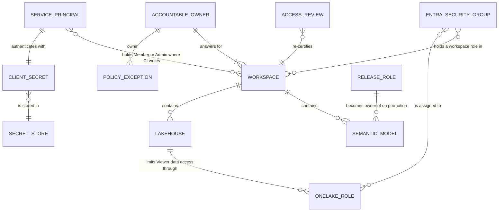

# Chapter 6 — Workspace and RBAC Governance

*Platform Development: For Enterprise Power BI and Microsoft Fabric*

Every Fabric workspace has an access list, and most access lists answer the wrong question. They say who *can* do things in the workspace. They rarely say who *answers for* the workspace: who decides what belongs in it, approves the next person added to it, notices when something in it has gone stale, and signs off when it is deleted. In a delivery model with pipelines and service principals, that gap widens, because more and more of the writes are made by identities that can't answer for anything.

This chapter is about closing that gap without slowing delivery down.

## Someone answers for every workspace, and something else does the typing

**A workspace is governable only when accountability, operational access, automation access, and data access are recorded and reviewed separately.** For every workspace, name an accountable owner and deputy outside the access list; assign human access through least-privileged groups; grant the automation identity only the rights used by the delivery path; and govern OneLake, semantic-model, and gateway access as separate data-plane controls.

This model fails its review if any workspace lacks an owner and deputy, any elevated principal lacks a current business reason and approver, any automation grant is unused by a pipeline step, any data-consumption need is met through an elevated workspace role, or any exception lacks an expiry.

<!-- EDITORIAL: replaced the four-part claim with one unifying statement plus an explicit multi-part success/failure test, per reviewer feedback that the original bundled four separable defaults under one "stand or fall together" framing and that its stated falsification test (approval traceability alone) was narrower than the claim itself. -->


The claim is falsifiable. If you can run an access review on your production workspace and, for every principal on the list, say why it is there, who approved it, and when that approval expires, then your governance works and this chapter will mostly confirm it. The illustrative scenario describes what that review usually finds instead.

Platform engineers own the identity and secret mechanics and the adapter comparison. BI leads and workspace owners own the ownership model, the matrices, and the review. Report and model authors should read the sections on feature workspaces and the data-plane boundary, because authors are usually the people who ask for "just Member so I can see the data."

## What the quarterly review found

The failure mode here is not a breach. It is drift: access that was reasonable when granted, that nobody revisited, until the list no longer matches the delivery model.

> **ILLUSTRATIVE SCENARIO — Four Owners and None**
>
> *This scenario is a composite built from patterns the repository and Microsoft's documentation describe. It is not an account of a single review. The sources are the quarterly "Workspace access review — remove stale users and service principals" item in `docs/governance/governance-checklist.md`, the workspace lifecycle table in `docs/architecture/workspace-strategy.md`, `New-FabricWorkspace` in `shared/scripts/deploy-dynamic.ps1`, Microsoft's statement that the deploying user becomes the owner of cloned semantic models, and the input fields of `tools/adoption-metrics-dashboard/index.html`.*
>
> A BI lead runs the quarterly access review the governance checklist calls for. The team's standard is the role matrix in the workspace strategy, and on paper Prod matches it: the lead is Admin, everyone else is Viewer, and the CI service principal is Member.
>
> The first question is why the service principal is in Prod at all. Nobody can point to a pipeline step that writes there. The repository's CI deploys only to Dev and feature workspaces, and promotions run through the Fabric deployment pipeline under whoever clicks **Deploy**. The Member assignment came from the matrix, not from a need.
>
> The second finding is a set of workspaces with names beginning `Dev-Feature-`. Each was created by the service principal the first time someone pushed a feature branch, and each still exists. The branches are long merged. The service principal is the only member of most of them.
>
> The third finding takes longer to explain. The semantic models in Test are owned by a developer who has since moved to another team, because that developer ran the first Dev-to-Test deployment. Changing a deployment rule on those models requires being their owner.
>
> The last finding is on the program dashboard. The Adoption Metrics Dashboard reports zero expired exceptions for the project. The Policy Exception Register, opened beside it, shows one exception whose expiry passed the previous month. The dashboard's number had been typed in at onboarding.
>
> **What changed after this:** the team recorded an accountable owner for every workspace in the deployment manifest, removed the service principal from Test and Prod, added a monthly cleanup of prefixed feature workspaces, assigned promotions to a named release role, and began filling the dashboard's exception counts from the register at each review instead of by memory.

None of those findings is a security incident, and none required anyone to act in bad faith. Each is a place where an access grant outlived its reason, or where the identity doing the work differed from the one people thought was doing it.

## The operating model: accountable owner, least-privileged groups, scoped automation

### Ownership is a record, not a role

Fabric's roles describe capabilities. Admin is the only role that can update or delete the workspace, add or remove people including other admins, or connect the workspace to a Git repository, according to Microsoft's workspace roles table. None of that makes an Admin *accountable*. A workspace can have three Admins and no owner, or one Admin who is a break-glass account nobody signs into.

The model therefore separates the two. Each workspace has one accountable owner—a person, with a named deputy—recorded somewhere a reviewer can find it: the deployment manifest's `solution.businessOwner` and `solution.technicalOwner` fields are a natural home, and the manifest already travels with the project. The owner approves access requests, answers the quarterly review, owns the workspace's exceptions, and decides when it is retired. The owner may or may not hold Admin. The repository's RACI table in the governance checklist makes a similar split for permissions: an IT admin is Responsible for workspace permissions, IT security is Accountable, and the BI lead is Consulted.

### Groups and the least-privileged role

Microsoft's workspace roles documentation allows roles to be assigned to individuals, security groups, Microsoft 365 groups, or distribution lists, and says members of nested groups inherit the group's role. `docs/governance/onelake-security.md` recommends assigning roles to Microsoft Entra security groups rather than individuals, which makes the access review a review of group membership—something identity teams already know how to certify. One exception matters for this book: Microsoft's deployment pipeline documentation says Microsoft 365 groups aren't supported as pipeline admins, so the group that administers the deployment pipeline must be a security group.

The repository's own matrix is the starting point for choosing roles.

**Listing 6.1 — `docs/architecture/workspace-strategy.md`, lines 77–86.** The repository's recommended role assignments by environment.

```markdown
| Role | Dev | Test | Prod |
|---|---|---|---|
| BI Lead / Team Lead | Admin | Admin | Admin |
| Senior BI Developer | Member | Contributor | Viewer |
| BI Developer | Contributor | Viewer | Viewer |
| QA / Tester | Viewer | Contributor | Viewer |
| Stakeholder / Business User | — | Viewer | Viewer |
| Service Principal (CI/CD) | Member | Member | Member |

> In **Prod**, only the CI/CD service principal and team leads should hold Member or higher. All humans should be Viewer unless there is an operational need.
```

Read it against the rest of the repository and three adjustments follow.

The first is the service principal row. Granting the CI identity Member in all three environments exceeds what the pipelines do. The repository's CI writes only to Dev and feature workspaces, so the service principal needs write access there and nothing in Test or Prod—unless you automate promotion, in which case it becomes the deploying identity and, per Microsoft's documentation, the owner of the semantic models it clones. That is a real design choice with ownership consequences, not a default to inherit. The deployment walkthroughs under `docs/deployment/` state the Dev requirement precisely: the service principal must be Admin or Member, because "Viewer is not sufficient."

The second is Admin concentration. `docs/governance/onelake-security.md` recommends that Admin be "Very limited," reserved for workspace owners, platform admins, or break-glass support, and that Member go to trusted leads who manage content and access. The matrix gives the BI lead Admin in every environment. Reconcile the two deliberately. A small Admin group containing the accountable owner and a break-glass identity, with the BI lead as Member, satisfies the OneLake guidance and still lets the lead manage access to lower roles.

The third is the capability description beside the matrix. `workspace-strategy.md` describes Contributor as able to "Create and modify content; cannot delete workspace-level items." Microsoft's Power BI roles table lists "Create, edit, and delete content in the workspace" as a capability that extends to Contributors. Plan on Contributors being able to delete items. The FAQ's answer about an unauthorized Prod edit likewise suggests that Contributor "cannot publish in Prod," which doesn't match Microsoft's role descriptions either. Its practical advice—Viewer for non-admins in Prod—is sound regardless.

### A matrix per environment

With those adjustments, here is a matrix consistent with the repository's delivery model. It is my recommendation, not a table from the repository.

| Principal | Dev (shared) | Feature workspaces | Test | Prod |
|---|---|---|---|---|
| Accountable owner and break-glass (security group) | Admin | — | Admin | Admin |
| BI lead | Member | — | Member | Member |
| BI developers (security group) | Contributor | Branch author as Admin of their own workspace | Viewer | Viewer |
| QA and testers | Viewer | — | Contributor, if UAT requires edits | Viewer |
| Business users | — | — | Viewer | Viewer |
| CI service principal | Member | Admin of workspaces it creates | — | — |
| Release role that promotes | — | — | Contributor or higher, plus pipeline admin | Contributor or higher, plus pipeline admin |

The release row follows Microsoft's deployment pipeline permissions. The lowest pipeline permission is pipeline admin, it is required for every pipeline operation, and deploying between stages also requires Contributor, Member, or Admin on the workspaces assigned to those stages. Setting a rule additionally requires being the owner of the item. The repository's FAQ describes "Pipeline Viewer" and "Pipeline Contributor" roles. Microsoft's current documentation describes only pipeline admin, so build the release role on that.

Whoever holds the release row becomes the owner of the semantic models that a deployment clones into a stage. Make the release role a small, stable group, or a dedicated identity, and record which one it is. Otherwise model ownership follows whoever happened to promote last, exactly as in the scenario.

### Automation identity and its tenant permissions

The deployment script authenticates as a service principal with a client secret.

**Listing 6.2 — `shared/scripts/deploy-dynamic.ps1`, lines 96–118.** The CI identity is a service principal using the client credentials grant.

```powershell
function Get-FabricAccessToken {
    param(
        [Parameter(Mandatory = $true)]
        [string]$TenantId,

        [Parameter(Mandatory = $true)]
        [string]$ClientId,

        [Parameter(Mandatory = $true)]
        [string]$Secret
    )

    $tokenUri = "$($script:AuthorityHost)/$TenantId/oauth2/v2.0/token"
    $body = @{
        client_id = $ClientId
        client_secret = $Secret
        grant_type = 'client_credentials'
        scope = $script:FabricScope
    }

    Write-Host 'Authenticating to Microsoft Fabric REST API.'
    $response = Invoke-RestMethod -Method Post -Uri $tokenUri -Body $body -ContentType 'application/x-www-form-urlencoded'
    return $response.access_token
```

Every adapter therefore stores the same three values—tenant ID, application ID, and client secret—and the secret is the thing to govern. Two Fabric tenant settings also gate what that identity can do, according to Microsoft's developer admin settings page. **Service principals can call Fabric public APIs** covers item APIs protected by Fabric's permission model, which is how the script creates and updates semantic models and reports. **Service principals can create workspaces, connections, and deployment pipelines** is what the feature deployment needs, because `New-FabricWorkspace` creates a workspace on first push. Both settings are scoped to security groups. Put the CI service principal in a dedicated group, and grant the second setting only if you keep pipeline-created feature workspaces.

The workspaces that script creates deserve their own governance line. `New-FabricWorkspace` sends only a display name. It assigns no capacity, adds no humans, and records no owner, so the creating service principal is the de facto admin of every feature workspace it makes. Chapter 2 covered cleanup. The governance consequence is that each such workspace needs a human owner written down—the branch author is the obvious choice—and must be deleted by a process, not by memory.

### Naming as a governance control

The governance checklist makes naming a `[BLOCK]` item: a workspace name must follow `WS-{Env}-{Team}`. The repository doesn't apply that convention consistently. The Deployment Manifest Builder's folder scan proposes Dev, Test, and Prod names of the form `BI-Dev-<project>`, `BI-Test-<project>`, and `BI-Prod-<project>`. The GitLab file's example feature prefix is `Dev-Feature`. And the feature-name sanitizer in `deploy-dynamic.ps1` keeps underscores, which the workspace strategy asks you to avoid. None of these is hard to fix—edit the proposed names, set `FeatureWorkspacePrefix` to a `WS-Dev-<Team>` value—but a `[BLOCK]` rule that the toolkit's own defaults violate will be ignored unless someone owns it.

## The data plane is a separate boundary

Workspace roles are control-plane permissions, and the repository's OneLake guidance is direct about what that implies for data.

**Listing 6.3 — `docs/governance/onelake-security.md`, lines 103–107.** OneLake security roles constrain Viewers and item readers, not elevated workspace roles.

```markdown
Important behavior:

- OneLake security roles grant data access to users in the Viewer workspace role or users with Read permission on the item.
- Workspace Admins, Members, and Contributors are not restricted by OneLake security roles and can read/write data in an item regardless of role membership.
- Lakehouses include a DefaultReader role that can grant data access to users with ReadAll permission. Review, edit, or remove it when it does not match your security requirements.
```

Microsoft's OneLake security documentation says the same thing from the other side: default roles apply only to Viewers, "because Admin, Member, and Contributor roles have elevated access through the Write permission." Every Member and Contributor grant is therefore also a data grant across the workspace's lakehouses and warehouses. That includes the CI service principal. A service principal with Member in a workspace that holds a lakehouse can read that lakehouse's data. Keep that in mind before you add it to Test or Prod.

The practical model has three layers, each with its own owner and review. Workspace roles decide who manages content. OneLake security roles, item permissions, and shortcuts decide who reads which data, and the OneLake guidance recommends Viewer plus OneLake roles for limited access and a review of each lakehouse's `DefaultReader` role. Semantic model security—row-level and object-level security—decides what report consumers see, and the governance checklist's Test-to-Prod section marks RLS, CLS, OneLake role, `DefaultReader`, and shortcut reviews as blocking. Gateways add a fourth, independent list. Microsoft's roles table notes that scheduling refreshes through an on-premises gateway also requires gateway permissions "managed elsewhere, independent of workspace roles," and the repository's gateway document asks for the refresh identity to be added as a user on each gateway data source. Review the gateway user lists with the workspace lists, or they will drift separately.

## Credentials and environments on the three platforms

**For platform engineers:** the governance requirement is the same across Azure DevOps, GitHub Actions, and GitLab — only deployment jobs should receive the client secret, and its owner and rotation date must be recorded. The adapters differ in how they scope that exposure and enforce approval; the following comparison identifies the repository's gaps on each platform.

<!-- EDITORIAL: opened the section with the governance decision rather than the implementation detail, per reviewer feedback that this made the following credential audit feel like a detour from the ownership/access thesis. -->


**Azure DevOps.** The combined pipeline reads the variable group `pbip-shared-secrets` and maps each value explicitly into the deploy step's environment.

**Listing 6.4 — `azdo/azure-pipelines.yml`, lines 461–474.** Azure DevOps maps secret variables into one step's environment.

```yaml
        - task: PowerShell@2
          displayName: 'Deploy PBIP to Dev workspace'
          env:
            TENANT_ID: $(TenantId)
            APP_ID: $(AppId)
            CLIENT_SECRET: $(ClientSecret)
            DEV_WORKSPACE_ID: $(DevWorkspaceId)
            DEV_WORKSPACE_NAME: $(DEV_WORKSPACE_NAME)
            AUTHORITY_HOST: $(AuthorityHost)
            FABRIC_API_BASE_URI: $(FabricApiBaseUri)
            FABRIC_API_SCOPE: $(FabricApiScope)
            IS_GCC_HIGH: $(IS_GCC_HIGH)
            GOV_SEMANTIC_MODEL_ID: $(GOV_SEMANTIC_MODEL_ID)
            GOV_REPORT_ID: $(GOV_REPORT_ID)
```

Microsoft's documentation explains why the mapping is necessary: unlike normal variables, secret variables are "not automatically decrypted into environment variables for scripts." The quality jobs that run downloaded third-party binaries never see `ClientSecret`, because no step there maps it. The YAML doesn't say whether `pbip-shared-secrets` is linked to Azure Key Vault. Azure DevOps supports that link, and it is the configuration the governance checklist requires. The deploy stages are ordinary jobs rather than deployment jobs targeting an Azure DevOps environment, so there is no environment-level approval or check in front of them.

**GitHub Actions.** Secrets are referenced only inside the deploy steps.

**Listing 6.5 — `.github/workflows/powerbi-ci.yml`, lines 380–387.** GitHub Actions references secrets only in the deploy step, inside a named environment.

```yaml
      - name: Deploy artifacts to Dev workspace
        shell: pwsh
        env:
          TENANT_ID: ${{ secrets.TENANT_ID }}
          APP_ID: ${{ secrets.APP_ID }}
          CLIENT_SECRET: ${{ secrets.CLIENT_SECRET }}
          DEV_WORKSPACE_ID: ${{ secrets.DEV_WORKSPACE_ID }}
          DEV_WORKSPACE_NAME: ${{ vars.DEV_WORKSPACE_NAME }}
```

Both deploy jobs declare an environment, `dev` or `feature`, so their secrets can be defined as environment secrets and the environments can carry protection rules such as required reviewers or deployment-branch restrictions, without changing the YAML. The workflow stores `DEV_WORKSPACE_ID` as a secret even though it's an identifier rather than a credential, and reads `DEV_WORKSPACE_NAME` and `FEATURE_WORKSPACE_PREFIX` from `vars`. `powerbi-ci.yml` has no top-level `permissions` block, so its `GITHUB_TOKEN` gets the repository's default permissions. The repository's own `secret-scan.yml` sets `contents: read`, which is the pattern to copy.

**GitLab CI/CD.** The file's header prescribes how the credentials are stored.

**Listing 6.6 — `gitlab/gitlab-ci.yml`, lines 10–15.** GitLab's credential variables, marked Masked and Protected.

```yaml
# REQUIRED CI/CD VARIABLES (Settings → CI/CD → Variables, all Masked + Protected):
#   TENANT_ID              - Azure AD tenant ID
#   APP_ID                 - Service principal application (client) ID
#   CLIENT_SECRET          - Service principal client secret
#   DEV_WORKSPACE_NAME     - Display name of the target Dev Fabric workspace
#                            (or use DEV_WORKSPACE_ID for a workspace GUID)
```

GitLab behaves differently from the other two in one important way. CI/CD variables defined in project settings are available to every job in the pipeline unless they are restricted. GitLab's variable settings offer an environment scope—all environments by default—and protection, which limits a variable to pipelines on protected branches or tags. As configured by the header, `CLIENT_SECRET` is visible to the dataset- and report-rules jobs that download and execute Tabular Editor and Fab Inspector, and—because it's Protected—invisible to unprotected `feature/` branches, as Chapter 2 described. Both deploy jobs declare environments, `dev` and `feature/$CI_COMMIT_REF_SLUG`. That makes the fix straightforward: scope the credential variables to those environments so only the deploy jobs receive them, and decide explicitly whether feature branches are protected.

**Against the checklist.** The governance checklist's deployment-pipeline section contains a blocking item.

**Listing 6.7 — `docs/governance/governance-checklist.md`, lines 93–97.** The checklist requires Key Vault for secrets as a blocking item.

```markdown
### 3.3 Deployment Pipeline

- [ ] Fabric Deployment Pipeline configured with Dev, Test, and Prod stages  
- [ ] Connection string parameters swapped for the **Test** data source  
- [ ] Secrets retrieved from **Azure Key Vault** (not embedded in pipeline config) **[BLOCK]**  
```

Read literally, the GitHub and GitLab adapters can never pass that item as written, because they store the secret in the platform's own secret store rather than retrieving it from Key Vault. The OneLake guidance is more flexible. It lists GitHub Actions secrets, Azure DevOps variable groups, Key Vault-linked groups, and environment-scoped secrets as acceptable secure stores. Pick one policy and make both documents say it. A reasonable version is "platform secret store with environment scoping and a recorded rotation date, or Key Vault; never in YAML or source."

The stronger alternative removes the stored secret altogether. Microsoft Entra workload identity federation lets an application registration trust tokens issued by an external identity provider, and GitHub Actions, Azure DevOps, and GitLab can each present such tokens. The repository doesn't use it. `Get-FabricAccessToken` sends a `client_secret`, so adopting federation means changing the token request in `deploy-dynamic.ps1` and each adapter's job setup. Until then, record a rotation date for the client secret and rotate it after any ownership change, as the OneLake guidance recommends.

### Figure 6.1 — The governance model as relationships



## Running the access review

The quarterly review the checklist calls for is the moment the model gets tested. It works best as a fixed agenda per workspace, run by the accountable owner with the platform engineer beside them.

Start with the owner record. Is the recorded owner still in the role, and is there a deputy? Then walk the workspace role list against the environment's matrix. For each principal, confirm that it is a group rather than a person unless an exception says otherwise, that its role is the least it needs, and that the reason is still true. Service principals get two extra questions: which pipeline step uses this access, and when was its secret last rotated. In Test and Prod, add the release role's model ownership. The workspace strategy's lifecycle table says that when a developer leaves, you remove them from all workspaces, revoke repository access, and "reassign items if needed." Model ownership is the item most often missed, and rule changes depend on it.

Then the data plane: OneLake roles and `DefaultReader` for each lakehouse, item-level shares (which the OneLake guidance notes are "harder to see than workspace roles"), shortcuts, RLS role membership, and the gateway data source user lists. Close with feature workspaces. List every workspace carrying your feature prefix, match each to a live branch, and delete the rest.

Most of that list can be gathered rather than remembered. The Power BI REST **Get Group Users** operation returns each principal on a workspace with its `groupUserAccessRight` and `principalType`, which is enough to compare a workspace against the matrix automatically. Store the expected **workspace-role** matrix in version control: principal or group, permitted role, justification, and accountable owner. A scheduled read-only job should compare that file with each workspace's role list and open an item for an unexpected or over-privileged assignment. The repository doesn't include such a job. This does not replace the quarterly review: it detects workspace-role drift early, while the review still verifies ownership, data-plane access, gateway users, model ownership, credentials, and exceptions.

<!-- EDITORIAL: renamed the proposed automation from "the access review" to a "workspace-role drift detector" and removed the unsupported "few dozen lines" estimate, per reviewer feedback that calling it a move "from an audit into a confirmation" overstated its coverage of the chapter's broader governance model (data plane, gateway, ownership, exceptions are separate surfaces it doesn't check). -->

Record the review. The governance checklist has no evidence format for it. A short Markdown note in the repository, committed by the owner and listing what changed, is enough, and it gives the next review a baseline.

## Exceptions that expire, and a dashboard that doesn't count them

Governance needs a way to say yes temporarily. The repository's tool for that is the Policy Exception Register at `tools/policy-exception-register/index.html`, introduced in Chapter 3 for quality-rule waivers. It works equally well for access exceptions: a named individual granted a role directly, a Member assignment granted during an incident, or a Prod Contributor during a data migration. Each entry records a rule or policy ID, owner, approver, affected artifact, reason, mitigation, status, and expiry. The register's health logic is simple.

**Listing 6.8 — `tools/policy-exception-register/index.html`, lines 209–222.** An exception is expired past its date or when marked expired, and expiring within 30 days.

```javascript
    function daysUntil(dateText) {
      if (!dateText) return null;
      const date = new Date(`${dateText}T00:00:00`);
      if (Number.isNaN(date.getTime())) return null;
      return Math.ceil((date - todayDate()) / 86400000);
    }

    function health(exception) {
      const days = daysUntil(exception.expiresOn);
      if (exception.status === "expired" || (days !== null && days < 0)) return "expired";
      if (days !== null && days <= 30) return "expiring";
      if (exception.status === "approved") return "approved";
      return "open";
    }
```

Two properties of that logic matter for access governance. First, an entry without an `expiresOn` date is neither expiring nor expired; the register displays it as "no expiration." Chapter 3's `New-EffectiveQualityRules.ps1` treats a missing expiry as inactive, so a rule exception without a date never takes effect, but nothing enforces expiry on an access exception except the review. Make an expiry date mandatory for every access exception by policy. Second, the thirty-day "expiring" window is a gift to the reviewer. Every expiring access exception is a decision to renew with a new approval or to remove the access.

The register doesn't remove anyone's access. It records the decision. The removal is a task the owner performs, and the next review verifies it.

The Adoption Metrics Dashboard at `tools/adoption-metrics-dashboard/index.html` sits one level up, tracking each onboarded project's status, platform, owner, rule counts, active and expired exceptions, readiness score, and onboarding time across the program.


It is a useful program view, but read its exception counts carefully. The dashboard doesn't load `policy-exceptions.json`. Its "Active exceptions" and "Expired exceptions" fields are numbers someone types into a form, as its `projectFromForm` function shows, and its `owner` field is free text. If governance reporting depends on those numbers, fill them from the register at each review rather than trusting the last value entered.


## When access is the reason something failed

Access problems often surface as delivery failures, and the messages rarely say "permission." These are the ones this repository and Microsoft's documentation make predictable.

| Symptom | Likely cause | What to check |
|---|---|---|
| `Dev workspace '…' was not found or is not visible to the service principal.` | The service principal isn't a member of the workspace, or the name is wrong. | Add the service principal to the workspace's security group with Member, or correct the name. |
| Deployment writes fail although the service principal can see the workspace | It holds Viewer. | The deployment walkthroughs require Admin or Member. |
| Feature deployment fails when creating a workspace | The tenant setting allowing service principals to create workspaces doesn't include its group. | Grant the setting to the CI group, or stop creating feature workspaces. |
| `Skipping unsupported Fabric list API for service principal` in the log | The script caught `PrincipalTypeNotSupported` on a Fabric list call and kept the Power BI REST results it had already gathered. | Informational, unless the item it was resolving is then reported as not found. |
| A developer can't switch a workspace's branch | Branch switching is Admin-only by default. | Enable the per-workspace setting for Contributors, or leave it Admin-only for shared Dev. |
| A promotion can't be started, or a rule's data source option is grayed out | The person isn't a pipeline admin, lacks a role on both stage workspaces, or isn't the item's owner. | Use the release role, and transfer model ownership if needed. |
## Trade-offs and lighter paths

Governance has a cost in friction, and the right amount depends on what the workspace holds.

A small team with one semantic model and no lakehouse can run a lighter model. Record one owner and a deputy, keep Admin to those two, give developers Contributor in Dev and Viewer elsewhere, and hold a fifteen-minute review before each Prod release instead of quarterly. The data-plane material mostly doesn't apply until there is OneLake data to protect.

A team that doesn't want a service principal creating workspaces can turn off feature deployment, as Chapter 2 discussed, and withhold the tenant setting that allows service principals to create workspaces. That removes an entire category of ownerless workspaces at the cost of the pipeline's preview environments.

A team in a regulated environment should go further than the repository. Adopt workload identity federation so no client secret exists to rotate. Put every deploy job behind the platform's environment approvals. Link Azure DevOps variable groups to Key Vault. Scope GitLab variables to environments. And make the access review produce evidence—who reviewed, what changed, and when—stored with the release records Chapter 8 describes.

Do not use Member or Contributor as the routine way to grant data-consumption access: those roles bypass the restrictions that OneLake roles are intended to enforce. Use Viewer plus an appropriate OneLake role or item permission. If an operational exception is unavoidable, record its owner, mitigation, approval, and expiry, then remove it through the review process.

<!-- EDITORIAL: reworded "no context justifies" to a routine-access prohibition with an explicit exception path, per reviewer feedback that "no context" was stronger than the chapter's own exception model, which recognizes migrations, incidents, and temporary exceptions elsewhere. -->


## Evidence and further reading

Repository sources: `docs/architecture/workspace-strategy.md`, `docs/governance/governance-checklist.md`, `docs/governance/onelake-security.md`, `docs/governance/power-bi-governance-tools.md`, `docs/architecture/gateway-deployment-pipeline.md`, both walkthroughs under `docs/deployment/`, `docs/faq.md` section 8, `shared/scripts/deploy-dynamic.ps1`, `tools/policy-exception-register/index.html`, `tools/adoption-metrics-dashboard/index.html`, `tools/deployment-manifest-builder/index.html`, `azdo/azure-pipelines.yml`, `.github/workflows/powerbi-ci.yml`, `.github/workflows/secret-scan.yml`, `gitlab/gitlab-ci.yml`, and `gitlab/README.md`.

Official documentation:

- Roles in workspaces in Microsoft Fabric: https://learn.microsoft.com/en-us/fabric/fundamentals/roles-workspaces
- Roles in workspaces in Power BI: https://learn.microsoft.com/en-us/power-bi/collaborate-share/service-roles-new-workspaces
- Give users access to workspaces: https://learn.microsoft.com/en-us/fabric/fundamentals/give-access-workspaces
- Deployment process, permissions, and ownership: https://learn.microsoft.com/en-us/fabric/cicd/deployment-pipelines/understand-the-deployment-process
- Fabric developer admin settings for service principals: https://learn.microsoft.com/en-us/fabric/admin/service-admin-portal-developer
- OneLake data security overview: https://learn.microsoft.com/en-us/fabric/onelake/security/get-started-security
- OneLake security roles, permissions, and scopes: https://learn.microsoft.com/en-us/fabric/onelake/security/data-access-control-model
- Azure Pipelines secret variables: https://learn.microsoft.com/en-us/azure/devops/pipelines/process/set-secret-variables
- Link a variable group to Azure Key Vault: https://learn.microsoft.com/en-us/azure/devops/pipelines/library/link-variable-groups-to-key-vaults
- GitHub Actions secrets: https://docs.github.com/en/actions/reference/security/secrets
- GitHub Actions deployments and environments: https://docs.github.com/en/actions/reference/workflows-and-actions/deployments-and-environments
- GitLab CI/CD variables, protection, and environment scope: https://docs.gitlab.com/ci/variables/
- GitLab protected environments: https://docs.gitlab.com/ci/environments/protected_environments/
- Microsoft Entra workload identity federation: https://learn.microsoft.com/en-us/entra/workload-id/workload-identity-federation

## Freshness note

Last verified September 24, 2026. Microsoft's Fabric workspace roles page was last updated in August 2026. The deployment-process page stated that pipeline admin is the only pipeline permission, and the developer settings page named the two service-principal tenant settings quoted here; tenant setting names have changed before and may change again. The repository documents and tools were read as they existed on that date. Where this chapter recommends a different matrix or policy from the repository's, it says so, and the repository may since have been updated to resolve the contradictions noted.

## Reader decision checklist

1. For each Dev, Test, and Prod workspace, who is the accountable owner and deputy, and where is that written outside the access list?
2. Which principals hold Admin in Prod, and could that group be reduced to the owner and a break-glass identity?
3. Which pipeline step uses each service principal's access in each workspace? Remove any access that no step uses.
4. Which identity promotes to Test and Prod, and does it therefore own those semantic models by design or by accident?
5. Are your two service-principal tenant settings scoped to a dedicated security group, and do you still need the one that lets service principals create workspaces?
6. Where is each adapter's client secret stored, which jobs can read it, and when does it expire?
7. Does any Member or Contributor assignment exist only to grant data access? What Viewer-plus-OneLake-role arrangement would replace it?
8. Does every access exception carry an owner, an approver, and an expiry date, and is the program dashboard's exception count taken from the register?
