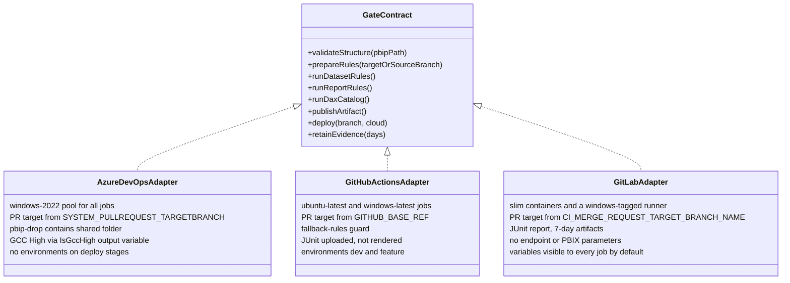

# Chapter 7 — CI/CD Platform Parity

*Platform Development: For Enterprise Power BI and Microsoft Fabric*

The repository behind this book makes an unusual promise: Azure DevOps, GitHub Actions, and GitLab CI/CD are supported as equals. Most accelerators pick one platform and leave the others as an exercise. This one ships three pipeline files, a parity matrix, and a generator that emits YAML for all three. That is genuinely useful, and it creates a specific risk. When three files are said to be equivalent, people stop reading two of them.

This chapter reads all three, side by side, and asks what "equal" should mean.

## Parity is a contract about behavior, not a count of files

The position this chapter defends is that platform neutrality is a behavioral contract. The same change, evaluated against the same policy branch, must produce the same release decision on every supported platform: required gates run with the same policy inputs; no publication or deployment occurs until those gates pass; and reviewers receive the agreed minimum evidence. Adapters may differ in syntax, runners, secret stores, and safe parallelism, but not in release safety or declared evidence obligations. Where an adapter genuinely cannot meet a clause of the contract, the gap is written down as a gap, with its consequence, rather than rounded up to "supported."

<!-- EDITORIAL: redefined parity by release outcomes rather than identical execution sequencing, per reviewer feedback that "same gates, in the same order" contradicted the chapter's own later acceptance of safe parallel DAX execution on GitHub/GitLab. -->


That claim is falsifiable with a small experiment. Pick five changes: a valid project, a broken `byPath` reference, a severity-3 model violation, an error-level report violation, and a malformed DAX catalog. Predict, for each platform, whether the pipeline blocks the merge and what evidence it retains. If your three predictions always match and are always right, your adapters are at parity, and the rest of this chapter is confirmation. For this repository, as shipped, they don't all match, and the places they diverge are instructive.

This is the platform engineer's chapter. Report and model authors can read the contract and the summary table and stop there. The point for authors is that the gate they meet shouldn't depend on which platform their team happened to choose.

## "Supported, supported, supported"

The failure mode is a comparison that is true line by line and misleading as a whole. `shared/examples/platform-parity-matrix.json`, the starter data for the repository's parity tool, marks Azure DevOps, GitHub Actions, and GitLab as `supported` for PBIP validation, both rule engines, DAX metadata tests, artifact publication, Dev deployment, feature deployment, and branch policy.

**Listing 7.1 — `shared/examples/platform-parity-matrix.json`, lines 64–72.** The starter matrix marks feature deployment as supported on every platform.

```json
    {
      "id": "feature-deploy",
      "capability": "Feature workspace deployment",
      "category": "Deployment",
      "azureDevOps": "supported",
      "githubActions": "supported",
      "gitLabCi": "supported",
      "notes": "Uses configured feature workspace prefix."
    },
```

Every one of those cells describes something a pipeline file contains. None describes whether the behavior matches. Earlier chapters found several places where it doesn't: GitLab's credential variables are marked Protected and so never reach unprotected feature branches; GitHub never renders its JUnit file; and GitLab's deploy jobs can't reach the GCC High path at all. The matrix has no row for GCC High.

> **ILLUSTRATIVE SCENARIO — The Matrix That Chose the Platform**
>
> *This scenario is a composite built from what the repository's files say and do. It does not describe a single engagement. The sources are `shared/examples/platform-parity-matrix.json`, the GCC High caveat in `gitlab/README.md`, the deploy jobs in `gitlab/gitlab-ci.yml`, `docs/architecture/gcc-high-deployment.md`, and the variable guidance in the GitLab file's header.*
>
> Consider the decision this matrix invites: a program office could read `supported` for Dev and feature deployment and conclude that GitLab is suitable for a GCC High team. The checked-in GitLab deploy job does not pass `AuthorityHost`, `FabricApiBaseUri`, `FabricApiScope`, or `UsePowerBiImport` to `deploy-dynamic.ps1`; under the script's documented defaults, that configuration would follow the commercial path. Protected variables create a separate feature-branch risk when the branch itself is not protected.
>
> The first Dev deployment authenticates against the commercial authority. GitLab's deploy job never passes `AuthorityHost`, `FabricApiBaseUri`, `FabricApiScope`, or `UsePowerBiImport` to `deploy-dynamic.ps1`, so the script runs with its commercial defaults. Setting the GCC High endpoint variables in GitLab has no effect, because nothing reads them. The first feature-branch push fails differently: the credentials were created Masked and Protected, as the header instructs, and the branch isn't protected.
>
<!-- EDITORIAL: replaced the narrated "program office asks... the answer given is yes" scene with a stated inference per reviewer feedback that the composite Field Note presented a hypothetical decision as if witnessed; the underlying technical finding is unchanged and was independently verified. -->

> **What changed after this:** the team added a GCC High row to its parity matrix, marked `gap` for GitLab, with a note naming the missing parameters. It added a note to the feature-deployment row explaining the protected-variable interaction. And it replaced its single matrix review with the behavioral check described later in this chapter, run whenever any pipeline file changes.

The lesson is not that GitLab is a second-class platform. Each gap is a few lines of YAML. The lesson is that a parity matrix edited by hand records someone's belief, and nothing in the repository compares that belief with the files.

## The invariant gate contract

The operating model starts by writing the contract down, independent of any platform. The contract below is what I'd hold every adapter in this repository to. The right-hand column lists what adapters may legitimately vary.

| Contract clause | Must be identical across adapters | May differ |
|---|---|---|
| Inputs | The PBIP path validated, searched by quality jobs, packaged, and deployed | Variable names and path syntax |
| Gate order | Structure validation before rules and tests; rules and tests before publication; publication before deployment | Stage versus job versus `needs` wiring |
| Branch policy | The policy branch is the pull-request target when one exists, otherwise the pushed branch | Which platform variable supplies it |
| Tools | The same tool versions and rule files | Download location, caching, runner image |
| Blocking semantics | A non-zero exit from any gate blocks publication and deployment; a skip is recorded as a skip | How a skip is expressed |
| Evidence | Structure, rule, and test results retained for an agreed period and visible to reviewers | Artifact service and retention mechanics |
| Deployment targets | `main` to Dev, `feature/*` to a feature workspace, pull requests deploy nothing | Environment and approval mechanism |
| Cloud mode | Commercial or GCC High chosen from configuration, with the same deploy path per cloud | Where endpoint variables are stored |
| Credentials | Available only to deploy steps | Secret store and scoping |

The contract has a useful property: each clause can be checked either by reading the YAML or by running a fixture through it. The rest of this chapter does both.

## Reading the three adapters side by side

This section compares the combined pipelines—`azdo/azure-pipelines.yml`, `.github/workflows/powerbi-ci.yml`, and `gitlab/gitlab-ci.yml`—clause by clause. Earlier chapters examined several of these differences in depth. Here the goal is the comparison itself.

### Triggers and pull-request context

The three files trigger on the same branch families in different grammars. The Azure DevOps file uses `trigger` for pushes to `main`, `develop`, and `feature/*` and a `pr` block for `main` and `develop`; for Azure Repos, pull-request validation actually comes from a branch policy, as Chapter 2 explained. GitHub uses `push` on `main`, `develop`, and `feature/**`, `pull_request` on `main` and `develop`, and `workflow_dispatch`. GitLab uses workflow rules admitting merge-request pipelines and branch pipelines for the same three families. The repository also contains a second Azure DevOps file with a narrower contract.

**Listing 7.2 — `azdo/azure-pipelines_ci.yml`, lines 4–16.** The CI-only Azure DevOps file triggers on a smaller branch set and has no deploy stages.

```yaml
trigger:
  branches:
    include:
      - main
      - feature/*

pr:
  branches:
    include:
      - main

pool:
  vmImage: 'windows-2022'
```

`azure-pipelines_ci.yml` omits `develop`, publishes with the older `PublishBuildArtifacts@1` task as `pbip-artifacts`, and deploys nothing. It is a legitimate CI-only adapter, but it is a fourth adapter, and the parity matrix doesn't mention it. `docs/Troubleshooting.md` compounds the confusion: its "Two Pipeline YAML Files Exist" entry names `azure-pipelines.yml` and a file called `azure-pipeline.yml`, which isn't in the repository. The two files that exist are `azure-pipelines.yml` and `azure-pipelines_ci.yml`. Pick which one is authoritative for each project and delete or rename the other.

### Runners and operating systems

Azure DevOps declares one pool, `windows-2022`, for the whole pipeline, so even the Python jobs run on Windows. GitHub mixes runners: `ubuntu-latest` for validation, DAX tests, and publication, `windows-latest` for both rule jobs and both deploy jobs. GitLab runs validation and DAX tests in `python:3.11-slim` on any Docker-capable Linux runner, publication in `alpine:latest`, and the rule and deploy jobs on a Windows runner you register yourself with the `windows` tag. The rule engines force Windows everywhere. Tabular Editor 2's documentation describes `TabularEditor.exe` as Windows-only, and the Fab Inspector build the pipelines download is `win-x64-CLI.zip`. The self-registered GitLab runner is the one place where the runtime isn't curated for you. Chapter 3 showed that the Fab Inspector CLI needs a .NET 8 x64 runtime, and a bare Windows shell runner won't have one unless someone installs it.

### Tool downloads and caching

All three adapters download the same four files from the same URLs at the start of each rule job: Tabular Editor's and Fab Inspector's `releases/latest` archives, and the two fallback rule files. My comparison script, shown later, confirmed that the three files contain an identical set of download URLs. That is parity of a kind: every platform floats to whatever is latest at run time, in the same way. None of the three uses its platform's caching mechanism, pins a version, or verifies a checksum. That is the first contract clause I would tighten, because version drift across runs is also drift across platforms whenever two teams' pipelines run on different days.

### Rule preparation and tool invocation

All three call `Prepare-QualityRules.ps1` in dataset and report modes with the pull-request target when one exists. The branch values come from `SYSTEM_PULLREQUEST_TARGETBRANCH`, `GITHUB_BASE_REF`, and `CI_MERGE_REQUEST_TARGET_BRANCH_NAME`. Only GitHub adds the guard that fails when the fallback BPA rules were used instead of the repository baseline. GitHub also calls Fab Inspector directly and checks `$LASTEXITCODE`, and because it runs `pwsh` with `$ErrorActionPreference = 'stop'` prepended, it treats Tabular Editor's replayed standard-error output as fatal. The other two use `Start-Process` and check the process exit code only. Those are small differences in failure semantics, but they are exactly the kind the contract exists to catch: a Tabular Editor run that writes to stderr and exits 0 passes on Azure DevOps and GitLab and fails on GitHub.

### Test publication and artifacts

Chapter 4 compared the DAX results in detail. Azure DevOps publishes JUnit to its Tests tab only when the runner succeeds. GitHub retains the XML as an artifact even on failure but doesn't render it. GitLab retains and renders it for seven days. For the deployable artifact the differences are larger. Azure DevOps publishes the whole `shared` folder as `pbip-drop`, so the deploy script travels with the content. GitHub uploads only the PBIP folder and re-checks out the repository for the script. GitLab copies the PBIP folder into `pbip-drop/` with a seven-day expiry. The artifact service differs by design. The *content* of the artifact differing is a contract question: only the Azure DevOps artifact is self-contained enough to redeploy exactly what was validated without reference to the repository.

The publication gate is where "skip" semantics diverge most visibly. GitHub's condition is explicit.

**Listing 7.3 — `.github/workflows/powerbi-ci.yml`, lines 344–352.** GitHub publishes when every gate succeeded or was skipped.

```yaml
    if: >-
      ${{
        always() &&
        vars.PBIP_CI_SKIP_PUBLISH != 'true' &&
        needs.validate_pbip.result == 'success' &&
        (needs.dataset_rules.result == 'success' || needs.dataset_rules.result == 'skipped') &&
        (needs.report_rules.result == 'success' || needs.report_rules.result == 'skipped') &&
        (needs.dax_tests.result == 'success' || needs.dax_tests.result == 'skipped')
      }}
```

GitLab expresses the same intent with `needs` marked `optional`, and adds a rule that never publishes from merge-request pipelines.

**Listing 7.4 — `gitlab/gitlab-ci.yml`, lines 223–243.** GitLab publishes after the gates, treats skipped gates as optional, and skips publication for merge requests.

```yaml
publish_artifact:
  stage: publish
  image: alpine:latest
  needs:
    - job: validate_pbip
      artifacts: false
    - job: dataset_rules
      optional: true
      artifacts: false
    - job: report_rules
      optional: true
      artifacts: false
    - job: dax_tests
      optional: true
      artifacts: false
  rules:
    - if: '$SKIP_PUBLISH == "true"'
      when: never
    - if: '$CI_PIPELINE_SOURCE == "merge_request_event"'
      when: never
    - when: on_success
```

Azure DevOps has no job-level skip in the project-local file at all. Its Publish stage depends on the Test stage, which depends on the whole Validate stage, and it runs on pull-request builds too, so a PR build in Azure DevOps produces a `pbip-drop` artifact that nothing deploys. All three treat a skipped gate as acceptable for publication. Only GitLab refuses to publish from a merge request. Only GitHub defines manual-run skip inputs, and as Chapter 3 showed, its job conditions ignore them.

### Environments, approvals, and secrets

Chapter 6 covered credentials. For parity, the relevant facts are structural. Azure DevOps deploy stages are ordinary jobs with no environment, so there is nowhere to attach an approval without changing the YAML. GitHub's deploy jobs name environments, `dev` and `feature`, where protection rules can be added in settings. GitLab's name `dev` and a per-branch `feature/$CI_COMMIT_REF_SLUG`, which can be protected in settings. The contract clause "credentials available only to deploy steps" holds on Azure DevOps and GitHub as written and fails on GitLab until the variables are scoped to environments.

### Dev deployment, feature deployment, and cloud mode

All three deploy `main` and `develop` to Dev and `feature/*` to a prefixed feature workspace, and none deploys from a pull request. The deployment *parameters* differ. Azure DevOps and GitHub pass the endpoint set and switch to PBIX import when the endpoints identify GCC High. GitLab passes neither, so GCC High is unreachable from it as written. That makes cloud mode the one contract clause the repository's adapters fail outright, rather than merely express differently.

### When a gate fails

Failure semantics are where parity matters most, because they decide what reaches a workspace. Tracing the shipped files for five failures gives this picture.

| Failure | Azure DevOps | GitHub Actions | GitLab CI/CD |
|---|---|---|---|
| Structure validation exits 1 | Rule jobs and later stages don't run | Rule, test, publish, and deploy jobs are skipped by their conditions | Jobs needing `validate_pbip` don't start |
| A rule job exits 1 | Validate stage fails; Test, Publish, and deploy don't run | Publication condition fails; deploy jobs don't run; DAX job still runs in parallel | Publication doesn't run; DAX job may already have run |
| DAX runner exits 1 | Test stage fails; results not published to the Tests tab | Publication blocked; XML still uploaded | Publication blocked; XML retained and rendered |
| A tool download fails | Treated as a rule-job failure | Treated as a rule-job failure | Treated as a rule-job failure |
| Deploy script throws | Deploy stage fails; artifact already published | Deploy job fails; artifact already uploaded | Deploy job fails; artifact already stored |

On the release-safety criterion, all three adapters block deployment after any mandatory gate fails. They are not fully equivalent, however: Azure DevOps serializes DAX after validation, GitHub and GitLab can expose concurrent failures, and the platforms retain failed DAX evidence differently. Treat release blocking as a required invariant and diagnostic visibility as a separately scored evidence requirement.

<!-- EDITORIAL: reworded so release-blocking is stated as the required invariant and evidence visibility as a separate, explicitly scored requirement, per reviewer feedback that the original declared one criterion uniquely decisive without a rule for scoring the acknowledged evidence differences. -->

### The honest summary

Putting those observations into the parity tool's own vocabulary gives a different matrix from the starter file. This is my assessment of the shipped files, not a table from the repository.

| Capability | Azure DevOps | GitHub Actions | GitLab CI/CD | Why |
|---|---|---|---|---|
| Structure validation | supported | supported | supported | Same script and path |
| Rule engines | supported | supported | partial | GitLab requires a self-managed Windows runner with .NET 8 |
| PR-target rule policy | supported | supported | supported | Different variables, same resolution |
| Fallback-rules guard | gap | supported | gap | Only GitHub fails when the fallback BPA file is used |
| DAX results visible to reviewers | partial | partial | supported | Azure DevOps skips publishing on failure; GitHub doesn't render |
| Self-contained deploy artifact | supported | partial | partial | Only Azure DevOps packages the script with the content |
| Dev deployment, commercial | supported | supported | supported | Same script |
| Feature deployment | supported | supported | partial | Protected credentials don't reach unprotected branches |
| GCC High deployment | supported | supported | gap | GitLab passes no endpoint or import parameters |
| Environment approvals | gap | supported | supported | Azure DevOps deploy stages have no environment |
| Credentials scoped to deploy steps | supported | supported | partial | GitLab variables reach every job unless scoped |
| Reusable template | supported | gap | gap | Only an Azure DevOps template exists |

A table with "gap" and "partial" in it is more useful than one without, because each non-supported cell is a backlog item with a known fix.

### Figure 7.1 — One contract, three adapters



## Testing parity instead of asserting it

Parity is tested at two levels: a static check that the adapters contain the same contract elements, and a behavioral check that the same fixtures produce the same outcomes.

The static check is cheap enough to run on every pull request that touches a pipeline file. The script below is mine, not part of the repository. It searches each adapter for one regular expression per contract element and reports where they differ. It can't prove behavior, but it catches the most common kind of drift: a step added to one file and forgotten in the others.

```python
# parity_check.py - author's sketch; not part of the repository.
CONTRACT = {
    "structure validator": r"validate_pbip_structure\.py",
    "PR target branch used": r"SYSTEM_PULLREQUEST_TARGETBRANCH|GITHUB_BASE_REF|CI_MERGE_REQUEST_TARGET_BRANCH_NAME",
    "Tabular Editor run": r"TabularEditor\.exe",
    "Fab Inspector run": r"PBIRInspectorCLI\.exe",
    "JUnit surfaced": r"PublishTestResults@2|junit:",
    "cloud endpoint passthrough": r"AuthorityHost|AUTHORITY_HOST",
    "GCC High PBIX switch": r"UsePowerBiImport",
    "fallback-rules guard": r"NUMERIC_COLUMN_SUMMARIZE_BY",
    # ...plus rule preparation, DAX runner, and deploy script entries
}
for item, pattern in CONTRACT.items():
    hits = [bool(re.search(pattern, t)) for t in texts.values()]
    drift += len(set(hits)) > 1
```

Run against the repository on September 24, 2026, the full version checked twelve elements. It reported every adapter containing the structure validator, both rule preparations, the PR-target resolution, both rule engines, the DAX runner, and the deploy script. It found four drifting elements: JUnit surfacing (absent from GitHub), endpoint passthrough and the PBIX switch (both absent from GitLab), and the fallback-rules guard (present only in GitHub). It also confirmed that the three files contain an identical set of tool and rule download URLs, and it exited 1 because drift was found. Those four lines are the same gaps the honest summary table records, found mechanically.

Static checks detect missing contract elements; fixture runs prove outcomes. Maintain five named fixtures—valid, broken reference, severity-3 model rule, error-level report rule, and malformed DAX catalog—and record, for each adapter: gate result, publication result, deployment result, and reviewer-visible evidence. Run the suite after pipeline, runner-image, tool-version, or shared-script changes. Any difference must be classified as a defect or a documented contract exception. The repository has no such suite today; building it is the single most valuable parity investment, because it turns the matrix from an opinion into a test result.

<!-- EDITORIAL: tightened the fixture-suite description into an explicit acceptance-test prescription (named fixtures, recorded outcomes, classification rule), per reviewer feedback that the original was correct but looser than the chapter's claim requires. -->


### Keeping adapters from drifting apart

Tests find drift after it happens. Ownership keeps it from happening. The repository's own change checklist, `docs/repo-change-checklist.md`, addresses pipelines directly.

**Listing 7.5 — `docs/repo-change-checklist.md`, lines 52–61.** The repository's checklist for pipeline and script changes.

```markdown
## CI/CD and script changes

When changing pipelines or scripts:

- [ ] Validate PowerShell parsing for changed `.ps1` files.
- [ ] Run available local smoke tests for scripts.
- [ ] Confirm Azure DevOps, GitHub Actions, and GitLab implications are documented.
- [ ] Update platform-specific README files when setup, variables, runners, triggers, or behavior changes.
- [ ] Update `docs/sparse-clone-guide.md` if sparse clone behavior changes.
- [ ] Confirm branch-aware behavior still works for feature branches and protected branches.
```

Line 58 asks that the three platforms' "implications are documented." That is necessary and not sufficient. Documentation says what a change should do on each platform, while the static and behavioral checks show what it does. Three habits close the gap. Make any pull request that edits one adapter touch the other two or record why not, which a path-based CODEOWNERS rule or required reviewer group can enforce on GitHub and GitLab, and an equivalent branch policy on Azure DevOps. Run the static check in that pull request. And schedule the behavioral fixtures, weekly or on each tool-version change, so a floating `releases/latest` download that changes behavior is noticed on all three platforms at once rather than by whichever team deploys next.
## The Platform Parity Matrix and the Pipeline Config Generator

The repository ships two browser tools for this chapter. Like the rest of `tools/`, they are companions shipped with the repository, not Microsoft products.

The CI/CD Platform Parity Matrix at `tools/platform-parity-matrix/index.html` records capabilities with a status per platform—supported, partial, planned, or gap—and notes, and exports JSON and Markdown. It is a register. It doesn't read YAML, and its counts reflect whatever statuses someone selected.


Use it as the *output* of parity testing: after the static and behavioral checks run, update the statuses from the results and commit the JSON beside the pipeline files. Note two inconsistencies in its data. The starter matrix in `shared/examples/` marks Dev deployment supported everywhere. The workshop answer key at `docs/workshops/accelerator-toolkit/reference-output/platform-parity-matrix.example.json` marks it partial for GitHub and GitLab. And `TODO.md` lists the tool's data file as `shared/platform-parity-matrix.json`, a path that doesn't exist.

The Pipeline Config Generator at `tools/pipeline-config-generator/index.html` emits YAML for any of the three platforms from one profile. It is a scaffold, not a source of truth — read its output with care. Its generated adapters currently diverge from the checked-in contract in consequential ways: they do not execute the quality engines (the quality jobs print that they will "Download Tabular Editor" and run `Prepare-QualityRules.ps1`, but never do), they resolve policy from the pushed branch rather than the pull-request target, and the deploy job has no branch condition, so it runs on pull-request builds too.

<!-- EDITORIAL: compressed the generator's defect list into a single lead paragraph and reduced the "further defects" catalog below, per reviewer feedback that this section became a second, dominant investigation that overwhelmed the chapter's platform-parity thesis. Retained the one concrete parameter-binding example (Listing 7.6) as proof. -->


**Listing 7.6 — `tools/pipeline-config-generator/index.html`, lines 187–193.** The generator's Azure DevOps deploy step passes parameters deploy-dynamic.ps1 doesn't define.

```javascript
  - job: DeployWorkspace
    pool:
      vmImage: 'windows-2022'
    steps:
    - pwsh: |
        & "$(DEPLOY_SCRIPT_PATH)" -TenantId "$(TenantId)" -AppId "$(AppId)" -ClientSecret "$(ClientSecret)" -WorkspaceName "$(DEV_WORKSPACE_NAME)" -ArtifactPath "$(PBIP_PATH)"
      displayName: 'Deploy PBIP artifacts'`);
```

`deploy-dynamic.ps1` has no `-WorkspaceName` or `-ArtifactPath` parameters, and its mandatory `-Branch` and `-PbipPath` are missing. When I ran the script with the generator's arguments on September 24, 2026, PowerShell stopped at parameter binding with "A parameter cannot be found that matches parameter name 'WorkspaceName'," and exited 1 before any network call. The GitHub and GitLab variants use the same arguments.

Use the generator only as input to the same static and fixture checks applied to hand-written adapters: running the static checker against the workshop's generated Azure DevOps example flagged the missing PR target, both missing rule engines, and the missing JUnit publication. A few further gaps are worth knowing before you rely on it: the generator recommends `.gitlab-ci.yml` at the repository root for GitLab, while the repository's own GitLab file lives at `gitlab/gitlab-ci.yml`; its Azure DevOps Publish stage depends on Validate and Test but not on the Quality stage; and the GitHub and GitLab variants' publish jobs likewise don't wait for the rule jobs, so in generated YAML a quality failure blocks neither publication nor deployment.

<!-- EDITORIAL: kept the first-hand parameter-binding test as direct evidence, but reframed the remaining defect list as "use it only as input to the same checks," per reviewer feedback that the full inventory read as a second failure-mode investigation disconnected from the parity thesis. -->


Treat the generator as a scaffold that shows the shape of an adapter, and treat the checked-in files as the adapters. Lab 6 asks participants to generate YAML and compare it with the reference output. Lab 2 asks them to compare it with the checked-in pipeline. The second comparison is the one that teaches parity.

## The shared template and why only one platform has it

For Azure DevOps, the repository offers a reusable template under `shared/universal-pipeline/`: a thin consumer file uses `extends` to pull `templates/fabric-ci.yml` from a separate templates repository. The template covers Validate, Test, and Publish. It has no deploy stages, and its skip switches are compile-time parameters. The parity matrix correctly marks GitHub and GitLab equivalents as planned. GitHub's reusable workflows and GitLab's `include` are the natural mechanisms when those are built.

One detail in the template deserves a test before adoption.

**Listing 7.7 — `shared/universal-pipeline/templates/fabric-ci.yml`, lines 86–99.** The template checks out two repositories and runs the validator against a relative PBIP path.

```yaml
  - job: ValidatePBIP
    displayName: 'Validate PBIP Structure'
    steps:
      - checkout: self
      - checkout: ${{ parameters.templatesRepoAlias }}

      - task: UsePythonVersion@0
        inputs:
          versionSpec: '$(PYTHON_VERSION)'
        displayName: 'Set Python version to: $(PYTHON_VERSION)'

      - script: |
          python $(TEMPLATES_REPO)/tests/validate_pbip_structure.py --pbip-path "$(PBIP_PATH)"
        displayName: 'Run PBIP structure validation'
```

Microsoft's multi-repository checkout documentation says that when a job has multiple checkout steps, each repository is checked out into a folder named after the repository under the sources directory. With two checkouts and no `path` on the first, the consumer's files land in a subfolder named after the consumer repository, while `$(PBIP_PATH)` defaults to `pbip-local` relative to the parent. The rules steps build paths from `$(Build.SourcesDirectory)` and `$(PROJECT_ROOT)` the same way. I didn't run the template against Azure DevOps, so treat this as a risk to verify, not a confirmed defect. If the consumer's paths don't resolve, the structure check fails and the rules jobs quietly fall back to the downloaded rule files. Adding an explicit `path` to the self checkout, or setting `projectRoot` to the repository's folder name, would make the behavior explicit.

## Trade-offs and lighter paths

Full parity has a cost that grows with every platform you support. A team, or a whole organization, that uses one platform should adopt that platform's adapter, delete the other two from its copy, and spend the saved effort on the behavioral fixtures for the one that remains. Neutrality at the organizational level can mean "each team uses exactly one adapter, and each adapter is tested." It doesn't have to mean "every team maintains three."

An organization that must support all three has two viable designs. The repository's current design duplicates the logic in three YAML files and relies on reviewers to keep them aligned; it is transparent and easy to read, and it drifts. The alternative moves the logic into scripts the YAML only calls: one PowerShell entry point per gate that takes the policy branch, paths, and cloud mode as parameters, with each adapter reduced to runner selection, variable mapping, and artifact handling. `Prepare-QualityRules.ps1` and `deploy-dynamic.ps1` already work this way. Extending the pattern to tool download and invocation would remove most of the drift this chapter found. The cost is that the YAML stops telling the whole story, so the script's parameters become the contract's documentation.

A lighter step for any team is to accept documented gaps rather than chase parity everywhere. A GitLab team with no GCC High tenants can mark that row `gap` with a one-line reason and move on. What it shouldn't do is leave the row out.

## Evidence and further reading

Repository sources: `azdo/azure-pipelines.yml`, `azdo/azure-pipelines_ci.yml`, `.github/workflows/powerbi-ci.yml`, `gitlab/gitlab-ci.yml`, `gitlab/README.md`, `shared/universal-pipeline/` (template, consumer file, and README), `shared/examples/platform-parity-matrix.json`, `docs/workshops/accelerator-toolkit/reference-output/platform-parity-matrix.example.json` and `azure-pipelines.generated.example.yml`, `tools/platform-parity-matrix/index.html`, `tools/pipeline-config-generator/index.html`, `shared/scripts/deploy-dynamic.ps1`, `docs/Troubleshooting.md`, `TODO.md`, and Labs 2 and 6.

First-hand evidence, gathered September 24, 2026: the static parity check against the shipped pipelines and against the generated example; the parameter-binding failure of `deploy-dynamic.ps1` with the generator's arguments; and the source reading of each adapter summarized in the tables above. No pipeline was run on a hosted platform for this chapter.

Official documentation:

- Azure Pipelines YAML schema: https://learn.microsoft.com/en-us/azure/devops/pipelines/yaml-schema/
- Azure Pipelines multi-repository checkout: https://learn.microsoft.com/en-us/azure/devops/pipelines/repos/multi-repo-checkout
- Azure Pipelines templates: https://learn.microsoft.com/en-us/azure/devops/pipelines/process/templates
- GitHub Actions workflow syntax: https://docs.github.com/en/actions/reference/workflows-and-actions/workflow-syntax
- GitHub Actions reusable workflows: https://docs.github.com/en/actions/reference/workflows-and-actions/reusing-workflow-configurations
- GitHub Actions dependency caching: https://docs.github.com/en/actions/reference/workflows-and-actions/dependency-caching
- GitLab CI/CD YAML syntax: https://docs.gitlab.com/ci/yaml/
- GitLab `needs` and optional needs: https://docs.gitlab.com/ci/yaml/#needs
- GitLab `include`: https://docs.gitlab.com/ci/yaml/includes/
- GitLab caching: https://docs.gitlab.com/ci/caching/
- Tabular Editor 2 command-line options: https://docs.tabulareditor.com/en/features/Command-line-Options.html

## Freshness note

Last verified September 24, 2026. The adapter comparison reflects the repository's pipeline files as read that day, and the tool behaviors cited from earlier chapters reflect Tabular Editor 2.29.0 and Fab Inspector 3.4.0. Platform features change independently: GitHub's reusable workflows, Azure DevOps templates, and GitLab includes each evolve on their own schedule, and hosted runner images change their preinstalled software regularly. Rerun the static check after any pipeline edit, and rerun the behavioral fixtures after any runner-image or tool-version change.

## Reader decision checklist

1. Have you written the gate contract for your organization, including which clauses may differ by platform?
2. For each platform you support, can you name the adapter file that is authoritative, and have you removed or renamed the others?
3. Do all your adapters resolve the policy branch from the pull-request target, run both rule engines, and block publication on a non-zero exit?
4. Is a skipped gate recorded somewhere a reviewer will see it, on every platform?
5. Are tool versions pinned, and are they the same on every platform on the same day?
6. Does your parity matrix contain rows for GCC High, environment approvals, and credential scoping, with honest statuses?
7. Which fixtures would you run through each adapter to prove parity, and when do they run?
8. If you use the Pipeline Config Generator, who reviews its output against the checked-in adapters before anything is committed?
