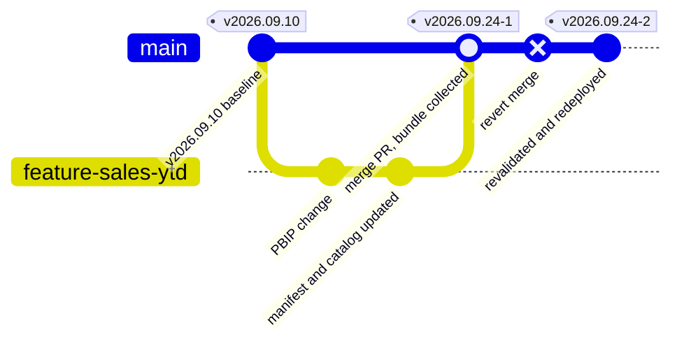

# Chapter 8 — Release Evidence and Rollback

*Platform Development: For Enterprise Power BI and Microsoft Fabric*

Every chapter so far has produced evidence: a structure log, effective rule files, rule-engine output, a DAX catalog result, a deployment log, a manifest, an exception register. Most of that evidence is excellent at the moment it's created and very hard to find three months later, when someone asks what changed in the production finance model, who approved it, and how to put it back.

This chapter is about making the answer to that question a file you can open rather than a reconstruction you have to perform.

## A release is a commit, a decision, and a bundle

The position this chapter defends is that every promotion to a controlled environment should leave behind a durable release record tied to the immutable source revision promoted, the approval that authorized it, and the evidence produced by its gates. That record must remain retrievable for the period the organization may need to explain, reproduce, or reverse the release. A rollback is a new, linked release: revert or restore the intended version, rerun the appropriate gates, redeploy, and record the decision and verification result.

<!-- EDITORIAL: replaced "exactly one commit and exactly one recorded release decision" with an attributable-revision-plus-durable-decision-chain framing, per reviewer feedback that "exactly one" confused traceability with cardinality (an incident or rollback approval can add a second linked decision to the same promoted commit). -->


The claim is falsifiable. Choose a Prod release from last quarter and, without asking anyone, produce the commit it came from, the rule set it was held to, the DAX results, the approver, and the steps to restore the previous version. If you can do that from stored artifacts in a few minutes, your evidence practice is sound. If the answer involves searching chat history and hoping artifacts haven't expired, this chapter describes why, and what to change.

Release managers and platform engineers own this chapter. Report and model authors should read the sections on what a pull request should carry and on rollback limits, because the evidence starts in the pull request they open.

## The release nobody could reconstruct

The failure mode is not missing evidence at release time. It is evidence that existed, was never assembled, and then aged out.

> **ILLUSTRATIVE SCENARIO — Ninety Days, Seven Days, and a Downloads Folder**
>
> *This illustrative scenario is derived from the repository's artifact-retention settings, documented platform defaults, the governance checklist, Lab 3's approval flow, and browser-tool export behavior. It illustrates a recurring failure pattern rather than a single audit.*

<!-- EDITORIAL: shortened the Field Note's source disclaimer per reviewer feedback that the original front-loaded a full source inventory before the incident narrative begins; full source list is unchanged, just condensed to one sentence. -->

>
> An internal auditor asks a BI team to show the evidence behind a Prod promotion of a finance semantic model from the previous quarter.
>
> The team's pipeline runs on GitLab. The DAX results and the `pbip-drop` artifact for that commit were retained for seven days, as the pipeline file specifies, and are gone. A sister team on GitHub is in better shape, but only because GitHub's default retention is ninety days and the release happened eighty days ago; next week it would be gone too. Neither pipeline ever published the effective rule files, because `Prepare-QualityRules.ps1` writes them to the runner's temporary directory.
>
> The Release Readiness Dashboard's recommendation for that release was exported to HTML and is in the release manager's Downloads folder. The PR Quality Summary was pasted into the pull request, where it still is. The Prod approval, per Lab 3's process gate, was a Teams message reading "Approved." The governance checklist calls for a release tag in the form `vYYYY.MM.DD`; nobody created one, and nothing in any pipeline creates it automatically.
>
> **What changed after this:** the team defined a release bundle, added a pipeline step to collect it, stored it with a retention period set by policy rather than by platform default, tagged each promoted commit, and moved the Prod approval from chat into the platform's environment approval so the approver's identity is recorded with the run.

Nothing in that story required anyone to be careless. The evidence was generated at every step. It was just scattered across four systems, each with its own retention, and nobody owned putting it together.

## The operating model: bundle, decide, retain, roll back through the gates

### What the bundle contains

A release bundle answers the review standard the toolkit's own workshop answer key sets out in `docs/workshops/accelerator-toolkit/reference-output/README.md`: what standards apply, what is automated and what is manual, what changed, what is impacted downstream, which pipeline ran, what exceptions exist and who approved them, whether the release is ready, and how maturity is measured. Mapped to this repository's artifacts, the bundle for one promotion contains:

| Question | Artifact | Produced by |
|---|---|---|
| Which commit? | Merge commit SHA, release tag, pull request link | Git and the CI platform |
| Was the project structurally sound? | Structure validation log | `validate_pbip_structure.py` |
| Which rules applied? | `Rules-Dataset.effective.json`, `Rules-Report.effective.json`, tool versions | `Prepare-QualityRules.ps1` or `New-EffectiveQualityRules.ps1` |
| What did the rules find? | Tabular Editor and Fab Inspector output | Rule jobs |
| What did the DAX catalog check? | `test-results/dax-test-results.xml` | `run_dax_tests.py` |
| What changed? | `pbip-diff-report.md` and `.json` | PBIP Diff Viewer |
| What could be affected? | `dependency-impact-report.md` and `.json` | Dependency Impact Analyzer |
| What did reviewers see? | `PR-Quality-Summary.md` and `pr-quality-summary.json` | PR Quality Summary Generator |
| What was deployed where? | `deployment-manifest.json`, including PBIX hashes for GCC High | Deployment Manifest Builder and `New-PbixDeploymentManifest.ps1` |
| What was waived? | `policy-exceptions.json` at the time of release | Policy Exception Register |
| Did bindings and refresh work? | Post-promotion verification output and refresh status | Chapter 5's verification step |
| Who decided? | Release Readiness Dashboard JSON, approver identity, deployment note | Dashboard, platform approval, Fabric deployment pipeline |

Most of those artifacts already exist somewhere in a run of this repository's pipelines or tools. The bundle's value is putting them in one place under one identifier.

### What the pull request should carry

The bundle starts in the pull request, and that is the report author's contribution. A reviewer should be able to answer "what changed and what could it affect" from the pull request without opening the PBIP JSON.

Two tools make that practical. The PBIP Diff Viewer at `tools/pbip-diff-viewer/index.html` compares a before and an after folder and classifies each changed file—report page, semantic model, rules, DAX tests, manifest, pipeline—by path, then exports Markdown and JSON. The Dependency Impact Analyzer at `tools/dependency-impact-analyzer/index.html` takes a list of changed objects such as `Revenue` or `Sales[Amount]` and lists measures, relationships, visuals, pages, tests, and governance files that mention them. Its matching is case-insensitive substring search across TMDL and report JSON, not a parse of DAX dependencies, so it over-reports. A change to `Revenue` also lists everything that mentions `Revenue YTD`. Treat its output as a review list to narrow, not a dependency graph to trust.

The repository's `.github/pull_request_template.md` is not the template to use for this. It is a checklist for changes to the toolkit itself: documentation, tool cards, sparse-clone scripts. The Fabric-oriented template is the example in `docs/architecture/github-fabric-git-best-practices.md`, with sections for the feature workspace preview, changed areas, validation, and screenshots. Add a line for the committed evidence folder and a line for exceptions introduced or renewed, and it becomes the front page of the bundle.
### The decision is part of the evidence

The governance checklist's post-release section lists what should happen after a Prod promotion.

**Listing 8.1 — `docs/governance/governance-checklist.md`, lines 137–143.** The checklist's post-release items, including a release tag.

```markdown
## 5. Post-Release *(within 48 hours of Prod promotion)*

- [ ] Prod dataset refreshed at least once on the new schedule without errors  
- [ ] End-user spot check: 3–5 users confirm key visuals are correct  
- [ ] Release tag created in Git: `vYYYY.MM.DD` pointing to the merge commit  
- [ ] Release notes published (what changed, known issues, support contact)  
- [ ] Retro item logged if any **[BLOCK]** items were triggered during this cycle  
```

Two items there anchor the bundle: the release tag pointing at the merge commit, and the release notes. Neither is automated anywhere in the repository. No pipeline creates a tag, and no step writes release notes. The core workshop plan in `docs/workshops/core-fabric-git/README.md` repeats the convention, "Tag releases as: `vYYYY.MM.DD`." A date-only tag breaks down when two releases happen on the same day; append a sequence or the short commit SHA.

The release decision itself deserves a durable form. The Release Readiness Dashboard at `tools/release-readiness-dashboard/index.html` is built for that. It takes pasted or loaded evidence for seven signals and produces a score, a blocker and warning count, a recommendation, and HTML, Markdown, or JSON exports. How it scores deserves as much scrutiny as the scores it produces.

**Listing 8.2 — `tools/release-readiness-dashboard/index.html`, lines 94–102.** Each signal is scored by presence and by regular-expression matches against pasted text.

```javascript
      const signals=[
        signal("Pipeline validation",has(pipeline),has(pipeline)?count(pipeline,/##\[error\]|\berror\b|failed for .* exit code/gi):1,count(pipeline,/##\[warning\]|\bwarning\b/gi),"CI and validation logs"),
        signal("PR quality summary",has(pr),(prJson?.errors||0),((prJson?.warnings||0)+(prJson?.risks?.length||0)),"Reviewer handoff"),
        signal("PBIP readiness",has(ready),has(ready)?count(ready,/\bblocker\b|missing|does not resolve/gi):1,count(ready,/\bwarning\b/gi),"Pre-PR scanner output"),
        signal("Deployment manifest",has(manifest),has(manifest)?0:1,0,"Release ownership and target mapping"),
        signal("Policy exceptions",has(exceptions),(exJson?.exceptions||[]).filter(e=>e.status==="expired").length,count(exceptions,/expiring|requested/gi),"Exception ownership and expiry"),
        signal("Effective rules",has(rules),0,has(rules)?0:1,"Branch-aware rules generated"),
        signal("DAX tests",has(dax),has(dax)?count(dax,/\bfailed\b|##\[error\]/gi):1,count(dax,/\bskipped\b|warning/gi),"Measure validation")
      ];
```

Presence counts for a lot: a missing signal costs eight points and, for most signals, adds a blocker. But three signals are satisfied by any non-empty text. The deployment manifest and effective-rules signals never add a blocker once something is pasted, and exceptions count as expired only when their `status` field literally reads `expired`. The Policy Exception Register computes expiry from dates for display, but exports the status the user chose. An approved exception whose date has passed therefore reaches the dashboard as `approved`.

The DAX signal has a sharper problem. Its blocker pattern looks for the word "failed" or an Azure DevOps `##[error]` marker. The DAX runner's summary line says "failures," and its JUnit file uses `<failure>` elements. I ran the dashboard's two DAX regular expressions against the runner's actual output from a failing run on September 24, 2026. The summary line "5 checks, 2 failures, 0 skipped" produced zero blockers and one warning. So did the failing JUnit XML. So did the summary line from a passing run. As written, the dashboard can't distinguish a failing DAX catalog from a passing one. Until that's fixed, paste the pipeline's own stage result alongside the DAX output, or edit the pattern to match `failures="[1-9]` and `<failure`.


Used with those limits in mind, the dashboard's JSON export is a good bundle entry. It records the release name, target, owner, timestamp, score, decision, and per-signal counts. Pair it with the approver's identity from the platform, not a chat message.

### What the repository retains today

Retention is the part of the story the pipelines control directly, and the three adapters control it differently.

**Azure DevOps** publishes the whole `shared` folder as the `pbip-drop` pipeline artifact. That includes the PBIP project, the rule baselines, the scripts, and the DAX catalog, so the artifact alone records much of what the run used. DAX results reach the **Tests** tab only when the runner succeeds, as Chapter 4 showed. How long all of it lives is governed by the project's retention policies in Azure DevOps settings, which the YAML doesn't set.

**GitHub Actions** uploads two artifacts: `pbip-artifacts`, which holds only the PBIP folder, and `dax-test-results`. GitHub's documentation gives ninety days as the default retention for workflow artifacts and logs, adjustable at repository or organization level. The workflow sets no `retention-days` of its own.

**GitLab CI/CD** sets retention explicitly, and short.

**Listing 8.3 — `gitlab/gitlab-ci.yml`, lines 244–252.** GitLab keeps the deployable artifact for seven days.

```yaml
  script:
    - echo "Packaging PBIP artifact from $PBIP_PATH"
    - mkdir -p pbip-drop
    - cp -r "$PBIP_PATH/." pbip-drop/
  artifacts:
    name: "pbip-drop-${CI_COMMIT_SHORT_SHA}"
    paths:
      - pbip-drop/
    expire_in: 7 days
```

The DAX job's artifacts use the same `expire_in: 7 days`. That is a sensible default for CI noise and too short for release evidence.

Nothing in any adapter retains the effective rule files, which are written to temporary directories and discarded with the runner. The rule engines' console output survives only in job logs, under each platform's log retention. Tabular Editor prints its version at the top of that output, so the version is recoverable from logs. The browser tools' outputs—readiness, diff, impact, PR summary, dashboard—are downloads or, with the local server described in Chapter 9, files written under `shared/` that someone must then commit. Fabric's side is limited too. Both the Power BI and Fabric REST references describe the deployment pipeline operations list as returning up to the twenty most recent deploy operations. Anything you want to keep from older promotions, you must have saved at the time.

The repository also doesn't implement signatures, attestations, or checksums over the evidence, beyond the PBIX and PBIP-source hashes in the GCC High manifest. If you need tamper evidence, add it deliberately. Platform features such as GitHub's artifact attestations are one route; storing the bundle in an immutable store is another.

### Where the manifest lives, and which schema it uses

The deployment manifest is the bundle's table of contents, and the repository currently has two incompatible shapes for it. The toolkit schema, written by `New-PbixDeploymentManifest.ps1` and by the Deployment Manifest Builder, looks like this.

**Listing 8.4 — `shared/scripts/New-PbixDeploymentManifest.ps1`, lines 220–243.** The toolkit manifest schema: solution object, artifacts object, environments array.

```powershell
    return [pscustomobject][ordered]@{
        version = 1
        solution = [pscustomobject][ordered]@{
            name = $Name
            domain = ''
            criticality = 'medium'
            businessOwner = ''
            technicalOwner = ''
            supportContact = ''
            description = ''
        }
        artifacts = [pscustomobject][ordered]@{
            pbipFile = Get-FirstRelativeFile -RootPath $RootPath -Filter '*.pbip'
            reportPath = Get-FirstRelativeDirectory -RootPath $RootPath -Suffix '.Report'
            semanticModelPath = Get-FirstRelativeDirectory -RootPath $RootPath -Suffix '.SemanticModel'
            rulesReport = 'shared/Rules-Report.json'
            rulesDataset = 'shared/Rules-Dataset.json'
            daxTests = 'shared/dax-tests.json'
            pbixFile = Get-RelativePath -RootPath $manifestDirectory -FilePath $ResolvedPbixFile
            pbixSha256 = ''
            pbipSourceSha256 = ''
            pbixGeneratedUtc = ''
            pbixGeneratedBy = ''
        }
```

The workshop's answer key uses a different one.

**Listing 8.5 — `docs/workshops/accelerator-toolkit/reference-output/deployment-manifest.example.json`, lines 1–18.** The reference-output manifest: top-level solutionName, an owners object, and artifacts as an array.

```json
{
  "version": 1,
  "solutionName": "Sales Performance Analytics",
  "businessPurpose": "Provide governed sales KPI reporting for sales operations and executive review.",
  "owners": {
    "businessOwner": "Sales Operations",
    "technicalOwner": "BI Platform Team",
    "releaseOwner": "Sales BI Lead"
  },
  "artifacts": [
    "Sales Performance.pbip",
    "Sales Performance.Report",
    "Sales Performance.SemanticModel",
    "Rules-Report.json",
    "Rules-Dataset.json",
    "dax-tests.json",
    "policy-exceptions.json"
  ],
```

They aren't interchangeable. The builder's loader reads `solution.name`, so the answer key's solution name loads as blank. And when I copied the answer key next to a stand-in project and ran `New-PbixDeploymentManifest.ps1 -ValidateOnly` on September 24, 2026, the script, which runs under strict mode, stopped with "The property 'pbixFile' cannot be found on this object," because `artifacts` is an array rather than an object. Standardize on the toolkit schema and treat the answer key as illustrative. Commit the manifest with the project, as the GCC High path already requires, so that every release commit carries its own manifest.

### Rollback goes back through the gates

There is no rollback button in this stack, and the repository's manifest default describes the right path: "Revert Git commit and redeploy the previous successful artifact." What that means depends on the environment.

In Dev and feature workspaces, rollback is a `git revert` of the merge commit, followed by the ordinary pipeline: validation, rules, tests, publication, and the CI deployment. Two properties of `deploy-dynamic.ps1` shape the result. It updates existing items in place.

**Listing 8.6 — `shared/scripts/deploy-dynamic.ps1`, lines 764–772.** An existing item is updated by ID with updateDefinition, so its identity survives the redeploy.

```powershell
    if ($existingItem) {
        Write-Host "Updating $type '$displayName' ($($existingItem.id))."
        $typePathSegment = Get-FabricTypePathSegment -Type $type
        $response = Invoke-FabricApi -Method Post -Path "workspaces/$WorkspaceId/$typePathSegment/$($existingItem.id)/updateDefinition?updateMetadata=true" -Body @{
            definition = $definition
        } -ReturnResponse
        Wait-FabricResponseOperation -Response $response
        return $existingItem.id
    }
```

Because the script resolves items by display name and type and then calls `updateDefinition` on the existing ID, a revert that restores the previous definition keeps the item's identity. Reports bound to the model stay bound. But the script never deletes anything. A release that *added* a report or model leaves that item in the workspace after the revert, and a release that *renamed* one leaves both names behind, because the rename created a new item. Remove those by hand, and list them in the rollback plan.

In Test and Prod, rollback happens through the Fabric deployment pipeline, not CI. Microsoft's deployment-process documentation says content can be deployed to any adjacent stage in either direction, and that an overwrite "only overwrites the content of the item. The item's ID, URL, and permissions remain unchanged." Deployment rules stay on the target stage, and gateway mappings persist across deployments. Rolling Prod back to the previous release therefore means one of two things. You can promote the previous known-good content forward again from Test, after reverting Dev and re-promoting through Test, which re-runs every gate. Or you can deploy backward from a stage that still holds the previous version. The first is slower and keeps the evidence chain intact. The second is faster and should itself produce a bundle entry explaining why.

Item identity deserves one more sentence of care, because it's where Dev and the promoted stages differ. In Dev, `deploy-dynamic.ps1` identifies items by the display name and type in each folder's `.platform` file, so identity follows the name. In Test and Prod, Microsoft's documentation says deployment pipelines pair items through "the connection between the parent item and its clones," so identity follows the pairing that the first deployment created. A rename in the PBIP source therefore creates a new item in Dev on the next CI run, while the deployment pipeline treats the renamed Dev item according to its own pairing. Rename semantic models and reports rarely, deliberately, and with a note in the bundle.
For GCC High, the deployable artifact is the committed PBIX. Rollback is a revert that restores the previous PBIX and manifest together, followed by the guarded import. The manifest check from Chapter 5 will refuse a revert that restores one without the other, which is exactly what you want.

Whichever path you take, treat rollback as a release with its own evidence bundle: record why it happened, the version restored, the gates rerun or bypassed, the approver, and the verification result. A rollback that bypasses the gates to save time may be the right call in the moment. It should still leave a bundle that says so, because the next audit will ask about it exactly as it asks about the release it undid.

Do not describe rollback as a full undo. Reverting the model does not restore refreshed data — a refresh after the bad release has already loaded data under the bad model, and reverting the model doesn't restore the previous data until the next refresh. It does not reverse warehouse-side changes: a renamed table in the warehouse isn't reverted by anything in this repository. It does not reset deployment rules and gateway bindings, which aren't part of the PBIP source, so a rule someone edited during the bad release stays edited. And a release that added or renamed items may leave newly created workspace items behind, as noted above. The repository contains no automated rollback test. Rehearse these limits in a non-production environment before an incident, record the recovery time you actually observe, and keep that record in the bundle template.

<!-- EDITORIAL: merged and tightened the rollback-limits paragraphs into an explicit operational-warning list, per reviewer feedback that the substance was strong but spread across two paragraphs in a way that made it harder to scan during an incident. -->


### Figure 8.1 — Evidence and rollback on the commit graph



## Building the bundle

The repository doesn't assemble a bundle today, so this is a pattern to add, one platform at a time. It needs no new tools.

For each approved Test or Prod promotion, create one immutable bundle directory named for the release tag or promotion ID. Its index must identify the source SHA, target environment, CI run, Fabric operation, approver, and verification result. Store beneath that index: the effective rules, validation and DAX results, manifest, exception register, PR summary, deployment note, and post-promotion verification output.

The collection job should run after approval and after promotion verification. It must collect failed-test output as well as successful output, copy runner-temporary files before the runner is discarded, and publish the finished bundle to the policy-governed store. The implementation syntax differs by CI platform; the bundle contract does not. Concretely, on each platform:

First, make the ephemeral files durable. In each rule job, copy the effective rule file out of the temporary directory into a folder that the job publishes as an artifact: `$(Agent.TempDirectory)` on Azure DevOps, `$env:RUNNER_TEMP` on GitHub, `$env:TEMP` on GitLab. Do the same for the DAX XML, and on Azure DevOps add `condition: always()` so the failure case is kept too.

<!-- EDITORIAL: added an explicit bundle index/contract statement ahead of the platform-by-platform steps, per reviewer feedback that the section described what to gather without ever specifying the index/schema that proves an artifact belongs to a given release. -->


Second, add the reviewer artifacts to the pull request. Lab 5 in `docs/workshops/accelerator-toolkit/labs/lab5-review-readiness-impact.md` already walks authors through exporting the readiness, diff, impact, and PR summary files. Ask authors to commit those exports under a release folder in the pull request, for example `release-evidence/<pr-number>/`, instead of attaching them to a comment. They become part of the merge commit and inherit Git's retention.


Third, collect the bundle at promotion time. When a promotion to Test or Prod is approved, a small job gathers the merge commit, the tag, the committed manifest and exception register, the CI artifacts for that commit, the Fabric deployment operation for the promotion, the post-promotion verification output, and the dashboard JSON. It writes them to a store with a retention period set by policy. Use the Fabric deployment's note field to record the commit SHA, so the Fabric side of the record points back to Git.

Fourth, move approvals into the platform. Pull-request approvals are already recorded by all three platforms. Promotion approvals aren't recorded anywhere unless you put them there. Lab 3 uses a Teams message as its Prod approval, a deliberate simplification for a workshop. In production, use an Azure DevOps environment with approvals and checks, which means converting the relevant stage to a deployment job, a GitHub environment with required reviewers, or a GitLab protected environment with deployment approvals. The approver's identity then lives with the run that performed the promotion.

### When the record has holes

Most evidence gaps show up as a specific question nobody can answer. These are the common ones in this repository's setup.

| Question that can't be answered | Usual cause | Fix |
|---|---|---|
| Which rules was this release held to? | Effective rule files were written to a runner's temporary directory | Publish them as an artifact from each rule job |
| Did the DAX catalog pass? | Azure DevOps didn't publish results after a failure, or artifacts expired | Add `condition: always()`; copy results into the bundle |
| Who approved Prod? | Approval was a chat message | Use a platform environment approval |
| Which commit is in Prod? | No tag, and no commit SHA in the Fabric deployment note | Tag promoted commits; put the SHA in the deployment note |
| What did the reviewer see? | The PR summary was pasted into a comment that was later edited | Commit the exported summary in the pull request |
| Was the manifest current? | The manifest wasn't committed, or used the answer-key schema | Commit it with the project; validate with the script |
| Was the promoted binding right? | No post-promotion verification ran | Add Chapter 5's verification step and keep its output |
### Deciding how long to keep it

Retention should come from the question the evidence answers, not from the platform. Three horizons cover most organizations. CI noise—runs on feature branches and failed pull-request builds—needs days, and GitLab's seven-day `expire_in` is about right for it. Release evidence for Test and Prod promotions needs at least as long as your audit or change-management window, which is usually measured in years, not the ninety days GitHub keeps by default. And the handful of artifacts you would need to rebuild a release from scratch—the manifest, the PBIX for GCC High, the tag—should live as long as the content they describe is in production.

That argues for splitting storage. Let each CI platform keep run artifacts on its own schedule. Copy the bundle for promotions into a store the organization governs, with retention and deletion controls set by policy and access limited to the release role and auditors. Keep the small, rebuild-critical files in Git, where they already live if the pull request carries them. Whatever you choose, write the retention period into the team's standard next to the bundle definition, so the next person to ask "how long do we keep this?" finds an answer rather than a default.
## Approvals and evidence across the three platforms

The release-evidence model is platform-neutral; approval and artifact-collection mechanics are not. Across Azure DevOps, GitHub Actions, and GitLab CI/CD, require the same record: source SHA and tag, CI evidence, promotion operation, platform-recorded approval, and post-promotion verification. Azure DevOps records pull-request approvals through branch policies, keeps pipeline artifacts under project retention policies, and has no environment on its deploy stages, so there is no deployment approval to record without YAML changes. GitHub records pull-request reviews under rulesets or branch protection, keeps artifacts for ninety days by default, and names `dev` and `feature` environments on its deploy jobs, where required reviewers can be configured without touching the workflow. GitLab records merge-request approvals under its approval rules, keeps this repository's artifacts for seven days because the YAML says so, and names environments on its deploy jobs that can be protected. None of the three adapters creates a tag, writes release notes, stores effective rules, or collects a bundle by default. Implement collection at each platform's protected promotion boundary — an Azure DevOps deployment job targeting an approved environment, a GitHub job bound to a protected environment, or a GitLab job bound to a protected environment and its required artifacts. Those steps are yours on every platform.

<!-- EDITORIAL: added a lead sentence separating the universal record from the platform-specific mechanics, per reviewer feedback that the original read as a dense compatibility paragraph without first stating what must stay constant across adapters. -->


The bundle-collection job itself is the one piece that must be written per platform, and its shape follows each platform's approval mechanism. On Azure DevOps it belongs in a deployment job targeting an environment, so it runs only after the environment's approvals and checks pass and can download the triggering run's artifacts. On GitHub it belongs in a job bound to the protected environment, so required reviewers gate it, with `actions/download-artifact` pulling the run's files. On GitLab it belongs in a job with the protected environment and `needs` on the jobs whose artifacts it collects. In all three, the Fabric side is a fourth system. The collection job must call the deployment pipeline operations API, or record the operation ID the promotion step returned, because no CI platform knows about a promotion it didn't perform.
## Trade-offs and lighter paths

A full bundle for every Dev deployment is overkill. Dev changes many times a day, and its evidence is the CI run itself. Reserve the bundle for promotions to Test and Prod, where it's rare enough to be affordable and consequential enough to matter.

A small team can get most of the value with three changes and no new infrastructure. Tag each promoted commit. Commit the manifest, exception register, and PR summary in the pull request. And paste the Fabric deployment's note and the verification result into the release notes the governance checklist already asks for. Git then holds the whole record, with Git's retention.

A regulated team should go further: store bundles in an immutable location, sign or attest them, record the tool versions and runner images alongside the outputs, and rehearse rollback on a schedule with recorded outcomes. None of that is in the repository today, and each item should be explicit in the team's standard rather than assumed from the toolkit.

The trade-off to avoid is keeping everything forever in the CI platform by raising retention limits across the board. That keeps a great deal of noise and still doesn't collect the evidence that lives outside CI—the Fabric deployment record, the approval, the verification—into one place.

## Evidence and further reading

Repository sources: `docs/governance/governance-checklist.md`, `docs/workshops/core-fabric-git/README.md`, `docs/workshops/core-fabric-git/labs/lab3-deployment-pipelines.md`, `docs/workshops/accelerator-toolkit/labs/lab5-review-readiness-impact.md` and `lab6-pipeline-release-governance.md`, `docs/workshops/accelerator-toolkit/reference-output/` (README, manifest, readiness, and PR summary examples), `tools/release-readiness-dashboard/index.html`, `tools/pr-quality-summary-generator/index.html`, `tools/policy-exception-register/index.html`, `tools/pbip-diff-viewer/index.html`, `tools/dependency-impact-analyzer/index.html`, `tools/deployment-manifest-builder/index.html`, `shared/scripts/deploy-dynamic.ps1`, `shared/scripts/New-PbixDeploymentManifest.ps1`, and the three pipeline files.

First-hand evidence, gathered September 24, 2026: the dashboard's DAX and pipeline regular expressions evaluated against the runner's actual passing and failing output and against a Tabular Editor log; the manifest validation failure against the reference-output example; and the source reading of each adapter's artifact and retention settings.

Official documentation:

- Fabric deployment process, overwrite behavior, and deploying in either direction: https://learn.microsoft.com/en-us/fabric/cicd/deployment-pipelines/understand-the-deployment-process
- Fabric REST, list deployment pipeline operations: https://learn.microsoft.com/en-us/rest/api/fabric/core/deployment-pipelines/list-deployment-pipeline-operations
- Power BI REST, Get Pipeline Operations: https://learn.microsoft.com/en-us/rest/api/power-bi/pipelines/get-pipeline-operations
- Azure Pipelines retention policies: https://learn.microsoft.com/en-us/azure/devops/pipelines/policies/retention
- Azure Pipelines environments, approvals, and checks: https://learn.microsoft.com/en-us/azure/devops/pipelines/process/approvals
- GitHub artifact and log retention: https://docs.github.com/en/organizations/managing-organization-settings/configuring-the-retention-period-for-github-actions-artifacts-and-logs-in-your-organization
- GitHub artifact attestations: https://docs.github.com/en/actions/concepts/security/artifact-attestations
- GitHub deployments and environments: https://docs.github.com/en/actions/reference/workflows-and-actions/deployments-and-environments
- GitLab job artifacts and `expire_in`: https://docs.gitlab.com/ci/jobs/job_artifacts/
- GitLab deployment approvals: https://docs.gitlab.com/ci/environments/deployment_approvals/
- Git revert: https://git-scm.com/docs/git-revert

## Freshness note

Last verified September 24, 2026. GitHub's default artifact retention of ninety days, the twenty-operation limit on deployment pipeline operation lists, and Fabric's overwrite and bidirectional deployment behavior were taken from the documentation available that day. The dashboard and manifest behaviors were observed against the repository as it stood on that date. Platform retention defaults and approval features change, and some are plan-dependent, so confirm them for your organization before setting a retention policy around them.

## Reader decision checklist

1. For your most recent Prod promotion, can you produce the commit, tag, effective rules, DAX results, manifest, exceptions, approver, and verification result from stored files alone?
2. How long does each of your CI platforms keep the artifacts for a release commit, and is that longer than your audit window?
3. Where are the effective rule files for a release stored after the runner that created them is gone?
4. Which manifest schema do your projects use, and does `New-PbixDeploymentManifest.ps1 -ValidateOnly` accept it?
5. Who approves promotions to Test and Prod, and is that approval recorded by the platform with the approver's identity?
6. Does your Release Readiness Dashboard input include something that actually registers a DAX failure?
7. For a bad Prod release, which rollback path will you use, and have you rehearsed it with recorded results?
8. After a rollback, which items, rules, bindings, or data will still reflect the bad release, and who removes or refreshes them?
