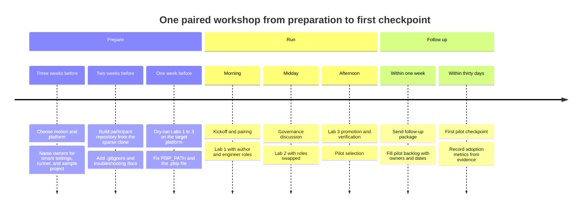

# Chapter 9 — Adoption and Workshop Delivery

*Platform Development: For Enterprise Power BI and Microsoft Fabric*

The previous eight chapters describe an operating model. None of it matters if the people who build reports and the people who run pipelines never learn it together. A report author who has never seen a quality gate fail will treat the first failure as a platform bug. A platform engineer who has never opened Power BI Desktop will design a gate that rejects the way authors actually save their work. Adoption starts when those two people sit at one keyboard and watch the same change move from a branch to a workspace.

This chapter is about designing that session, running it with the repository's real materials, and following it up in a way that produces evidence rather than enthusiasm.

## Teach the operating model in pairs, then prove it on one pilot

**A workshop should be designed as the first checkpoint of a pilot, not as a standalone training event.** Run report authors and platform engineers together when the lab requires them to hand work to one another; preflight the exact repository, platform, and pipeline the pilot will use; and leave the session with one named pilot, owners, dates, and an evidence-producing first promotion.

This is a strong default, not a universal format. Its value is testable: compare whether the pilot reaches its first governed promotion, with retained release evidence, against the agreed checkpoint date.

<!-- EDITORIAL: consolidated the three-part claim into one governing statement with a measurable outcome, per reviewer feedback that pairing was stated too unconditionally and the chapter otherwise concedes it has no comparative outcome data. -->


That claim is falsifiable. If teams that attend separate author and engineer sessions adopt the model as reliably as teams trained in pairs, or if workshops without a named pilot produce governed releases as often as workshops with one, then the pairing and the pilot are ceremony. The repository contains no outcome data either way. It contains workshop *design*, not attendance figures or adoption statistics, and this chapter doesn't invent any. What it can show is that the materials themselves assume pairing, and where they will trip a pair up if the facilitator hasn't prepared.

Facilitators and delivery leads own most of this chapter. BI leads should read the pilot and follow-up sections, because they will own the pilot after the facilitator leaves.

## Where a well-designed workshop goes wrong

The failure mode is rarely a bad agenda. It is a good agenda meeting an environment nobody tested, so that the room spends its energy on setup instead of the model.

> **ILLUSTRATIVE SCENARIO — The Lab That Worked, and the Lab After It**
>
> *This scenario is reconstructed from the repository's Lab 1 and Lab 2 materials, the facilitator change log, the PBIP validator, and Microsoft's Power BI Desktop projects documentation. It illustrates a handoff that a dry run must test; it is not an account of a delivered workshop.*

<!-- EDITORIAL: shortened and reworded the composite disclaimer to describe it as an illustrative preflight scenario rather than a Field Note carrying incident-level evidentiary weight, per reviewer feedback that the label borrowed the authority of a first-hand account while explicitly disclaiming one. Heading relabeled from "COMPOSITE FIELD NOTE" to "ILLUSTRATIVE SCENARIO" per your instruction. -->

>
> A pair—one report author, one platform engineer—completes Lab 1 without trouble. They connect a Fabric workspace to the repository with the folder path `/projects`, as the lab directs, sync, branch, change a text box, and merge. The repository now contains their report and semantic model folders under `projects/`.
>
> Lab 2 asks them to run `azdo/azure-pipelines.yml`. Its first job validates `shared/pbip-local`, which contains only a README, and fails with "No .pbip file found." The engineer points the pipeline at `projects/` instead. The job fails again with the same message. Lab 1's Part 2.2 showed a `.pbip` file in the expected structure, so the pair assumes their sync went wrong and re-syncs.
>
> The facilitator knows the answer from Microsoft's own FAQ on Power BI Desktop projects: there is no `.pbip` file when a Fabric workspace connects to Git, because "the PBIP file is optional and simply serves as a shortcut to the report folder." The repository's validator requires exactly one. The pair adds a minimal `.pbip` pointing at their report folder, and the job gets past its first check to the report's own references.
>
> **What changed after this:** the facilitator added a pre-built `.pbip` and a note to the workshop's setup, set `PBIP_PATH` to the Lab 1 folder path in the participants' pipeline copy, and moved that check into the dry run.

The lesson isn't that the labs are wrong. Each lab is internally consistent. The failure is that Lab 1's output and Lab 2's input were designed separately, and only a dry run on the real platform shows where they disagree.

## The operating model for delivery

The repository offers two workshops and a delivery guide. Read together, they describe a sound model that this chapter makes explicit: pairs, a real platform, a dry run, a paced agenda, and a pilot with owners.

### Two workshops, one pairing rule

The canonical material lives under `docs/workshops/`. The older `docs/workshop-plan/` folder now redirects to it—its `README.md` is a compatibility stub—but the folder still contains its original lab files and `Fabric_Git_Workshop_Plan.md`; treat `docs/workshops/` as authoritative and the old folder as legacy content pending cleanup. The **Core Fabric Git Workshop** in `docs/workshops/core-fabric-git/README.md` teaches workspace Git integration, PBIP, branching, CI validation, and deployment pipelines through three labs. Its agenda runs a full day.

**Listing 9.1 — `docs/workshops/core-fabric-git/README.md`, lines 20–33.** The core workshop's full-day agenda.

```markdown
| Time        | Topic                                                                 |
|-------------|------------------------------------------------------------------------|
| 09:00–09:20 | Kickoff, objectives, prerequisites check                               |
| 09:20–10:15 | Version control in Fabric & PBIP; Git with Azure DevOps/GitHub         |
| 10:15–10:30 | Break                                                                  |
| 10:30–11:30 | **Lab #1:** Connect Workspace → Git; branch & PR workflow              |
| 11:30–12:15 | Collaboration patterns & governance best practices                     |
| 12:15–13:00 | Lunch                                                                  |
| 13:00–13:45 | Deployment Strategy: Dev → Test → Prod; CI/CD with Azure DevOps        |
| 13:45–14:45 | **Lab #2:** CI pipeline for PBIP, workspace Git sync (manual & automated) |
| 14:45–15:00 | Break                                                                  |
| 15:00–16:00 | **Lab #3:** Fabric Deployment Pipelines — bind workspaces, configure deployment rules, promote Dev → Test → Prod |
| 16:00–16:30 | Publishing artifacts & release checklist                               |
| 16:30–17:00 | Webapp team POC: Power BI Embedded + communications plan           |
```

Two things in that agenda need adjusting for most audiences. The last slot, a "Webapp team POC" on Power BI Embedded, is specific to the engagement the plan was written for; drop it or replace it with pilot planning. And the agenda names Azure DevOps for the deployment-strategy session and Azure DevOps or GitHub for version control, which matters for the platform comparison below.

The **Accelerator Toolkit Workshop** in `docs/workshops/accelerator-toolkit/README.md` teaches the browser tools through Labs 4, 5, and 6 and a reference review, in modules of 75, 75, 90, and 30 minutes—four and a half hours in total. Its facilitation guidance states the pairing rule this chapter argues for.

**Listing 9.2 — `docs/workshops/accelerator-toolkit/README.md`, lines 93–98.** The toolkit workshop pairs a BI-focused participant with a platform or governance participant.

```markdown
## Facilitation guidance

- Have participants work in pairs: one BI-focused participant and one platform/governance-focused participant.
- Treat generated artifacts as reviewable source files, not throwaway exports.
- Encourage participants to explain why they chose each rule severity, exception status, branch policy, and release recommendation.
- End each lab with a comparison against the reference outputs and a short discussion of what would change for the participant's real environment.
```

Apply the same rule to the core workshop. In Lab 1 the author drives Power BI Desktop and the Fabric portal while the engineer handles the repository and branch policy. In Lab 2 they swap: the engineer registers and reads the pipeline while the author interprets the rule output. In Lab 3 the author reviews the stage comparison and refresh while the engineer configures rules and the release role. Each person sees the other's half of the boundary at the moment it matters.

### Choosing the delivery motion

`docs/delivery/workshop-delivery-guide.md` defines three motions: a **briefing** for audiences deciding whether to adopt; a **workshop** for hands-on labs; and **pilot enablement** for onboarding a real project, with discovery, repository setup, rule tuning, CI/CD setup, release planning, and handoff. Choose deliberately. A briefing delivered to people who expected labs wastes a day. Labs delivered to people who haven't agreed to adopt anything produce a pleasant afternoon and no pilot. For most organizations the right sequence is a short briefing for decision-makers, the paired core workshop for the team that owns the first pilot, and pilot enablement immediately afterward, with the toolkit workshop folded into pilot enablement when the team starts writing its own rules and manifests.

### Prerequisites that actually block labs

The core plan lists participant prerequisites: a capacity-backed workspace with Contributor or higher, current Power BI Desktop, VS Code with Git extensions, repository access with permission to branch and open pull requests, the Fabric Git integration admin setting enabled, credentials if organizational policies block OAuth, and a local sample dataset and PBIP starter project. The delivery guide adds an environment checklist—workspace, Git provider, branch strategy, PBIP project, CI/CD runner, secrets, rules, DAX tests—and a pre-delivery checklist that includes service principal details if deployment automation is in scope.

In this repository review, three prerequisites are most likely to block the labs before participants reach the operating model, and all three need a named owner before the day. Tenant settings are the first: Git integration, deployment pipeline creation, and, for Lab 2's deployment stages, the service-principal settings Chapter 6 described. These are admin-portal changes that participants can't make themselves. The second is a working pipeline runner with the Windows capabilities the rule jobs need. On GitLab, that means a Windows runner someone has registered and tagged, with a .NET 8 runtime installed. The third is a PBIP project that the repository's validator accepts. That's the scenario's lesson, and it applies to the sample data as much as to customer projects.

<!-- EDITORIAL: attributed the "most lost time" prioritization to this repository review rather than stating it as a general delivery finding, per reviewer feedback that no workshop was actually delivered to support the original empirical-sounding phrasing. -->


## Building the workshop environment

### The sparse clone

The repository ships a sparse-clone script that materializes a subset of itself as a new standalone repository. The workshop catalog recommends it, through either a Windows Forms front end, `Start-SparseCloneUI.ps1`, or the script directly. The profile determines what participants receive.

**Listing 9.3 — `shared/scripts/Clone-SparseToolkitProfile.ps1`, lines 75–102.** The Standard profile, and what -IncludeWorkshop adds.

```powershell
    $standardPaths = @(
        'README.md',
        'shared/',
        'tools/',
        'images/',
        'docs/index.md',
        'docs/index.html',
        'docs/images/',
        'docs/deployment/',
        'docs/architecture/gcc-high-deployment.md',
        'docs/governance/',
        'docs/enterprise-quality-rules-pattern.md'
    )

    if ($WithWorkshop) {
        $standardPaths += @(
            'Supporting_Docs_For_Workshop.md',
            'docs/workshops/',
            'docs/delivery/',
            'docs/architecture/',
            'docs/faq.md',
            'docs/Rules-Authoring-Guide.md',
            'docs/sparse-clone-guide.md',
            'presentations/',
            'powerpoint/',
            'Social Media/video/'
        )
    }
```

I ran the script on September 24, 2026 against a local clone of the repository's committed `main` branch, in three configurations. `-Platform GitHub -Profile Standard` produced 97 files: the GitHub workflow and setup guide, `shared/`, `tools/`, images, governance and deployment docs. `-Platform AzDo -Profile Minimal` produced 39 files, without `tools/`. `-Platform GitLab -Profile Standard -IncludeWorkshop` produced 220 files, including the workshop catalog, sample data, presentations, slide decks, and the FAQ.

Preflight the generated participant repository, not just the source repository. In the tested profiles, required workshop support files were absent: `.gitignore` (the file that ignores Python caches and explicitly re-includes PBIP files, `.platform` files, and definition folders under `shared/pbip-local/`), `docs/Troubleshooting.md`, and `docs/Local-Validation-Guide.md` — even with `-IncludeWorkshop`. The GitHub platform profile also includes only `powerbi-ci.yml` and the setup guide, not the secret-scanning workflow. Add the files your delivery depends on, then rerun the same profile before distributing it.

<!-- EDITORIAL: compressed the sparse-clone omissions into facilitation guidance (action + risk) rather than a full inventory, per reviewer feedback that the density of findings made the chapter feel like a repository maintenance issue list. -->


The script's last step matters for follow-up.

**Listing 9.4 — `shared/scripts/Clone-SparseToolkitProfile.ps1`, lines 123–140.** The clone is converted to an independent repository with a single initial commit.

```powershell
function Complete-IndependentClone {
    Remove-Item -LiteralPath (Join-Path (Get-Location) '.git') -Recurse -Force
    git init -b $Branch
    if ($LASTEXITCODE -ne 0) {
        git init
        if ($LASTEXITCODE -ne 0) { throw 'git init failed.' }
        git checkout -b $Branch
        if ($LASTEXITCODE -ne 0) { throw "Failed to create branch: $Branch" }
    }

    git add -A
    if ($LASTEXITCODE -ne 0) { throw 'git add failed.' }

    git commit -m 'Initial sparse profile materialization'
    if ($LASTEXITCODE -ne 0) {
        Write-Warning 'Initial commit failed, likely because Git user.name/user.email is not configured. Files are staged for the first commit.'
    }
}
```

The result has no history and no remote. That's intentional, as the script says in its closing message: "Create a new empty repo, then add it with: git remote add origin <new-repo-url>." It also means participants' repositories can't later pull updates from the toolkit. Decide before the workshop whether that is what you want. For a pilot that will adopt fixes to `deploy-dynamic.ps1` or the rule scripts, a fork or a subtree may serve better than a detached copy.

### The sample data

When a team has no PBIP project it can use, the repository provides a synthetic dataset under `docs/workshops/sample-data/dib-supply-chain/`: eleven CSV files describing a fictional defense manufacturer's suppliers, parts, purchase orders, shipments, inspections, compliance findings, risk scores, and inventory. The README is explicit that the data is synthetic and must not be mixed with controlled or customer information. The tables are small—between 5 and 18 data rows each by my count—which makes them fast to load and useless for performance discussions. The build guide shows a Power Query pattern that reads each CSV from the public GitHub raw URL, which avoids a gateway. That URL returned the expected file when I checked it on September 24, 2026, but a tenant that blocks outbound web sources will need the local-file variant instead. Build the sample project once, before the day. Save it where the pipeline expects it, a folder containing the `.pbip` directly, as Chapter 1 explained, rather than the subfolder the build guide recommends.

### The tools and the local server

The browser tools open from `tools/index.html`, the launchpad, and run entirely in the browser.


Participants can download each tool's output and move it into the repository. Or the facilitator can run `shared/scripts/serve.py`, which serves the repository locally and adds a save endpoint that tools call to write files back.

**Listing 9.5 — `shared/scripts/serve.py`, lines 131–143.** The local server writes only under shared/ and only for four file types.

```python
            # 2. Only allow writes inside permitted directories
            relative = target.relative_to(ROOT)
            top_dir = relative.parts[0] if relative.parts else ""
            if top_dir not in ALLOWED_WRITE_DIRS:
                allowed = ", ".join(sorted(ALLOWED_WRITE_DIRS))
                self._json_error(403, f"Write blocked. Allowed directories: {allowed}/")
                return

            # 3. Only allow specific file extensions
            if target.suffix.lower() not in ALLOWED_EXTENSIONS:
                allowed = ", ".join(sorted(ALLOWED_EXTENSIONS))
                self._json_error(403, f"File type not allowed. Allowed: {allowed}")
                return
```

I tested those guards against a copy of the server in a scratch folder on September 24, 2026. A save to `shared/policy-exceptions.json` succeeded. Saves to `tools/hack.json`, to `../escape.json`, and to `shared/run.ps1` were refused with the three messages the code defines: the directory restriction, "Path escapes the repository root," and the extension restriction. The server binds to 127.0.0.1 only. Its guardrails are sensible for a workshop laptop. The files it writes still need to be committed, which is a useful teaching moment for the evidence practices in Chapter 8.

### The facilitator's own materials

The repository carries a complete slide kit. `presentations/` holds nine Marp Markdown decks—kickoff, version control and PBIP, Lab 1, collaboration and governance, deployment strategy, Lab 2, a Lab 2 facilitator briefing, Lab 3, and release with the Embedded session—and `powerpoint/` holds their PPTX exports, plus a PDF of the facilitator briefing. The numbering follows the core agenda, which makes it easy to drop the Embedded deck and keep the rest in order. Because the Markdown files are the sources, edit them, not the PPTX files, when you correct a lab detail, then regenerate the exports so the two stay in step. The delivery guide's publishing pattern says the same about its article: "The Markdown source remains the source of truth."

For briefings, `docs/delivery/workshop-datasheet.md` is the customer-facing summary, offering half-day briefing and full-day workshop formats. The demo video, in `docs/videos/` and `Social Media/video/`, walks through the toolkit in nineteen scenes. The blog article under `docs/blog/2026-07-17-enterprise-bi-devops-with-microsoft-fabric/` has HTML and PDF versions for sharing afterward.
## Running the labs on each platform

The labs aren't equally portable, and a facilitator should know exactly where each platform leaves the script.

**Lab 1** depends on Fabric's Git integration, and Microsoft's documentation lists Azure DevOps, GitHub, and GitHub Enterprise—cloud-hosted only—as the supported Git providers. The lab's instructions cover Azure DevOps and GitHub. A team whose code lives in GitLab can't connect a Fabric workspace to it, so Lab 1 and the branch-out pattern from Chapter 2 aren't available as written. For GitLab audiences, run Lab 1 as a Power BI Desktop exercise: save as PBIP, commit on a branch, push, and open a merge request. The CI pipeline, not the workspace, then carries the change into Fabric through the feature deployment.

**Lab 2** is written for Azure DevOps. It registers `azdo/azure-pipelines.yml`, adds a build-validation branch policy, and reads the Tests and Artifacts tabs. There is no GitHub or GitLab version of the lab. The equivalent setup lives in `.github/GITHUB_ACTIONS_SETUP.md` and `gitlab/README.md`, and Chapter 7's comparison tells you what will look different: no rendered DAX results on GitHub, seven-day artifacts on GitLab, and GitLab's configuration-file path setting. Two details in Lab 2 itself need correcting in advance. Its YAML excerpt shows `PBIP_PATH` as `'.'`, while the real file uses `'shared/pbip-local'` and adds a `PROJECT_ROOT` variable the excerpt omits. And its prerequisites refer to both an existing `projects` folder and `shared/pbip-local`. Pick one, and match `PBIP_PATH` to Lab 1's folder path.

**Lab 3** runs entirely in Fabric: create a deployment pipeline, assign workspaces, configure rules, compare, promote, and verify. It is the same on every platform. Its approval gate is a deliberate simplification, a Teams message, which Chapter 8 explained how to replace in production. Its REST automation extension uses the endpoint mismatch Chapter 5 described, so run it only if you correct the call.

The **toolkit labs**, 4 through 6, are platform-neutral except for Lab 6's first part, which generates Azure DevOps YAML with the Pipeline Config Generator. Treat that output as the scaffold Chapter 7 described, and compare it with the checked-in pipeline rather than committing it.

### Problems to expect on the day

Most day-of problems are documented somewhere in the repository, which means a facilitator can have the fix ready before anyone raises a hand.

| Symptom | Where it's documented | Fix to have ready |
|---|---|---|
| Git integration isn't visible in workspace settings | FAQ section 1; Lab 1 troubleshooting | The tenant setting was enabled in advance, or a demo workspace where it is |
| OAuth sign-in to the Git provider fails | FAQ section 1; Lab 1 tip | A personal access token with the scope Lab 1 names |
| A participant can't switch branches | Chapter 2; Microsoft's branch-workspace documentation | Branch switching is Admin-only by default; use branch-out or grant Admin in the lab workspace |
| `No .pbip file found` in Lab 2 | This chapter's scenario; FAQ section 3 | A prepared `.pbip` and the corrected `PBIP_PATH` |
| Rule jobs fail before evaluating anything | Chapter 3 | A Windows runner with a .NET 8 x64 runtime, and outbound access to the download URLs |
| Feature deployment reports a missing prefix | Lab 2 troubleshooting | `FeatureWorkspacePrefix` set in the variable group or equivalent |

Put this table in the facilitator note, and walk through its first three rows during the kickoff so participants recognize the symptoms when they appear.
## A buildable facilitator plan

The repository's delivery guide provides the checklists. What follows turns them into a schedule with owners. It is my plan, assembled from those materials, not a document in the repository.

### Figure 9.1 — Preparing, running, and following up one paired workshop



**Three weeks before.** Choose the motion and the CI/CD platform with the sponsor, and confirm the Git provider supports Lab 1 or plan the GitLab variant. Name an owner for each blocking prerequisite: a Fabric administrator for tenant settings, a platform engineer for the runner and variables, and a BI developer for the sample or customer PBIP project. Agree the pairs by name. One author and one engineer per pair is the design; if the room has more of one role, use trios rather than same-role pairs.

**Two weeks before.** Build each pair's repository from the sparse clone with `-IncludeWorkshop` and the target platform. Add the missing `.gitignore` and troubleshooting documents. Build the sample PBIP once, check that the structure validator passes against the folder the pipeline will use, and commit it or provide it as a download. If Lab 2's deployment stages are in scope, create the service principal, the variable group or secrets, and the feature workspace prefix. On GitLab, decide how credentials reach feature branches, given the protected-variable behavior from Chapter 2.

**One week before.** Dry-run every lab on the target platform with a colleague playing each role, and time each lab against the agenda slot. Record every deviation from the written lab, including the ones in this chapter, in a one-page facilitator note alongside `lab2-facilitator-change-log.md`. That existing change log is a good model: it tells facilitators what changed in Lab 2 and gives them a two-to-three-minute talk track. It also shows how easily such notes fall out of date: its list of the scripts and rule files the guidance now matches still names `shared/Rules-Report.json`, which the repository doesn't contain.

**On the day.** Open with the business problem and the pairing rule, then run the labs with the roles described earlier. End each lab with the reference comparison the toolkit workshop recommends: what would change in the participants' real environment. Reserve the last hour for choosing the pilot, not for the Embedded session in the original agenda.

**Afterward.** The delivery guide's follow-up package—hosted links, the article PDF, the platform setup guide, the sparse-clone guide, a pilot backlog, and open risks with owners—should go out within a week, while the pilot is still a decision rather than a memory.

## From workshop to pilot

The delivery guide includes a pilot backlog template, and it's the most useful page for the handoff.

**Listing 9.6 — `docs/delivery/workshop-delivery-guide.md`, lines 197–210.** The delivery guide's pilot backlog template.

```markdown
## Pilot backlog template

| Item | Owner | Notes |
|---|---|---|
| Select pilot PBIP project |  |  |
| Confirm workspace topology |  |  |
| Create or clone project repo |  |  |
| Configure CI/CD platform |  |  |
| Generate initial rule files |  |  |
| Run readiness scan |  |  |
| Enable branch policy |  |  |
| Document deployment manifest |  |  |
| Review exceptions and rule maturity |  |  |
| Schedule follow-up checkpoint |  |  |
```

Fill it in before the room empties. Give every row a person's name and a date, not a team name. Then add the rows this book's chapters make necessary: confirm `PBIP_PATH` and the `.pbip` file (Chapter 1); decide author versus pipeline feature workspaces (Chapter 2); commit a report rule baseline (Chapter 3); decide what the DAX stage claims to prove (Chapter 4); write the post-promotion verification (Chapter 5); record the workspace owner and release role (Chapter 6); pick the one adapter the pilot will use and its fixtures (Chapter 7); and define the evidence bundle and its retention (Chapter 8).

Ownership after the workshop should be as explicit as the backlog. The BI lead owns the backlog and the pilot's release decisions. The platform engineer owns the adapter the pilot uses, its variables and runner, and the behavioral fixtures from Chapter 7. A governance owner, often the BI lead in a small team, owns the rule baseline and the exception register. The workspace's accountable owner from Chapter 6 is named in the manifest. The facilitator owns two checkpoints and then leaves. The first, within thirty days, confirms the pipeline runs on the pilot and the backlog has moved. The second, at the pilot's first promotion to Test, reviews the evidence bundle with the team. After that, the facilitator's job is done, and the program's measures take over.
The delivery guide's success criteria are worth keeping, with one addition. They define success as the team being able to explain how PBIP moves through source control, which CI/CD pattern it will use, how validation fits pull requests, how release readiness is documented, which project is the pilot, and which rules start advisory. Those are capability statements. Add one outcome statement: the pilot's first governed promotion to Test, with its evidence bundle, by a date the sponsor has agreed.

## Measuring adoption without inventing it

The Adoption Metrics Dashboard at `tools/adoption-metrics-dashboard/index.html` tracks projects across a program: status from candidate through pilot, active, scaled, or paused; platform; owner; toolkit profile; onboarding and go-live dates; time to onboard; rules enabled and blocking; active and expired exceptions; readiness score; and last release decision.

Because the dashboard's fields are manually entered, it is useful only when each value is linked to a retained artifact. As Chapter 6 noted, its numbers are typed in, not computed. Fill each field from an artifact. Rules enabled and blocking come from the committed baseline and the effective-rules output. Exceptions come from the register. The readiness score comes from the scanner or dashboard export. The release decision comes from the bundle. A dashboard filled from memory measures optimism.

<!-- EDITORIAL: reworded to state the criterion (fields must be artifact-linked) before the endorsement, per reviewer feedback that "it is the right tool for follow-up" replaced explanation with editorial endorsement. -->


The repository's own materials make no adoption claims beyond design intent. The starter metrics in `shared/examples/adoption-metrics.json` describe a fictional "Cost Management" pilot, and the reference outputs are an answer key, not results. That is the right posture for the book too. When you report on a program, report the counts the dashboard records from evidence—pilots started, promotions completed with bundles, exceptions expired and renewed—and leave satisfaction scores out of the adoption story.

## A lighter format

Not every team can give a full day plus a half-day of toolkit labs. A realistic lighter format covers the same boundary in about three hours, provided the environment is prepared in advance.

Start with a thirty-minute framing of the operating model and the pairing rule. Then run a ninety-minute combined lab with pairs working on one prepared PBIP project in a prepared repository. Branch in Power BI Desktop or by branch-out, make one model change and one report change, push, watch the pipeline run on the target platform, read one rule failure together, and fix it. Follow with a thirty-minute walk through one Fabric deployment pipeline promotion, demonstrated by the facilitator rather than performed by every pair. Close with thirty minutes of pilot selection using the backlog template. The browser tools appear only where they serve that path: the readiness scanner before the push, the PR summary before review, the exception register if a rule needs waiving.

What the lighter format gives up is each participant configuring Git integration and deployment rules themselves. That is acceptable when the pilot team's platform engineer will configure them anyway, and not acceptable for a team that has no platform engineer. For that team, run the full core workshop.

## Trade-offs

Pairing doubles the people needed for each seat and makes scheduling harder. It is still the design to protect, because the alternative—separate author and engineer sessions—teaches each group half of every failure mode in this book.

Running on the customer's real platform costs preparation time, runner setup, and sometimes a security review. Running on a facilitator's sandbox is faster and teaches a platform the team won't use. Prioritize the customer or team's actual CI/CD platform when a security review and runner setup are feasible before the day; the dry run is what makes that affordable.

Use synthetic data for the workshop when data access, handling approvals, or refresh dependencies would consume the session. Use a customer PBIP for the pilot once the team has selected it and can support the required controls. A reasonable compromise is to teach on the synthetic project and run the pilot backlog's first row, "Select pilot PBIP project," before the day ends.

<!-- EDITORIAL: reworded both trade-off statements from declarative verdicts ("is right," "smaller trade-off than it looks") to conditional guidance, per reviewer feedback that several judgments in this section were asserted as settled despite the chapter's own admission that no workshop outcome data exists. -->


Finally, the future workshops listed in `docs/workshops/README.md`—branch strategy, environment parameter mapping, promotion planning, and six others—are placeholders, not materials. Don't schedule them as though they exist. Use the relevant chapters of this book to fill the gap if the need is urgent.

## Evidence and further reading

Repository sources: `docs/workshops/README.md`, `docs/workshops/core-fabric-git/README.md` and its three labs and facilitator change log, `docs/workshops/accelerator-toolkit/README.md`, its three labs, and its `reference-output/` folder, `docs/delivery/workshop-delivery-guide.md` and `workshop-datasheet.md`, `docs/sparse-clone-guide.md`, `shared/scripts/Clone-SparseToolkitProfile.ps1`, `shared/scripts/Start-SparseCloneUI.ps1`, `shared/scripts/serve.py`, `docs/workshops/sample-data/dib-supply-chain/`, `tools/index.html`, `tools/adoption-metrics-dashboard/index.html`, `shared/examples/adoption-metrics.json`, `.github/GITHUB_ACTIONS_SETUP.md`, `gitlab/README.md`, `presentations/`, and `Social Media/video/`.

First-hand evidence, gathered September 24, 2026: three sparse-clone runs against a local copy of the committed `main` branch, the `serve.py` save-guard tests in a scratch copy, a row count of the sample CSV files, and an HTTP check of the sample data's raw GitHub URL. No workshop was delivered for this chapter, and no attendance or adoption figures are reported.

Official documentation:

- Fabric Git integration overview and supported Git providers: https://learn.microsoft.com/en-us/fabric/cicd/git-integration/intro-to-git-integration
- Power BI Desktop projects overview, including the FAQ on the missing .pbip file: https://learn.microsoft.com/en-us/power-bi/developer/projects/projects-overview
- Fabric branch workspaces and branch-out: https://learn.microsoft.com/en-us/fabric/cicd/git-integration/branched-workspace
- Fabric deployment pipelines overview: https://learn.microsoft.com/en-us/fabric/cicd/deployment-pipelines/intro-to-deployment-pipelines
- Fabric Git integration admin settings: https://learn.microsoft.com/en-us/fabric/admin/git-integration-admin-settings
- Git sparse checkout: https://git-scm.com/docs/git-sparse-checkout
- Azure Pipelines create your first pipeline: https://learn.microsoft.com/en-us/azure/devops/pipelines/create-first-pipeline
- GitHub Actions quickstart: https://docs.github.com/en/actions/get-started/quickstart
- GitLab runner registration: https://docs.gitlab.com/runner/register/

## Freshness note

Last verified September 24, 2026. Microsoft's Git integration overview, updated in July 2026, listed Azure DevOps, GitHub, and GitHub Enterprise, all cloud-hosted, as the supported Git providers. The Power BI projects overview carried the FAQ entry on the missing `.pbip` file. Both lists change; recheck them before promising a GitLab audience that Lab 1 will work. The sparse-clone results reflect the committed `main` branch of the repository on that date; the working copy had uncommitted changes, including to `docs/sparse-clone-guide.md`, that a later commit may carry into the profiles.

## Reader decision checklist

1. Which delivery motion does your audience need—briefing, workshop, or pilot enablement—and in what order?
2. Who are the pairs, by name, with one report author and one platform engineer in each?
3. Does your Git provider support Fabric Git integration, and if not, what replaces Lab 1?
4. Who owns tenant settings, the pipeline runner, and the sample project, and when is each confirmed?
5. Have you dry-run Labs 1 to 3 on the real platform, and does the Lab 1 output pass the Lab 2 validator?
6. Does the participant repository include `.gitignore` and the troubleshooting documents the labs reference?
7. Which pilot project will leave the room with a backlog, named owners, and a date for its first governed promotion?
8. Which Adoption Metrics Dashboard fields will you fill from artifacts, and who updates them at each checkpoint?
