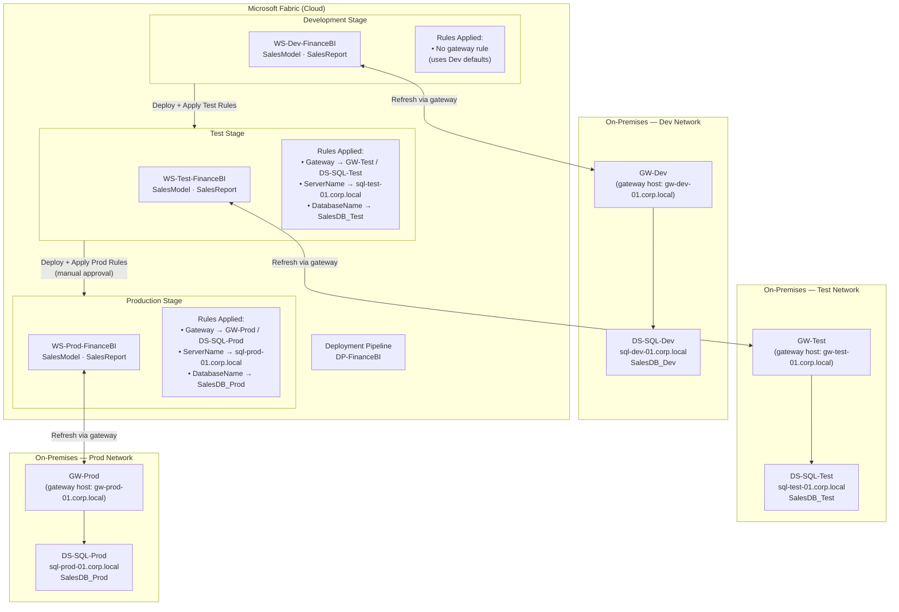

# On-Premises Gateway Architecture for Fabric Deployment Pipelines

## Overview

When semantic models connect to on-premises SQL Server (or other on-premises sources), every Fabric workspace requires a registered **on-premises data gateway data source** that the semantic model refresh can route through. Because Dev, Test, and Prod environments each target a different on-premises database server, each stage in the deployment pipeline must point to a **different gateway data source**.

Fabric Deployment Pipeline **gateway rules** solve this automatically at promotion time: when content is promoted from one stage to the next, the rule replaces the gateway and data source binding without any manual intervention in the semantic model.

---

## Environment Inventory

| Stage | Workspace | Gateway Cluster | Gateway Data Source | SQL Server | Database |
|---|---|---|---|---|---|
| Development | `WS-Dev-<team>` | `GW-Dev` | `DS-SQL-Dev` | `sql-dev-01.corp.local` | `SalesDB_Dev` |
| Test | `WS-Test-<team>` | `GW-Test` | `DS-SQL-Test` | `sql-test-01.corp.local` | `SalesDB_Test` |
| Production | `WS-Prod-<team>` | `GW-Prod` | `DS-SQL-Prod` | `sql-prod-01.corp.local` | `SalesDB_Prod` |

Each gateway cluster runs on a dedicated on-premises host in its respective network segment (Dev DMZ, Test DMZ, Prod DMZ) with read-only service accounts scoped to that environment's database.

---

## Architecture Diagram



---

## Gateway Prerequisites

Before configuring deployment rules, complete the following setup for each environment:

### 1. Install and Register the Gateway on Each Host

On each on-premises host, install the **Microsoft On-Premises Data Gateway** and register it to your tenant:

| Gateway Cluster | Host | Service Account |
|---|---|---|
| `GW-Dev` | `gw-dev-01.corp.local` | `svc-gw-dev@corp.local` |
| `GW-Test` | `gw-test-01.corp.local` | `svc-gw-test@corp.local` |
| `GW-Prod` | `gw-prod-01.corp.local` | `svc-gw-prod@corp.local` |

Each gateway host must have:
- Network line-of-sight to its corresponding SQL Server
- Outbound HTTPS (port 443) access to Fabric/Power BI service endpoints
- The gateway service account must have `db_datareader` (minimum) on the target database

### 2. Create a Gateway Data Source on Each Gateway

In the **Power Platform admin center** (or Fabric admin portal):

1. Navigate to **Data (preview)** → **On-premises data gateways**.
2. Select the gateway cluster (e.g., `GW-Dev`).
3. Click **+ New data source**.
4. Configure:

   | Field | Dev | Test | Prod |
   |---|---|---|---|
   | **Data source name** | `DS-SQL-Dev` | `DS-SQL-Test` | `DS-SQL-Prod` |
   | **Data source type** | SQL Server | SQL Server | SQL Server |
   | **Server** | `sql-dev-01.corp.local` | `sql-test-01.corp.local` | `sql-prod-01.corp.local` |
   | **Database** | `SalesDB_Dev` | `SalesDB_Test` | `SalesDB_Prod` |
   | **Authentication** | Windows / Basic | Windows / Basic | Windows / Basic |
   | **Username** | `CORP\svc-bi-dev` | `CORP\svc-bi-test` | `CORP\svc-bi-prod` |

5. Click **Add** and verify the connection status shows **Online**.

### 3. Grant Gateway Data Source Access to the Workspace Service Principal

Each workspace's semantic model refresh identity (service principal or user) must be added as a **User** on the gateway data source:

1. Open the data source (e.g., `DS-SQL-Dev`).
2. Click the **Users** tab.
3. Add the Fabric workspace admin account or the service principal used for refresh.

---

## Deployment Rules Reference

Deployment rules are configured per **target stage** (Test and Prod). The Development stage has no rules because it is the source of truth.

### Accessing Deployment Rules

1. In the deployment pipeline canvas, click **(…)** on the **Test** (or **Prod**) stage header.
2. Select **Deployment rules**.
3. Select the semantic model (`SalesModel`).
4. Configure both **Data source rules** and **Gateway rules** as shown below.

---

### Development Stage — Default Bindings (no rules required)

The semantic model in the Dev workspace is published with its Dev bindings already set. These are the defaults that all rules override.

| Rule Type | Binding |
|---|---|
| Gateway | `GW-Dev` |
| Data source | `DS-SQL-Dev` |
| `ServerName` parameter | `sql-dev-01.corp.local` |
| `DatabaseName` parameter | `SalesDB_Dev` |

---

### Test Stage — Deployment Rules

Configure these rules on the **Test** stage so they are applied every time content is promoted from Dev → Test.

#### Gateway Rule

| Field | Value |
|---|---|
| **Original gateway data source** | `GW-Dev` / `DS-SQL-Dev` |
| **New gateway** | `GW-Test` |
| **New data source** | `DS-SQL-Test` |

Steps in the UI:
1. Under **Gateway rules**, click **+ Add rule**.
2. In **Original gateway data source**, select the Dev data source (`sql-dev-01.corp.local — SalesDB_Dev`).
3. In **New gateway**, select `GW-Test`.
4. In **New data source**, select `DS-SQL-Test`.
5. Click **Save**.

#### Data Source Rules (Power Query Parameter Overrides)

| Parameter | Dev Value (original) | Test Value (override) |
|---|---|---|
| `ServerName` | `sql-dev-01.corp.local` | `sql-test-01.corp.local` |
| `DatabaseName` | `SalesDB_Dev` | `SalesDB_Test` |

Steps in the UI:
1. Under **Data source rules**, click **+ Add rule** for each parameter.
2. Select the parameter name from the dropdown.
3. Enter the override value.
4. Click **Save**.

> **Why both rules?** The gateway rule re-binds the *refresh path* (which physical gateway and registered data source to use). The data source parameter rules update the *connection string values* embedded in the Power Query M code. Both are required when parameters drive the connection string — the gateway rule alone does not rewrite the M query parameters.

---

### Production Stage — Deployment Rules

Configure these rules on the **Prod** stage so they are applied every time content is promoted from Test → Prod.

#### Gateway Rule

| Field | Value |
|---|---|
| **Original gateway data source** | `GW-Dev` / `DS-SQL-Dev` |
| **New gateway** | `GW-Prod` |
| **New data source** | `DS-SQL-Prod` |

> **Note:** The "original" gateway data source listed in the rule always refers to the binding defined in the **Development** stage artifact, regardless of what Test overrides. Fabric resolves the chain correctly.

Steps in the UI:
1. Under **Gateway rules**, click **+ Add rule**.
2. In **Original gateway data source**, select the Dev data source (`sql-dev-01.corp.local — SalesDB_Dev`).
3. In **New gateway**, select `GW-Prod`.
4. In **New data source**, select `DS-SQL-Prod`.
5. Click **Save**.

#### Data Source Rules (Power Query Parameter Overrides)

| Parameter | Dev Value (original) | Prod Value (override) |
|---|---|---|
| `ServerName` | `sql-dev-01.corp.local` | `sql-prod-01.corp.local` |
| `DatabaseName` | `SalesDB_Dev` | `SalesDB_Prod` |

---

## Complete Rules Summary Table

| Stage | Rule Type | Original (Dev) Binding | Override Value |
|---|---|---|---|
| **Test** | Gateway | `GW-Dev / DS-SQL-Dev` | `GW-Test / DS-SQL-Test` |
| **Test** | Data source — `ServerName` | `sql-dev-01.corp.local` | `sql-test-01.corp.local` |
| **Test** | Data source — `DatabaseName` | `SalesDB_Dev` | `SalesDB_Test` |
| **Prod** | Gateway | `GW-Dev / DS-SQL-Dev` | `GW-Prod / DS-SQL-Prod` |
| **Prod** | Data source — `ServerName` | `sql-dev-01.corp.local` | `sql-prod-01.corp.local` |
| **Prod** | Data source — `DatabaseName` | `SalesDB_Dev` | `SalesDB_Prod` |

---

## Semantic Model — Power Query Parameter Definitions

The semantic model must use **Power Query parameters** for the server and database values. Hard-coded connection strings cannot be overridden by deployment rules.

In Power BI Desktop (or TMDL), the parameters look like this:

```m
// Parameter: ServerName
"sql-dev-01.corp.local" meta [IsParameterQuery = true, Type = "Text", IsParameterQueryRequired = true]

// Parameter: DatabaseName
"SalesDB_Dev" meta [IsParameterQuery = true, Type = "Text", IsParameterQueryRequired = true]
```

The SQL Server data source query references the parameters:

```m
let
    Source = Sql.Database(ServerName, DatabaseName),
    SalesData = Source{[Schema="dbo", Item="SalesOrders"]}[Data]
in
    SalesData
```

When Fabric applies deployment rules at promotion time, it rewrites the parameter default values in the promoted copy — the original Dev artifact is unchanged.

---

## REST API — Applying Rules Programmatically

For teams managing many semantic models or automating pipeline configuration, the Fabric REST API allows reading and writing deployment rules.

### List Existing Rules for a Stage

```powershell
$pipelineId = "<your-pipeline-id>"
$stageOrder = 1  # 0 = Dev, 1 = Test, 2 = Prod

Invoke-PowerBIRestMethod `
    -Url "v1.0/myorg/pipelines/$pipelineId/stages/$stageOrder/artifacts" `
    -Method Get | ConvertFrom-Json | Select-Object -ExpandProperty value
```

### Set Gateway and Data Source Rules via REST API

```powershell
$pipelineId = "<your-pipeline-id>"
$stageOrder  = 1    # Test stage
$artifactId  = "<semantic-model-artifact-id>"

$body = @{
    rules = @(
        @{
            name  = "GatewayRule"
            value = @{
                gatewayId      = "<gw-test-cluster-id>"
                datasourceId   = "<ds-sql-test-id>"
            }
        },
        @{
            name  = "ParameterRule-ServerName"
            value = "sql-test-01.corp.local"
        },
        @{
            name  = "ParameterRule-DatabaseName"
            value = "SalesDB_Test"
        }
    )
} | ConvertTo-Json -Depth 5

Invoke-PowerBIRestMethod `
    -Url "v1.0/myorg/pipelines/$pipelineId/stages/$stageOrder/artifacts/$artifactId/rules" `
    -Method Put `
    -Body $body `
    -ContentType "application/json"
```

> Retrieve gateway cluster IDs and data source IDs from the Power BI REST API:
> - `GET https://api.powerbi.com/v1.0/myorg/gateways` — returns all gateway clusters and their IDs
> - `GET https://api.powerbi.com/v1.0/myorg/gateways/{gatewayId}/datasources` — returns registered data sources on a gateway

---

## Validation Checklist — On-Premises Gateway Configuration

- [ ] Gateway installed, registered, and showing **Online** in the admin portal for all three environments (`GW-Dev`, `GW-Test`, `GW-Prod`)
- [ ] Gateway data sources created and tested for each environment (`DS-SQL-Dev`, `DS-SQL-Test`, `DS-SQL-Prod`)
- [ ] Service accounts / workspace identities added as **Users** on each gateway data source
- [ ] Semantic model uses Power Query parameters for `ServerName` and `DatabaseName` (no hard-coded connection strings)
- [ ] Dev workspace semantic model bound to `GW-Dev / DS-SQL-Dev` and refreshes successfully
- [ ] Deployment rules configured on **Test** stage: gateway rule + both parameter rules
- [ ] Deployment rules configured on **Prod** stage: gateway rule + both parameter rules
- [ ] After Dev → Test promotion: semantic model in `WS-Test` refreshes against `sql-test-01.corp.local / SalesDB_Test`
- [ ] After Test → Prod promotion: semantic model in `WS-Prod` refreshes against `sql-prod-01.corp.local / SalesDB_Prod`
- [ ] Deployment pipeline canvas shows no differences across all three stages after final promotion

---

## Troubleshooting

| Issue | Likely Cause | Resolution |
|---|---|---|
| Gateway data source not appearing in the rule dropdown | The data source was not registered on the gateway, or the logged-in user is not a gateway admin | Open the Power Platform admin center, verify the data source exists on the target gateway, and confirm the user has **Admin** on the gateway |
| "Original gateway data source" field is empty | The semantic model does not use a gateway in the Dev workspace (e.g., it connects to Azure SQL, not on-prem) | On-prem gateway rules only appear for models already using an on-prem gateway in the source stage |
| Refresh fails in Test with "Unable to connect" after promotion | Gateway rule is set correctly but parameter rules are missing — M query still targets Dev SQL | Add the `ServerName` and `DatabaseName` parameter rules to the Test stage and re-promote |
| Refresh succeeds but returns Dev data | Parameter rules saved but gateway rule is missing — refresh routes through `GW-Dev` to the Dev DB | Add the gateway rule for the Test/Prod stage pointing to the correct gateway cluster and data source |
| Gateway shows Offline in admin portal | Gateway service is stopped on the host, or the host lost connectivity to the internet | RDP to the gateway host, restart the **On-premises data gateway** Windows service; verify outbound HTTPS is permitted |
| Service account auth fails on gateway data source | Credentials on the gateway data source are stale or the service account password changed | Edit the gateway data source in the admin portal and re-enter the credentials |
