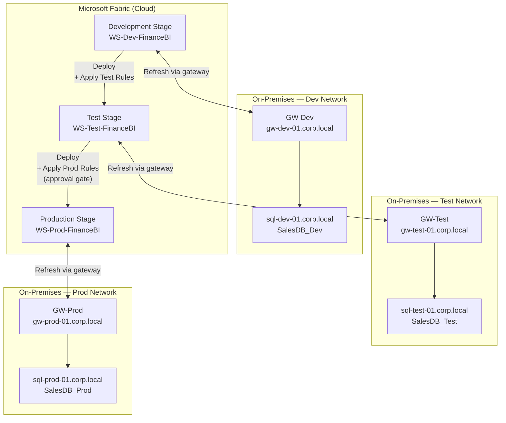

# Lab 3 — Fabric Deployment Pipelines (Dev → Test → Prod)

## Overview

In this lab you will create a **Fabric Deployment Pipeline** that moves Power BI reports and semantic models through three environments: Dev, Test, and Prod. You will configure each stage, set deployment rules to swap data source parameters per environment, run a promotion, and verify the results.

This lab picks up where Lab 2 ends — your CI pipeline is green on `main` and your Dev workspace contains validated PBIP content.

---

## Objectives

1. Create a Fabric Deployment Pipeline with three stages  
2. Bind the Dev, Test, and Prod workspaces to their respective stages  
3. Configure **deployment rules** to swap data source connections per environment  
4. Create a deployment manifest and release evidence using accelerator tools  
5. Promote content from **Dev → Test**  
6. Review a **deployment comparison** (diff) before promoting  
7. Gate the **Test → Prod** promotion with readiness evidence and manual approval  
8. Verify content in the Prod workspace  

---

## Prerequisites

| Requirement | Detail |
|---|---|
| Completed Lab 1 & 2 | Dev workspace has Git-connected content; CI pipeline is passing |
| Three Fabric workspaces | `WS-Dev-<team>`, `WS-Test-<team>`, `WS-Prod-<team>` — all on Fabric capacity (F2+) |
| Fabric role | You need **Admin** on all three workspaces, and at minimum **Contributor** on the Deployment Pipeline |
| Deployment Pipelines enabled | Admin toggle in Fabric Admin Portal: **Users can create and use deployment pipelines** must be on |
| Parameterized data sources | The sample semantic model uses Power Query parameters for the server and database name |
| Accelerator tools | Local browser access to `tools/index.html` |

---

## Background: How Fabric Deployment Pipelines Work

A Fabric Deployment Pipeline is a built-in Fabric feature (separate from Azure DevOps pipelines) that promotes workspace content — reports, semantic models, dataflows, notebooks — between stages without requiring manual re-publishing.

Key concepts:

| Concept | Description |
|---|---|
| **Stage** | One of: Development, Test, Production. Each stage is bound to exactly one workspace. |
| **Deployment rules** | Per-stage overrides applied at promotion time (e.g., swap connection strings) |
| **Comparison view** | Shows which items differ between adjacent stages before you promote |
| **Selective deployment** | Lets you promote a subset of items rather than the entire workspace |

---

## Part 1 — Create the Deployment Pipeline

### 1.1 Open Deployment Pipelines

1. In the Microsoft Fabric portal, click **Workspaces** in the left nav.  
2. At the bottom of the left nav, click **Deployment pipelines** (rocket icon), or navigate to **Create → Deployment pipeline**.

### 1.2 Create a New Pipeline

1. Click **Create pipeline**.  
2. Name it: `DP-<team>` (e.g., `DP-FinanceBI`).  
3. Click **Create**.

You will see the three-stage canvas: **Development | Test | Production**.

---

## Part 2 — Assign Workspaces to Stages

### 2.1 Assign the Development Stage

1. Click **Assign a workspace** under the **Development** stage.  
2. Select `WS-Dev-<team>`.  
3. Click **Assign**.

Fabric loads the workspace inventory. All items (reports, semantic models) appear in the Development column.

### 2.2 Assign the Test Stage

1. Click **Assign a workspace** under the **Test** stage.  
2. Select `WS-Test-<team>`.  
3. Click **Assign**.

### 2.3 Assign the Production Stage

1. Click **Assign a workspace** under the **Production** stage.  
2. Select `WS-Prod-<team>`.  
3. Click **Assign**.

The pipeline canvas now shows all three workspaces side-by-side. Items with differences between stages are highlighted.

---

## Part 3 — Configure Deployment Rules

Deployment rules allow you to override data source parameters and connection settings at promotion time, so the same PBIP artifact points to the correct database in every environment.

### 3.1 Open Deployment Rules for the Test Stage

1. In the pipeline canvas, click the **Deploy** button between **Development** and **Test** (do not click it yet — look for the **Deployment rules** link below or beside the button).  

   Alternatively: click the ellipsis **(…)** on the **Test** stage header and choose **Deployment rules**.

2. Select the **semantic model** (e.g., `SalesModel`).

### 3.2 Add a Data Source Rule

1. Under **Data source rules**, click **+ Add rule**.  
2. Locate the Power Query parameter or connection string that points to the Dev database.  
3. Set the **Test** value to the Test database server and database name:

   | Parameter | Dev Value | Test Value |
   |---|---|---|
   | `ServerName` | `dev-sql.database.windows.net` | `test-sql.database.windows.net` |
   | `DatabaseName` | `SalesDB_Dev` | `SalesDB_Test` |

4. Click **Save**.

### 3.3 Add Deployment Rules for the Production Stage

Repeat the process for the **Production** stage, pointing parameters to the Prod database:

| Parameter | Prod Value |
|---|---|
| `ServerName` | `prod-sql.database.windows.net` |
| `DatabaseName` | `SalesDB_Prod` |

> **Tip:** If your model uses a **gateway** for on-premises sources, add a **gateway rule** alongside the data source rule to redirect to the correct gateway data source for each environment.

---

## Part 3a — Accelerator Checkpoint: Create the Deployment Manifest

Before promoting between workspaces, create a deployment contract that explains what is being released.

1. Open:

   ```text
   tools/deployment-manifest-builder/index.html
   ```

2. Capture:

   - Solution name and business purpose
   - Business, technical, and release owners
   - Dev/Test/Prod workspace names
   - Required validation gates
   - Approval requirements
   - Rollback plan
   - Known exceptions

3. Export:

   ```text
   deployment-manifest.json
   deployment-summary.md
   ```

4. Save the manifest with your lab outputs. You will use it again in the release readiness step.

---

## Part 3b — Configure Gateway Rules for On-Premises Data Sources

> **When to use this section:** If your semantic model connects to an **on-premises SQL Server** (or other on-prem source) through the on-premises data gateway, you must configure **gateway rules** in addition to the data source parameter rules in Part 3. Each stage routes through a dedicated gateway that has network access to that environment's SQL Server.
>
> For full architecture diagrams, gateway setup prerequisites, REST API examples, and a complete rules reference, see the [On-Premises Gateway Architecture for Deployment Pipelines](../../../architecture/gateway-deployment-pipeline.md).

### Environment and Gateway Mapping

Each stage uses a dedicated on-premises gateway cluster and registered data source:

| Stage | Workspace | Gateway Cluster | Gateway Data Source | SQL Server | Database |
|---|---|---|---|---|---|
| Development | `WS-Dev-<team>` | `GW-Dev` | `DS-SQL-Dev` | `sql-dev-01.corp.local` | `SalesDB_Dev` |
| Test | `WS-Test-<team>` | `GW-Test` | `DS-SQL-Test` | `sql-test-01.corp.local` | `SalesDB_Test` |
| Production | `WS-Prod-<team>` | `GW-Prod` | `DS-SQL-Prod` | `sql-prod-01.corp.local` | `SalesDB_Prod` |

### Architecture — Multi-Gateway Deployment Pipeline



### 3b.1 — Configure Test Stage Gateway Rule

1. Click **(…)** on the **Test** stage header and choose **Deployment rules**.
2. Select `SalesModel`.
3. Under **Gateway rules**, click **+ Add rule**.
4. In **Original gateway data source**, select the Dev binding: `sql-dev-01.corp.local — SalesDB_Dev` (registered on `GW-Dev`).
5. In **New gateway**, select `GW-Test`.
6. In **New data source**, select `DS-SQL-Test`.
7. Click **Save**.

Then add the parameter overrides (as in Part 3.2):

| Rule Type | Parameter | Override Value |
|---|---|---|
| Data source rule | `ServerName` | `sql-test-01.corp.local` |
| Data source rule | `DatabaseName` | `SalesDB_Test` |

### 3b.2 — Configure Production Stage Gateway Rule

1. Click **(…)** on the **Production** stage header and choose **Deployment rules**.
2. Select `SalesModel`.
3. Under **Gateway rules**, click **+ Add rule**.
4. In **Original gateway data source**, select the Dev binding: `sql-dev-01.corp.local — SalesDB_Dev` (the "original" always refers back to the Dev artifact).
5. In **New gateway**, select `GW-Prod`.
6. In **New data source**, select `DS-SQL-Prod`.
7. Click **Save**.

Then add the parameter overrides:

| Rule Type | Parameter | Override Value |
|---|---|---|
| Data source rule | `ServerName` | `sql-prod-01.corp.local` |
| Data source rule | `DatabaseName` | `SalesDB_Prod` |

### Complete Rules at a Glance

| Stage | Rule Type | Original (Dev) Binding | Override |
|---|---|---|---|
| Test | Gateway rule | `GW-Dev / DS-SQL-Dev` | `GW-Test / DS-SQL-Test` |
| Test | `ServerName` parameter | `sql-dev-01.corp.local` | `sql-test-01.corp.local` |
| Test | `DatabaseName` parameter | `SalesDB_Dev` | `SalesDB_Test` |
| Prod | Gateway rule | `GW-Dev / DS-SQL-Dev` | `GW-Prod / DS-SQL-Prod` |
| Prod | `ServerName` parameter | `sql-dev-01.corp.local` | `sql-prod-01.corp.local` |
| Prod | `DatabaseName` parameter | `SalesDB_Dev` | `SalesDB_Prod` |

> **Why both gateway rules AND parameter rules?** The gateway rule re-binds the *refresh path* (which physical gateway and registered data source is used). The parameter rules update the *connection string values* in the Power Query M code. Both are required — the gateway rule alone does not rewrite the M query parameters, and the parameter rules alone do not redirect the gateway connection.

---

## Part 4 — Review the Comparison (Diff)

Before promoting, always review what will change using the comparison view.

1. In the pipeline canvas, click the **Compare** icon (or the difference count displayed between stages, e.g., "3 different").  
2. The comparison panel opens showing:
   - Items only in **Development** (new — will be added to Test on promotion)
   - Items only in **Test** (removed — will be deleted from Test on promotion, if selected)
   - Items **different** between stages (updated)
   - Items **identical** (no action needed)
3. Expand any item to see which properties have changed.
4. Confirm the expected changes match your recent commits before proceeding.

### 4.1 Accelerator Checkpoint: Compare PBIP and Impact

Use the accelerator tools to supplement the Fabric Deployment Pipeline comparison.

1. Open:

   ```text
   tools/pbip-diff-viewer/index.html
   ```

2. Compare the before/after PBIP snapshots if available and export:

   ```text
   pbip-diff-report.md
   ```

3. Open:

   ```text
   tools/dependency-impact-analyzer/index.html
   ```

4. Enter changed model objects from the release and export:

   ```text
   dependency-impact-report.md
   ```

5. Use these outputs to decide which report pages, visuals, measures, and relationships need regression review in Test.

---

## Part 5 — Promote Dev → Test

### 5.1 Select Items to Deploy

1. Click **Deploy** between the **Development** and **Test** stages.  
2. The deployment panel opens with all changed items pre-selected.  
3. Review the list. For this lab, leave all items selected.

### 5.2 Run the Deployment

1. Optionally add a **deployment note**: `Lab 3 — initial Dev → Test promotion`.  
2. Click **Deploy**.

Fabric promotes all selected items to `WS-Test-<team>`, applying the data source rules you configured in Part 3.

### 5.3 Verify the Deployment

1. After the deployment completes, click **View deployment details** to see a log of what was promoted.  
2. Open `WS-Test-<team>` in a new tab.  
3. Confirm the report and semantic model are present.  
4. Trigger a **manual dataset refresh** on the Test semantic model:
   - Click the semantic model → **Refresh now**.  
   - Confirm the refresh succeeds against the Test database.

---

## Part 6 — Validate Before Promoting to Prod

Before promoting to Prod, complete the validation gates defined in the governance checklist.

### 6.1 Accelerator Checkpoint: Register Exceptions

If any validation or UAT finding is approved for temporary release, record it before continuing.

1. Open:

   ```text
   tools/policy-exception-register/index.html
   ```

2. Capture owner, approver, reason, affected artifact, expiration, and mitigation.
3. Export:

   ```text
   policy-exceptions.json
   policy-exceptions-summary.md
   ```

### 6.2 UAT Checklist

Work through the following with your lab partner acting as a stakeholder:

- [ ] Report visuals display correct Test data  
- [ ] Row-level security (RLS) roles tested: sign in as a test user and confirm they see only their permitted rows  
- [ ] No placeholder or developer-only pages visible  
- [ ] Dataset refresh completed without errors in Test workspace  
- [ ] Deployment rules are correct (Test connection, not Dev)  

### 6.3 Compare Test → Prod

1. Click the difference count between the **Test** and **Production** stages in the pipeline canvas.  
2. Confirm the comparison matches what was just promoted to Test.  
3. If the diff looks unexpected, stop and investigate before proceeding.

### 6.4 Accelerator Checkpoint: Release Readiness

Before requesting Prod approval, consolidate all release evidence.

1. Open:

   ```text
   tools/release-readiness-dashboard/index.html
   ```

2. Paste or summarize:

   - Pipeline validation log
   - PR quality summary
   - PBIP readiness report
   - Deployment manifest
   - Policy exceptions
   - Effective rules summary
   - DAX test summary
   - PBIP diff and dependency impact notes

3. Generate a release recommendation.
4. Do not proceed to Prod unless the recommendation is **Ready to release** or the facilitator explicitly accepts **Release with review**.

---

## Part 7 — Promote Test → Prod (with Approval Gate)

### 7.1 Simulating an Approval Gate

Fabric Deployment Pipelines do not have a native built-in approval step in all configurations, so teams implement the gate through one of these patterns:

**Option A — Azure DevOps / GitHub Actions release gate (recommended for automation):**
- A release pipeline stage targets the Prod workspace via the Fabric REST API.
- The stage requires a manual approval from an authorized approver before running.

**Option B — Process gate (for this lab):**
- The BI Lead must confirm sign-off in writing (Teams message, PR comment, or ticket update) before the Prod promotion is performed.
- Only the Admin performs the promotion after confirmation.

For this lab, use **Option B**:

1. Post a message in your workshop Teams channel: `[Lab 3] Requesting Prod promotion approval — @facilitator`.  
2. Attach or summarize the Release Readiness Dashboard recommendation.  
3. The facilitator (or your lab partner) responds: `Approved`.  
4. Proceed.

### 7.2 Deploy Test → Prod

1. In the pipeline canvas, click **Deploy** between the **Test** and **Production** stages.  
2. Review the deployment panel. Confirm all expected items are selected.  
3. Add a deployment note: `Lab 3 — Test → Prod promotion after UAT sign-off`.  
4. Click **Deploy**.

### 7.3 Verify Production

1. Open `WS-Prod-<team>`.  
2. Confirm the report and semantic model are present.  
3. Trigger a **manual refresh** on the Prod semantic model and confirm success.  
4. Open the report and spot-check 2–3 key visuals against expected values.  
5. Return to the Deployment Pipeline canvas — all three stages should now show **identical content** (no differences highlighted).

### 7.4 Accelerator Checkpoint: Adoption Metrics

Record that this project completed a governed promotion path.

1. Open:

   ```text
   tools/adoption-metrics-dashboard/index.html
   ```

2. Add or update a project row with:

   - Platform
   - Toolkit profile
   - Readiness score
   - Rule maturity
   - Open exceptions
   - Time-to-onboard

3. Export or save the adoption summary for program tracking.

---

## Part 8 — Automate the Promotion with the Fabric REST API *(extension)*

For teams that want to automate Test → Prod promotion (e.g., triggered from an Azure DevOps release pipeline), the Fabric REST API exposes a deployment endpoint.

### 8.1 Get the Pipeline ID

```powershell
# Install the Fabric PowerShell module if not already installed
Install-Module -Name MicrosoftPowerBIMgmt -Scope CurrentUser -Force

Connect-PowerBIServiceAccount

# List deployment pipelines
Invoke-PowerBIRestMethod -Url "v1.0/myorg/pipelines" -Method Get | ConvertFrom-Json
```

Note the `id` field for your pipeline (`DP-<team>`).

### 8.2 Trigger Deployment via REST API

```powershell
$pipelineId = "<your-pipeline-id>"
$body = @{
    sourceStageOrder = 1   # 0=Dev, 1=Test, 2=Prod
    isBackwardDeployment = $false
    newWorkspace = $null
    note = "Automated promotion via REST API"
    options = @{
        allowOverwriteTargetArtifact = $true
        allowCreateArtifact = $true
    }
} | ConvertTo-Json -Depth 5

Invoke-PowerBIRestMethod `
    -Url "v1.0/myorg/pipelines/$pipelineId/deploy" `
    -Method Post `
    -Body $body `
    -ContentType "application/json"
```

> In a production Azure DevOps release pipeline, replace `Connect-PowerBIServiceAccount` with service principal authentication using a client credential from Azure Key Vault.

---

## Validation Checklist

- [ ] Deployment Pipeline created and all three workspaces assigned  
- [ ] Deployment Manifest Builder output created and reviewed  
- [ ] Data source rules configured for both Test and Prod stages  
- [ ] Gateway rules configured for both Test and Prod stages *(on-premises sources only)*  
- [ ] Comparison (diff) reviewed before both promotions  
- [ ] PBIP Diff Viewer and Dependency Impact Analyzer outputs reviewed when PBIP/model changes are available  
- [ ] Dev → Test promotion completed; Test dataset refreshes against Test DB via `GW-Test`  
- [ ] UAT checklist completed and sign-off obtained  
- [ ] Policy exceptions, if any, are recorded with owner, approver, expiration, and mitigation  
- [ ] Release Readiness Dashboard recommendation reviewed before Prod approval  
- [ ] Test → Prod promotion completed; Prod dataset refreshes against Prod DB via `GW-Prod`  
- [ ] Pipeline canvas shows no differences across all three stages  
- [ ] Adoption Metrics Dashboard updated for the promoted project  
- [ ] *(Extension)* REST API call triggers deployment programmatically  

---

## Troubleshooting

| Issue | Resolution |
|---|---|
| "Assign workspace" button is greyed out | Confirm your account is **Admin** on the target workspace. |
| Data source rules not saving | Ensure the semantic model uses **Power Query parameters** for server/database. Hardcoded connection strings cannot be overridden with rules. |
| Gateway rule dropdown is empty | The semantic model must already be bound to an on-premises gateway data source in the Dev workspace before gateway rules appear. Bind the Dev model to `GW-Dev / DS-SQL-Dev` and re-open Deployment Rules. |
| Refresh fails after promotion with "Unable to connect" | Gateway rule is set but parameter rules are missing — the M query still targets the Dev server name. Add `ServerName` and `DatabaseName` parameter rules and re-promote. |
| Refresh returns Dev data after Test promotion | Parameter rules saved but gateway rule is missing — refresh routes through `GW-Dev` to the Dev database. Add the gateway rule pointing to `GW-Test / DS-SQL-Test`. |
| Gateway shows Offline in admin portal | Restart the **On-premises data gateway** Windows service on the gateway host; verify outbound HTTPS (port 443) is permitted from the host. |
| "Original gateway data source" shows wrong gateway | The "original" binding always refers to the Dev artifact's gateway. If the Dev model is bound to a different gateway than expected, correct the Dev workspace binding first, then refresh the Deployment Rules view. |

> For a full troubleshooting reference and REST API examples for managing gateway rules programmatically, see the [On-Premises Gateway Architecture for Deployment Pipelines](../../../architecture/gateway-deployment-pipeline.md).
| Deployment fails with "Refresh failed" | Check that the gateway (if on-premises) is online and that the deployment rule points to the correct data source. Review the error in the activity log. |
| Comparison shows unexpected deletions | Another team member may have modified the Test workspace directly. Only promote from the pipeline — never edit Test or Prod workspaces manually. |
| REST API returns 401 | Ensure the service principal has the **Contributor** role on the pipeline and all target workspaces. |
| Prod workspace shows old content | Confirm the deployment completed (check deployment history in the pipeline). Perform a hard browser refresh. |

---

## Key Takeaways

- Fabric Deployment Pipelines are the **Continuous Delivery** layer complementing your CI pipeline.  
- **Deployment rules** ensure environment-specific configuration without maintaining separate PBIP files per environment.  
- The **comparison view** is your last line of defence — always review what will change before deploying to Prod.  
- Approval gates (manual or automated via REST/Azure DevOps) enforce process controls on Prod promotions.  
- Only the **Dev workspace** should be Git-connected. Test and Prod receive content exclusively through the pipeline.

---

## Related Documents

- [CI/CD Architecture](../../../architecture/cicd-architecture.md)  
- [Workspace Strategy](../../../architecture/workspace-strategy.md)  
- [Governance Checklist](../../../governance/governance-checklist.md)  
- [Lab 2 — CI Pipeline Validation for the Power BI Project](lab2-ci-pipeline.md)


