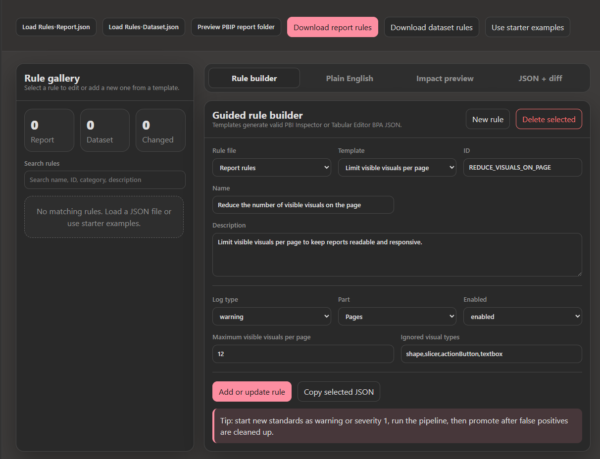

# Fabric BI DevOps Accelerator Tools

This folder contains static browser-based tools for creating and maintaining enterprise Power BI quality standards without hand-editing JSON.

## Launchpad

Open [Fabric BI DevOps Accelerator Launchpad](index.html) first. It provides the recommended workflow, audience paths, generated artifact summary, and links to every tool.

## Tools

| Tool | Audience | Purpose | Output |
|---|---|---|---|
| [Enterprise Standards Builder](enterprise-standards-builder/index.html) | BI leads, governance owners, report creators | Choose enterprise policy controls and generate pipeline-ready quality rules | `Rules-Report.json`, `Rules-Dataset.json`, `enterprise-policy-profile.json`, policy summary Markdown |
| [Quality Rule Designer](rule-designer/index.html) | Platform team, advanced BI developers | Edit or create individual report and dataset rules with guided templates or custom logic | `Rules-Report.json`, `Rules-Dataset.json` |
| [DAX Test Builder](dax-test-builder/index.html) | BI developers, semantic model owners | Define DAX measure test metadata consumed by the pipeline runner | `dax-tests.json`, DAX test catalog Markdown |
| [Deployment Manifest Builder](deployment-manifest-builder/index.html) | Release managers, BI leads, platform engineers | Scan existing PBIP folders or manually define deployment ownership, artifacts, environments, parameters, approvals, and rollback | `deployment-manifest.json`, deployment summary Markdown |
| [PBIP Project Readiness Scanner](pbip-readiness-scanner/index.html) | Report creators, platform team | Scan a PBIP repo or project folder before PR | Readiness Markdown report, JSON report |
| [PR Quality Summary Generator](pr-quality-summary-generator/index.html) | PR authors, reviewers, BI leads | Generate a pull request summary from changed files, logs, readiness output, DAX test context, and deployment manifest context | `PR-Quality-Summary.md`, `pr-quality-summary.json` |
| [Policy Exception Register](policy-exception-register/index.html) | Governance owners, BI leads, reviewers | Track policy and rule exceptions with owner, reason, expiration, approval, and mitigation | `policy-exceptions.json`, exception summary Markdown |
| [Effective Rules Generator](effective-rules-generator/index.html) | Governance owners, platform engineers | Merge baseline rules, branch policy, project overrides, and approved exceptions into CI-ready effective rule files | `Rules-Report.effective.json`, `Rules-Dataset.effective.json`, summary Markdown |

## Screenshots

### Enterprise Standards Builder

### Quality Rule Designer

### DAX Test Builder

The DAX Test Builder creates test metadata for measure-level validation. It exports `dax-tests.json`, which the pipeline runner now reads for metadata validation and JUnit reporting. Actual DAX query execution can be added later through semantic-link-labs, XMLA, or Tabular Editor scripting.

A starter catalog of generally accepted DAX test patterns is available at `shared/dax-tests.json`. The starter tests are disabled by default because measure names, table names, expected values, and filter contexts must be customized for each semantic model before CI enforcement.

## Recommended Workflow

1. Open `tools/enterprise-standards-builder/index.html` in a browser.
2. Choose a profile: **Advisory adoption**, **Enterprise standard**, or **Strict enterprise gate**.
3. Adjust policy controls for report usability, visual standards, semantic model quality, DAX standards, and formatting.
4. Download the generated `Rules-Report.json` and `Rules-Dataset.json`.
5. Review the JSON and commit the files under `shared/`.
6. Use `tools/rule-designer/index.html` when you need to tune an individual rule or author custom PBI Inspector / Tabular Editor BPA logic.
7. Use `tools/dax-test-builder/index.html` to customize `shared/dax-tests.json`, define measure-level DAX tests, and export the updated test catalog.
8. Use `tools/deployment-manifest-builder/index.html` to create the deployment contract for Dev/Test/Prod, parameters, approvals, and rollback.
9. Use `tools/pbip-readiness-scanner/index.html` before opening a PR to catch missing PBIP structure, governance assets, and CI/CD wiring.
10. Use `tools/pr-quality-summary-generator/index.html` to create a reviewer-friendly PR summary from changed files and validation output.
11. Use `tools/policy-exception-register/index.html` when a rule or policy exception needs owner, reason, approval, expiration, and mitigation tracking.
12. Use `tools/effective-rules-generator/index.html` or `shared/scripts/New-EffectiveQualityRules.ps1` to produce effective CI rule files from baseline rules, overrides, and exceptions.

All tools are self-contained HTML files. They do not require a local server, package install, or internet access.

For a documentation and marketing overview, see [Fabric BI DevOps Accelerator Tools](../docs/governance/power-bi-governance-tools.md).
